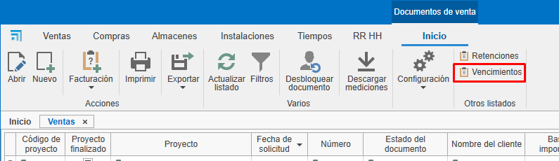
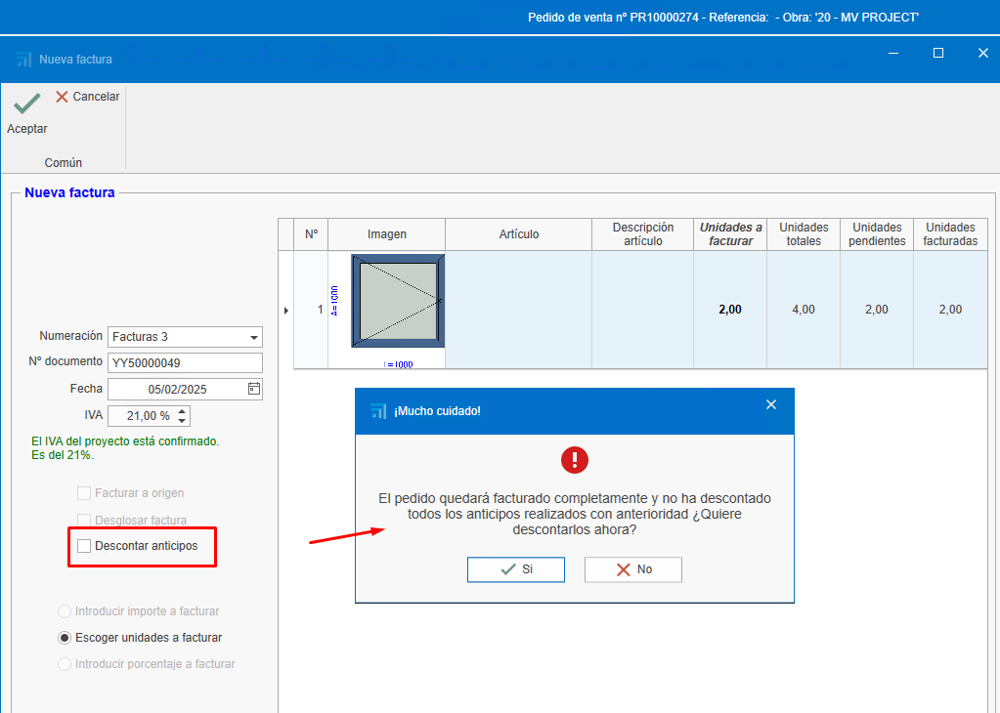
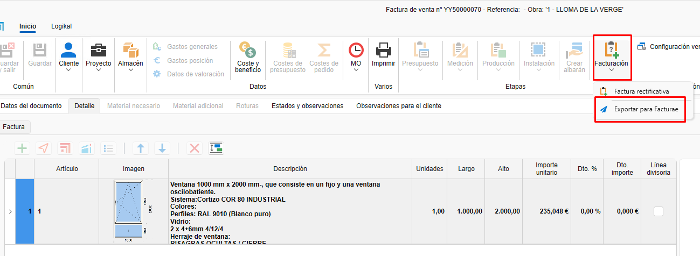
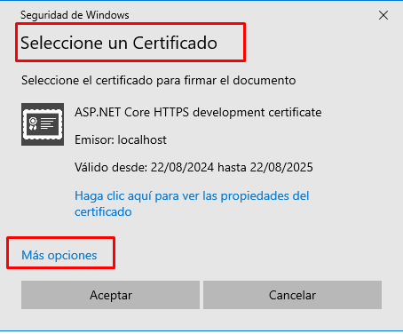
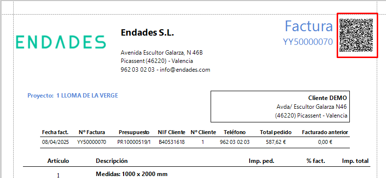

# Fatturazione

---

## 1. Introduzione
Questo manuale descrive il processo di creazione, modifica e gestione delle fatture. Imparerai a usare i filtri, creare fatture a partire dai preventivi, gestire gli incassi e applicare gli eventuali aggiustamenti.

---

## 2. Creare fatture dai preventivi
Per creare fatture a partire da preventivi, segui questi passaggi:

### 2.1. Creare un preventivo

- Aggiungi righe con i prodotti o servizi (es. finestre, lamiere).
- Definisci quantità e prezzi.

    

### 2.2. Generare la fattura

- Accedi alla sezione di fatturazione.
- Seleziona "Crea fattura" a partire dal preventivo.

    

- Scegli il tipo di fattura:

    - **Fattura anticipata**: consente di incassare un importo parziale e fatturare il resto successivamente.

        

    - **Fattura per unità**: fattura solo le unità selezionate da fatturare. Successivamente obbliga a continuare a fatturare nello stesso modo (impostazione predefinita).

        

    - **Inserire importo da fatturare**: consente di incassare un importo specifico del totale della fattura. Successivamente obbliga a continuare a fatturare nello stesso modo.

        

    - **Inserire percentuale da fatturare**: consente di incassare una percentuale specifica del totale della fattura. Successivamente obbliga a continuare a fatturare nello stesso modo.

    

- __Fattura a origen__ è fattura per certificato.

### 2.3. Inviare la fattura al cliente

- Una volta creata, puoi visualizzare la fattura in anteprima prima di inviarla o stamparla.

    

    

    

- Invia la fattura al cliente via e-mail o stampala.

    

> **Nota:** La fattura può essere generata dal preventivo, dall'ordine o dalla bolla. È consigliabile generare le fatture sempre dallo stesso documento — ad esempio dall'ordine, se è lì che si raggiunge l'accordo con il cliente — per una migliore gestione e tracciabilità.

### 2.4. Stato e osservazioni

- Creando la fattura nella scheda **Stato e osservazioni** verranno mostrati campi come Data, Scadenze, ritenuta, RE, Sconto P.P.

---

## 3. Gestione degli incassi

Per gestire gli incassi delle fatture:

### 3.1. Segnare le fatture come incassate

- Dal documento della fattura è possibile contrassegnare la fattura come incassata.

    

- In alternativa, accedi all'elenco delle scadenze da "Documenti di vendita".

    

- Filtra le fatture in attesa di incasso.

    

- Seleziona le fatture e contrassegnale come incassate. Per selezionare più fatture usa **Ctrl + Click** o **Ctrl + A** per selezionarle tutte.

    

- Indica la modalità di pagamento (bonifico, cambiale, ecc.), la data di incasso e la data di registrazione in conto. I campi evidenziati in rosso sono obbligatori. Questi campi possono essere configurati nella sezione "Forme di pagamento".

    

> **Nota:** In questa sezione, come in altri elenchi di documenti, è possibile applicare filtri a piacere.

- Nell'elenco dei documenti di vendita, apparirà nella tracciabilità del preventivo lo stato della fattura come "Incassata".

    

### 3.2. Report sugli incassi

- Accetta il preventivo per generare un ordine (nel caso in cui la fatturazione sia partita dal preventivo).

    

- Usa il report "Stato fatturazione e incassi" per vedere lo stato delle fatture (incassate, pendenti, percentuale di fatturazione, ecc.). Filtra per il preventivo da visualizzare.

    

    

- Usa il report di elenco fatture per visualizzare le informazioni della fattura (data, cliente, imponibile, IVA, totale, ecc.). Questo report può essere generato per intervallo di date o applicando il filtro corrente dell'elenco.

    

    

    

---

## 4. Fatturazione da ordini

Per fatturare da ordini, segui questi passaggi:

### 4.1. Fatturazione da ordine

- È possibile fatturare direttamente dall'ordine, seguendo gli stessi passaggi del preventivo.

- Un'altra modalità è creare una produzione dall'ordine e indicare la quantità di finestre da includere in quella fase di produzione.

    

    

    

- Una volta confermato che le finestre indicate nella fase "Producción 1" sono state prodotte, puoi tornare all'ordine e creare una fattura specificando la quantità da fatturare.

    

> **Nota:** Si consiglia di fatturare sempre dall'ordine, poiché è lì che si formalizza l'accordo con il cliente.

- Se detrai l'intero importo della fattura (unità) e hai emesso e incassato una fattura anticipata, al momento della conferma della fattura apparirà un messaggio per confermare lo sconto dell'anticipo.

    

- Confermando, l'anticipo sarà detratto dalla fattura.

    

- Generando la fattura per l'invio al cliente vedrai il dettaglio di quanto è stato incassato e detratto.

    

---

## 5. Fatturazione dalle bolle

Se lavori con bolle, segui questi passaggi:

### 5.1. Creare bolle dagli ordini

- Genera bolle per le produzioni effettuate.

    

> **Nota:** Verifica che prezzi e descrizioni siano corretti.

### 5.2. Fatturare dalle bolle

- Accedi all'ordine corrispondente.
- Seleziona "Crea fattura" dalla bolla e segui gli stessi passaggi precedenti.

    

> **Nota:** Controlla che prezzi e unità corrispondano a quanto concordato con il cliente; eventuali modifiche in produzione (es. variazione misura finestra) possono influire sul prezzo e differire dall'ordine.

---

## 6. Forme e modalità di pagamento

Configura le forme e le modalità di pagamento secondo le tue esigenze:

### 6.1. Forme di pagamento

- Definisci le condizioni di pagamento (es. 30 giorni, 60 giorni, 90 giorni). È possibile creare più forme con configurazioni diverse.

    

- Configura se è necessario richiedere la modalità di pagamento, la data effettiva di scadenza, la data di registrazione e la banca. Questa configurazione si rifletterà nell'elenco delle scadenze quando la fattura viene contrassegnata come incassata e i campi obbligatori (in rosso) devono essere compilati.

    

- Imposta il numero di scadenze e le percentuali di pagamento.

    

### 6.2. Modalità di pagamento

- Indica come verrà eseguito il pagamento (bonifico, cambiale, contanti).

    

- Configura se è necessario richiedere la data di incasso, la banca o la data di registrazione in conto.

    

---

## 7. Rettifiche e annullamenti

Se hai bisogno di correggere o annullare una fattura:

### 7.1. Fatture appena create

- Se la fattura non è stata inviata, eliminala e ricreala con la stessa numerazione. Ci sono diversi modi per eliminare la fattura:

    - Dall'elenco vendite, trova la fattura, fai clic destro sulla riga e seleziona "Elimina".

        

    - Dalla fattura, aprila e eliminala dalla scheda "Fattura", fai clic destro e seleziona "Elimina".

        

    - Dalla fattura, in alto a sinistra, clicca sul logo ENBLAU e seleziona "Elimina".

        

### 7.2. Fatture già inviate

- Se la fattura è già stata inviata, emetti una fattura rettificativa.

    

- Assicurati che soddisfi i requisiti fiscali.

## 8. Conferma fattura (Proforma)

- Per generare un documento di conferma (proforma) prima di emettere la fattura al cliente, puoi farlo da: **Documenti di Vendita → Fatturazione → Fatturazione Ordini**.

    

    - Si aprirà una finestra **Nuova fattura** dove cercare il cliente per cui generare la proforma:

    

    - Nella parte inferiore appariranno gli ordini in attesa di fatturazione per quel cliente nella scheda "Tipo di fattura e intestazione". Dopodiché, nella colonna **Fatturare** con un doppio clic seleziona gli ordini che desideri generare:

    

    - Scegli il "Tipo di fatturazione" per generare il documento:

    

    - Nella scheda "Dettagli fatture" potrai vedere tutte le righe di ciascun ordine e, dalla barra superiore, usare l'opzione Esporta dettaglio per esportare in .pdf o .xls:

    

    - Esempio in PDF:
    
    

---

> **Gestione filtri** Usa i filtri e i filtri personalizzati per ottimizzare la ricerca negli elenchi. Per maggiori informazioni, segui questo link: [4. Gestión de filtros](/Utilidades/4.UT_Gestion_Filtros)

---

## 9. Sconto per pagamento anticipato

Lo **sconto per pagamento anticipato** è una riduzione applicata all'importo totale della fattura quando il cliente effettua il pagamento entro un termine breve stabilito. Ha lo scopo di incentivare il pagamento anticipato e facilitare il flusso di cassa del fornitore.

### 9.1. Applicazione consigliata

Si consiglia di **includere lo sconto già nell'ordine**, nella sezione **"Stato e osservazioni"**, affinché venga riportato correttamente nella fattura finale, sia essa generata dall'**ordine** o dalla **bolla**.

> ⚠️ **Importante**: Applicare lo sconto direttamente dalla fattura può generare **disallineamenti nei report** come "Stato fatturazione e incassi", poiché l'importo fatturato potrebbe non corrispondere ai valori originariamente previsti.

### 9.2. Calcolo dello sconto

Esiste una **opzione di configurazione** che determina come viene applicato lo sconto:

- Se l'opzione è **attivata**, lo sconto si applica **sul totale comprensivo di IVA**.
- Se l'opzione è **disattivata**, lo sconto si applica **solo sull'imponibile** e l'IVA viene calcolata sull'importo netto.

    

---

## 10. Fatturazione delle bolle

### 10.1. Acquisti

Nella sezione **Documenti di acquisto** esiste un'opzione dedicata alla **Fatturazione delle bolle**.  
Selezionandola:

- Si apre una finestra dove puoi **scegliere il fornitore**.
- Verrà mostrato un **elenco di bolle**, dove è possibile:
  - **Filtrare** per progetto, date, documenti, ecc.
  - **Selezionare** le bolle da fatturare segnando la casella nella colonna **Seleziona**.

    

### 10.2. Vendite

Nel modulo **Documenti di vendita** è presente un'opzione simile per la fatturazione delle bolle.
Accedendo:

- Si apre una finestra dove puoi **indicare il progetto e/o il cliente**.
- Il sistema mostrerà l'elenco delle bolle corrispondenti.
- Con un **doppio clic** sulla casella della colonna **“Da fatturare”**, puoi selezionare facilmente i documenti da includere nella fattura.

    

    

---

## 11. Fatturazione elettronica (FACTURAE)

Per generare una fattura elettronica da ENBLAU, è necessario che sia il Cliente sia l'Azienda abbiano compilato alcuni campi obbligatori.

**Azienda:** campi richiesti: CIF, Indirizzo, Località, CAP, Provincia e Paese.
    
    

**Clienti:** campi richiesti: Ragione sociale, NIF/CIF, Codice paese e Tipo di persona (**J**: Giuridica, **F**: Fisica).
    
    

Procedura:

1. Apri la fattura che desideri emettere come fattura elettronica.

2. Nella barra superiore della fattura, clicca su **Fatturazione** e seleziona **Esporta per Facturae** dal menu a tendina.

    

3. Indica il percorso dove salvare la fattura elettronica in formato XML.

    

4. Al salvataggio si aprirà una finestra per selezionare una firma certificata valida. Se necessario, clicca su Altre opzioni, seleziona il certificato e premi Accetta.

    
    
    

5. Dopo aver premuto Accetta, verrà mostrato un messaggio che conferma l'esportazione avvenuta correttamente nel percorso indicato.

    

> ⚠️ **Importante!** Una volta esportata la fattura elettronica non potrà essere eliminata né modificata.

6. Dopo l'esportazione del file XML, accedi al [Validatore e visualizzatore di fatture](https://face.gob.es/es/facturas/validar-visualizar-facturas) per caricare il file e verificarne il contenuto.

    

7. Attiva le opzioni Formato Facturae e Firma della fattura per procedere con la validazione.

    

Stampando la relazione di una fattura elettronica da ENBLAU, in alto a destra verrà visualizzato un codice QR contenente informazioni rilevanti della fattura (NIF, nome, indirizzo, cliente, numero fattura, ecc.).

    
    
    

---

## 12. Considerazioni finali
- **Mantieni gli ordini aggiornati**: tutti i documenti devono essere collegati a un ordine per facilitare il controllo dei costi e della fatturazione.

- **Esportazione contabile**: a fine mese esporta i dati contabili dall'elenco vendite o acquisti.

- **Domande e supporto**: in caso di dubbi, contatta il team di supporto via e-mail.

---

Questo manuale ti aiuterà a gestire la fatturazione in modo efficiente e a evitare errori comuni.