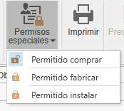
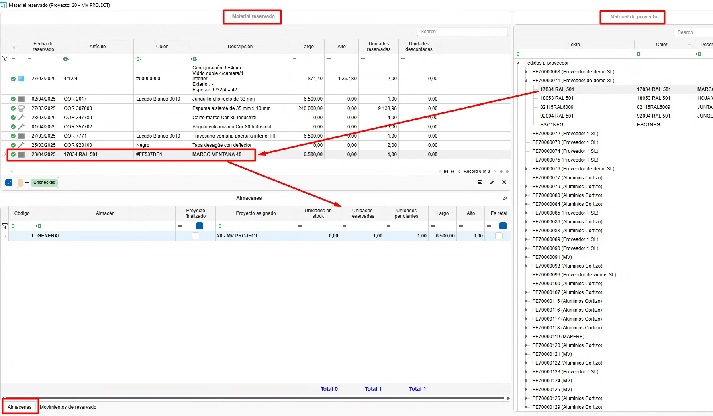
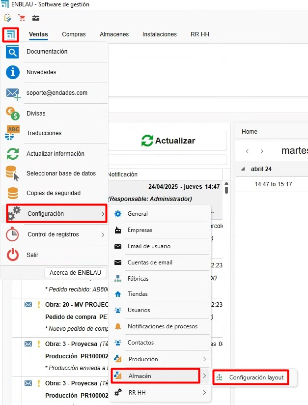
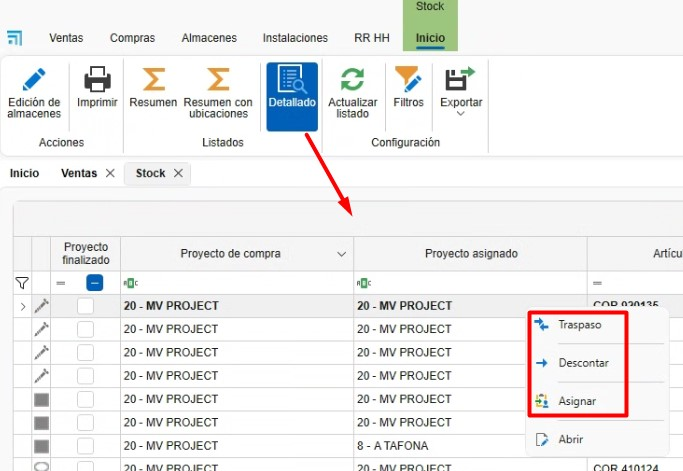
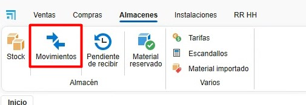
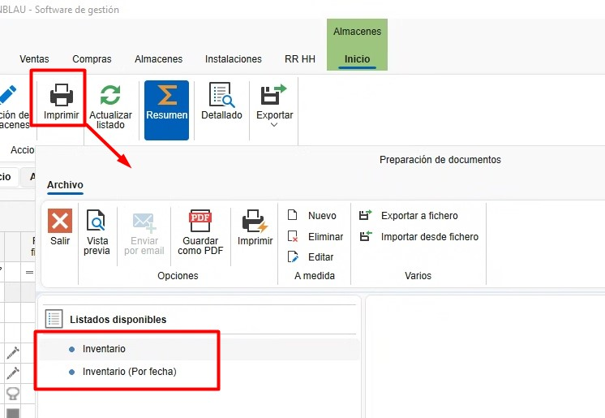

# Sistema di controllo delle scorte ENBLAU

---

## 1. Scopo

Questo manuale è pensato per gli utenti nuovi al sistema di controllo delle scorte utilizzato dai Clienti e da Endades. L'obiettivo principale è fornire una guida dettagliata per la gestione efficiente dei progetti, dalla creazione degli ordini fino all'ottimizzazione del processo di produzione in ENBLAU. Il documento descrive i passaggi necessari per eseguire le operazioni chiave del sistema ed è strutturato in modo sequenziale per facilitarne la comprensione.

---

## 2. Gestione degli ordini di acquisto

### 2.1. Ordini di acquisto

- Dal menu principale **Acquisti**, vai alla sezione "Ordini di acquisto".
- Specifica i materiali richiesti e la quantità.
- In caso di variazioni nelle referenze, aggiungile manualmente se sono già configurate nel database.
- Nell'ordine di vendita (sezione **Vendite**) seleziona il documento e vai alla scheda **Materiale necessario** per ottenere l'elenco dei materiali dell'ordine.

    - Le righe degli articoli evidenziate in verde indicano che c'è materiale in stock per quel progetto o per il progetto impostato come **Stock**. Le righe evidenziate in rosso indicano che non ci sono materiali per quel progetto o non sono presenti in magazzino.

    - Puoi indicare se vuoi o meno acquistare un articolo, nel caso in cui sia già presente in magazzino. Per ogni materiale verranno mostrate: unità in stock, unità riservate e unità in sospeso.

    

  > ⚠️ **Importante!** Per assegnare un progetto di tipo stock vai in Generale - Configurazione - **Acquisti e magazzino** e imposta nel menu a tendina **Progetto per stock** un progetto creato in precedenza per la gestione dello stock.

  

- Conferma con **Richiedi materiale** e invia l'ordine al fornitore corrispondente.

- Nella sezione **Magazzini** è disponibile l'opzione **In attesa di ricevimento**, dove viene mostrato l'elenco dei materiali pendenti per ciascun progetto e ordine di acquisto.

  

- Facendo clic con il tasto destro sulla riga dell'articolo puoi aprire l'ordine di acquisto relativo a quel materiale:

  

> ℹ️ **Nota:** Per informazioni più dettagliate sugli ordini di acquisto, segui questo link: [Ordini di acquisto](1.PR_Ventas_Compras.md#4-compras)

 > ⚠️ **Importante!** Per effettuare l'ordine dei materiali da un documento di vendita, in alcuni casi sono necessari permessi speciali per eseguire acquisti. Questo permesso è richiesto anche per fabbricare o installare.

### 2.2. Assegnare materiali a un progetto

- Dalla vista **Materiale necessario**, durante il processo di elenco e richiesta materiali, è possibile assegnare articoli provenienti da un altro progetto al progetto in cui ti trovi. Nella sezione delle ubicazioni fai clic destro sulla riga - **Assegna**:

  

  - Indica il progetto di destinazione a cui assegnare (per impostazione predefinita è quello in cui ti trovi) e la quantità (per impostazione predefinita quella necessaria per il progetto):
  
  

  - Assegnando l'articolo al progetto di destinazione, l'unità di stock verrà automaticamente trasferita al progetto di destinazione sommando la quantità assegnata, mentre dal progetto di origine verrà sottratta. L'articolo verrà mostrato in verde.

> ⚠️ **Importante!** Assicurati che sia possibile utilizzare materiali dal progetto da cui desideri trasferire gli articoli.

### 2.3. Materiali riservati

- Da un documento di **Vendite**, **Acquisti** o dalla sezione **Progetti** è possibile riservare materiali per il progetto, selezionandoli in **Materiali riservati** dal menu a tendina **Magazzino**.

  

- Si aprirà una finestra di materiali riservati e dalla sezione **Materiale di progetto** puoi trascinare i materiali dagli ordini al fornitore:

  

- Successivamente, nella sezione Magazzini è possibile visualizzare tutti i materiali riservati per un progetto:

  

  

> ℹ️ **Nota:** L'uso del materiale riservato è puramente informativo: non impedirà l'utilizzo dei materiali anche se sono riservati. Si raccomanda l'uso di [Assegnare materiali a un progetto](#22-assegnare-materiali-a-un-progetto) se desideri un controllo dello stock più accurato.

### 2.4. Ripristino delle scorte

 Nella sezione **Acquisti** c'è l'opzione **Ripristino delle scorte**, che mostra l'elenco dei materiali da ordinare quando sono sotto il livello minimo o sotto il livello abituale.

  
    
 - I materiali **segnalati in rosso** sono quelli al di sotto del **minimo** o dell'**abituale**. 

    - La colonna **Unità in stock** mostra la quantità disponibile del materiale.  
    - La colonna **Unità da ordinare** indica quanto manca per raggiungere il **massimo in stock**.  
    - Se il materiale soddisfa il minimo o l'abituale, **non apparirà nell'elenco**.

 - I materiali **segnalati in verde** sono quelli che non hanno un massimo definito in magazzino.  

    - Per impostazione predefinita viene aggiunta **una unità** per sotto minimo e sotto abituale affinché compaiano nell'elenco di ripristino delle scorte.

 - Seleziona la casella **Da importare** per i materiali che devono essere ordinati. Poi premi il pulsante **Importa** per aggiungerli all'ordine di acquisto.

  

> ℹ️ **Nota:** Per maggiori informazioni su come definire per ogni materiale il livello minimo, massimo e abituale, consulta la sezione [Configurazione dei materiali](#61-configurazione-dei-materiali).

---

## 3. Gestione dei magazzini e dei movimenti

### 3.1. Layout dei magazzini

- Dal menu principale **Magazzini** - **Stock**, puoi aggiungere o modificare i magazzini.

  

- Configura il layout del magazzino dalla pagina iniziale: **ENBLAU** – **Configurazione** – **Magazzino** – **Layout**:

  

  - Crea zone, scaffalature e posizioni nel sistema per una chiara organizzazione. Verrà mostrato come una vista ad albero.
  - Associa ogni posizione alla corrispondente area di stoccaggio. Esempio:
    - **Aggiungi piano**: Aggiungi un piano e puoi indicare il magazzino.
    - **Aggiungi zona/sottzona**: Aggiungi una zona o sottzona sotto la posizione selezionata.

    

### 3.2. Stock

- Nella sezione **Magazzini - Stock** trovi l'elenco con le opzioni **Riepilogo, Riepilogo con ubicazione** e **Dettagliato**:

  

  

  - **Riepilogo:** In questo elenco puoi vedere in modo sintetico un materiale raggruppato per progetto assegnato. Verranno mostrati i totali di unità, unità pendenti e unità riservate.

    <!--  -->

  - **Riepilogo con ubicazione:** In questo elenco potrai vedere in modo sintetico un materiale raggruppato per progetto assegnato e la sua ubicazione.

    <!--  -->

  - **Dettagliato:** In questo elenco vedrai in modo più dettagliato dove si trova un materiale con il suo progetto di acquisto, progetto assegnato, ubicazione in magazzino e separato per documento di bolla di consegna. Inoltre, permette di scalare, trasferire ed assegnare articoli.  

    <!--  -->

### 3.3. Movimenti in magazzino 

- Esegui i movimenti dei materiali tra zone e progetti:
  - In **Magazzini** - **Stock** – **Dettagliato**, fai clic destro sul materiale che vuoi trasferire, scalare o assegnare.

  

  - Seleziona il materiale dal progetto.
  - **Scalare**: Indica il progetto, il numero dell'ordine, il responsabile e la quantità (barre e pezzi) o la lunghezza (giunti).

    

  - **Trasferimento**: Indica la posizione di origine, destinazione, quantità (barre e pezzi) o lunghezza (giunti).

    

  - **Assegna**: Indica il progetto di destinazione, il responsabile, la quantità (barre e pezzi) o la lunghezza (giunti). Questa funzione è la stessa della sezione Materiale necessario -[Assegnare materiali a un progetto](#22-assegnare-materiali-a-un-progetto).

     

 - I movimenti di ingresso, uscita, trasferimento e assegnazione di ogni materiale verranno registrati nella **bolla di consegna**. Puoi visualizzare gli ingressi e le uscite in **Magazzini – Movimenti**.

    

    

 - Dalla sezione Movimenti è disponibile la funzione **Restituisci**. Fai clic con il tasto destro sul movimento di uscita che desideri annullare e apparirà l'opzione di restituzione:

    

    Si aprirà la finestra **Movimento di restituzione** dove indicherai le unità e la posizione da cui vuoi restituire il materiale; per impostazione predefinita è la posizione da cui è stato emesso il materiale:

      

 - L'opzione **Apri** dall'elenco dettagliato apre la bolla (colonna numerazione) della riga e dell'articolo selezionato:

    

### 3.4. Report di magazzino (inventario)

 - Nella sezione **Magazzini** - **Movimenti** è possibile stampare diversi tipi di report:

  - **Riepilogo:** Ci sono due report **Inventario** e **Inventario per data**.

    

    **Inventario** mostra un report di inventario, secondo i filtri applicati nell'elenco del magazzino. Include le colonne Articolo, Progetto Unità, Unità pendenti e Unità riservate.

      

    **Inventario per data** mostra un report di inventario alla data scelta. Include le colonne Articolo, Descrizione, Unità e Importo.

      

  - **Riepilogo con ubicazione:** Esiste il report **Inventario dettagliato**.

    **Inventario dettagliato** mostra un report di inventario, secondo i filtri applicati nella vista dettagliata del magazzino. Include Ubicazione magazzino, Articolo, Descrizione e Unità.

      

  - **Dettagliato:** C'è il report **Inventario dettagliato**.

    **Inventario dettagliato** mostra un report di inventario, secondo i filtri della vista dettagliata del magazzino. Include Progetto, Numero della bolla d'acquisto, Ubicazione magazzino, Articolo, Descrizione e Unità raggruppate per referenza e lunghezza. 

      

  - Nella sezione **Magazzini** - **Movimenti** è possibile stampare vari report:

    

    **Movimenti** mostra un elenco dei movimenti visualizzati nella lista dei movimenti. Include Data del movimento, Responsabile, Progetto assegnato, Ubicazione magazzino, Articolo, Descrizione, Unità e Tipo di movimento.

      

    **Movimenti I** mostra un elenco dei movimenti visualizzati. Include le colonne Tipo di movimento, Data del movimento, Responsabile, Documento, Unità, Importo, Articolo e Descrizione.

      

## 4. Inventari

- Nella sezione **Magazzini** - **Inventari** è possibile normalizzare il magazzino tenendo conto dello stock in tempo reale.

  

### 4.1. Nuovo inventario

  - Per creare un inventario accedi alla sezione Inventari e seleziona **Nuovo**.

    

### 4.2. Rilevazione dello stock

  **1.** Dall'inventario, seleziona il **Progetto** definito come **Stock**.  

  **2.** Clicca su **Ottieni stock** per caricare l'elenco dei materiali del progetto **Stock**:  
    
    

  **3.** Nella colonna **Unità contabilizzate**, inserisci le unità fisiche effettive presenti in magazzino per ciascun articolo, in base al conteggio effettuato nella posizione del magazzino.  
      

  **4.** Dopo aver indicato le unità nella colonna **Unidades contabilizzate**, le righe degli articoli verranno evidenziate in rosso, indicando una discrepanza nelle unità. Poi clicca su **Aggiorna magazzino** per registrare la rettifica in base alle unità contabilizzate.  
      

  **5.** Dopo l'aggiornamento del magazzino, le righe verranno mostrate in verde.  

  - Nelle colonne **Unidades Stock** e **Unidades contabilizzate** saranno visibili le quantità aggiornate.  
  - Nella colonna **Contabilizzato** verrà marcata una casella.  
  - Nella colonna **Fecha contabilizada** verrà registrata la data della rettifica.  

          

  - Questo processo genera un movimento di rettifica (entrata o uscita) in magazzino:  

      

    > ℹ️ **Nota**: Nell'elenco dell'inventario sono visibili solo **entrate** e **uscite**.  
    > Non è possibile effettuare movimenti di tipo **trasferimento** da questo elenco.  

  **6.** Puoi anche aggiungere nuovi articoli dai rami:

  - **Articoli (materiali ENBLAU)**  
  - **Articoli importati (materiali di Logikal)**  

    Per farlo:  
    - Trascina l'articolo nell'elenco dell'inventario.  
    - Indica le **unità**, le **dimensioni** (se si tratta di barra, superficie o giunto), la **posizione in magazzino** e il **prezzo**.  
        

    > ℹ️ **Nota**: Quando aggiungi un articolo nuovo all'inventario, è obbligatorio indicare una **ubicazione**. Altrimenti, non verrà aggiornato nello stock.  

  **7.** Con il pulsante **Aggiorna unità in stock** si aggiornano le unità correnti per ciascuna riga dell'inventario.  

     

---

### 4.3. Report di rettifica dell'inventario

- È possibile **Stampare** l'elenco dell'inventario, che mostra le colonne:  
  **Articolo**, **Descrizione**, **Data ultima verifica**, **Unità in stock**, **Unità contabilizzate** e **Ubicazione**.  

  

    

- Questo report è pensato per agevolare il conto manuale dello stock in magazzino prima di procedere all'aggiornamento nell'elenco dell'inventario. Nella colonna **Unità contabilizzate** va indicata la quantità reale di ogni articolo in stock.  

    

---

## 5. Stock necessario

- Una volta che una produzione è stata creata e inoltrata alla produzione (taller), è possibile visualizzare e scalare i materiali manualmente.

  

- Si aprirà una finestra "Stock necessario" che indica se il materiale è disponibile e in quali magazzini, e a quale postazione verrà scalato quel materiale. Per scalare il materiale è necessario selezionare la casella nella colonna **Stock a scalare** per il materiale.

  

> ⚠️ **Importante!** Se il materiale non è presente in magazzino, non verrà scalato.

> ℹ️ **Nota:** Per un controllo più granulare dello stock, si consiglia di utilizzare l'app mobile enSITE per effettuare questo tipo di scalatura. Per maggiori informazioni sull'app vedere [2.1. Ricezione in enSITE](4.PR_Manual_Stock_enCONTROL.md#21-recepcion-en-ensite)
  
---

## 6. Materiali importati

Nella sezione **Magazzini → Materiale importato** è presente l'elenco di tutti i materiali importati da **Logikal**.

---

### 6.1. Configurazione dei materiali

In questa sezione puoi definire, per ciascun articolo, una serie di valori predefiniti che influenzano la gestione degli acquisti e della produzione:

- **Acquistare**:  
  Se questa casella è selezionata, il materiale verrà proposto di default come "da acquistare" quando viene elencato nella sezione **Materiale necessario**.

- **Montaggio a destinazione**:  
  Se selezionata, il materiale verrà montato a destinazione durante il processo nel posto **Picking** all'interno di **enCONTROL**.

- **Controllo di stock**:  
  Se attivato, il materiale verrà considerato per lo sconto automatico durante il processo di produzione.

- **Stock minimo**, **stock massimo** e **stock abituale**:  
  Puoi definire i valori di riferimento per la gestione delle giacenze, utile per avvisi, ripristini o pianificazione.

    

    Nella sezione [Ripristino delle scorte](#24-ripristino-delle-scorte) in Acquisti puoi ottenere un elenco di articoli sotto minimo o sotto abituale a seconda di come sono stati definiti i valori minimi, massimi e abituali per ciascun materiale.

> ℹ️ **Nota:** La corretta configurazione di questi campi migliora significativamente il controllo dell'inventario, la pianificazione degli acquisti e la tracciabilità dei materiali durante la produzione.

---

## 7. Prodotto finito

Il **prodotto finito** è quello completamente fabbricato e verificato nella postazione di **Controllo finale** in **enCONTROL**.

Nella sezione **Magazzini → Prodotto finito** si trovano due elenchi principali:

- **Ubicazione prodotti**
- **Movimenti prodotto**

  

---

### 7.1. Ubicazione prodotti

- Nell'elenco **Ubicazione prodotti** viene mostrata la posizione attuale del prodotto finito, così come è stata definita dalla postazione di **Controllo finale** in **enCONTROL**.

  

- Da questa vista, cliccando con il tasto destro su una riga, è possibile:

  - Spostare il prodotto in un'altra ubicazione.
  - Effettuare l'uscita del prodotto.
  - Aprire il documento di produzione associato a quel prodotto.

  

---

### 7.2. Movimenti di prodotto

- Nella sezione **Movimenti prodotto** vengono registrate tutte le operazioni sui prodotti finiti, tra cui:

  - Entrata.
  - Uscita.
  - Trasferimento.

  

- Facendo clic destro su una riga con **tipo di movimento** uguale a **uscita**, viene abilitata l'opzione **Restituire**.

  

- Selezionando questa opzione si aprirà la finestra **Restituzione prodotto finito**, dove bisogna:

  1. Indicare la nuova **ubicazione** del prodotto.
  2. Confermare l'operazione.

  

Al termine del processo, il sistema registrerà un nuovo movimento di tipo **Entrata** nello storico del prodotto.

> ℹ️ **Nota:** Questa funzionalità è utile per gestire restituzioni interne, prodotti rifiutati o riassegnazioni logistiche all'interno del magazzino.

---

## 8. Controllo dello stock e report

- Monitora lo stock necessario dalla sezione "Produzione".
- Identifica materiali riservati e pendenti in tempo reale.
- Genera report di inventario per valutare l'uso dei materiali e pianificare gli acquisti futuri.

---

## 9. Risoluzione dei problemi comuni

- **Errore durante l'import delle referenze**: Verifica che le referenze siano configurate nel database.
- **Materiali in eccesso o mancanti**: Assicurati di registrare correttamente le ubicazioni e le quantità al ricevimento dei materiali.
- **Problemi con il layout del magazzino**: Controlla la configurazione delle zone e adatta le impostazioni secondo necessità.

---

## 10. Conclusione

Questo manuale fornisce una guida passo-passo per i processi principali del sistema di controllo delle scorte. Seguendo queste istruzioni, gli utenti saranno in grado di gestire efficacemente gli inventari, migliorare la produzione e ottimizzare la relazione con i fornitori. Per supporto aggiuntivo, contatta l'amministratore di sistema.

