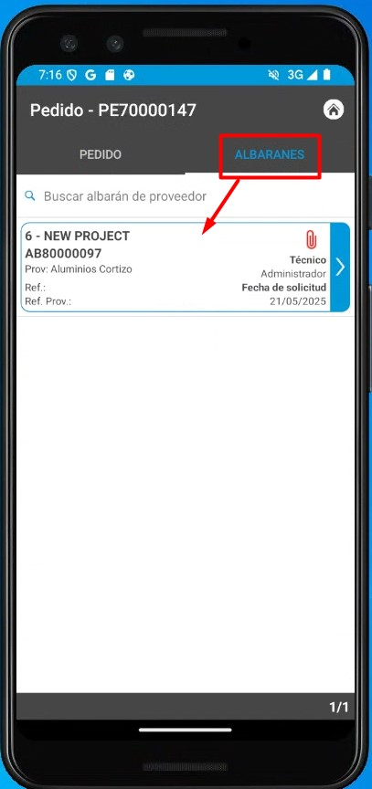
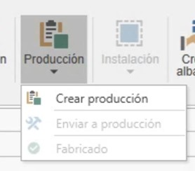
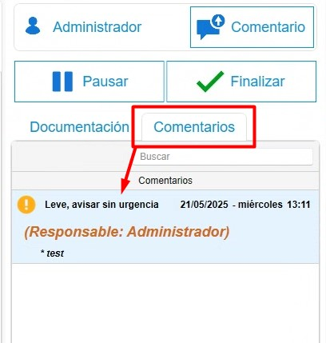
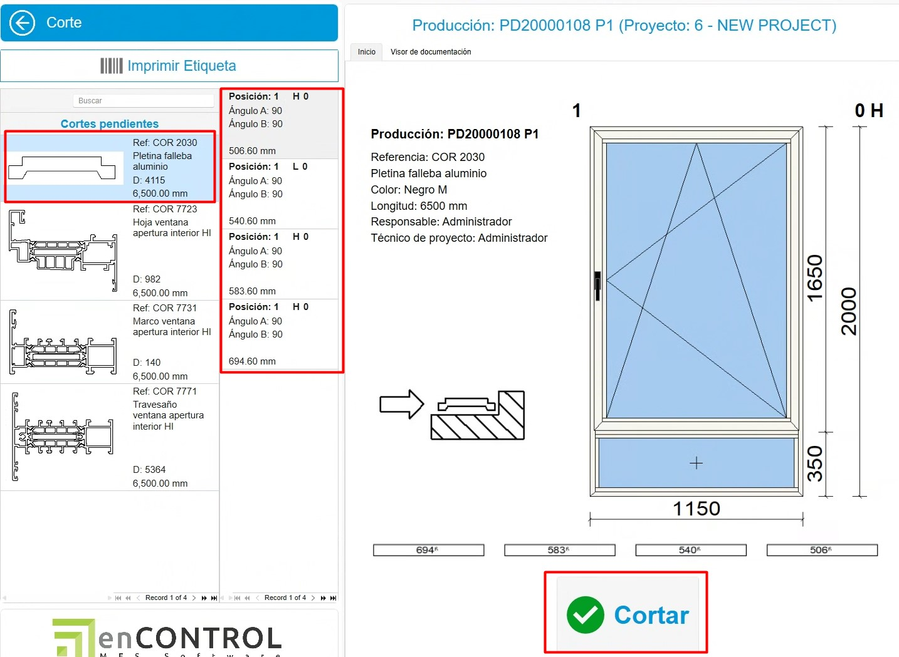
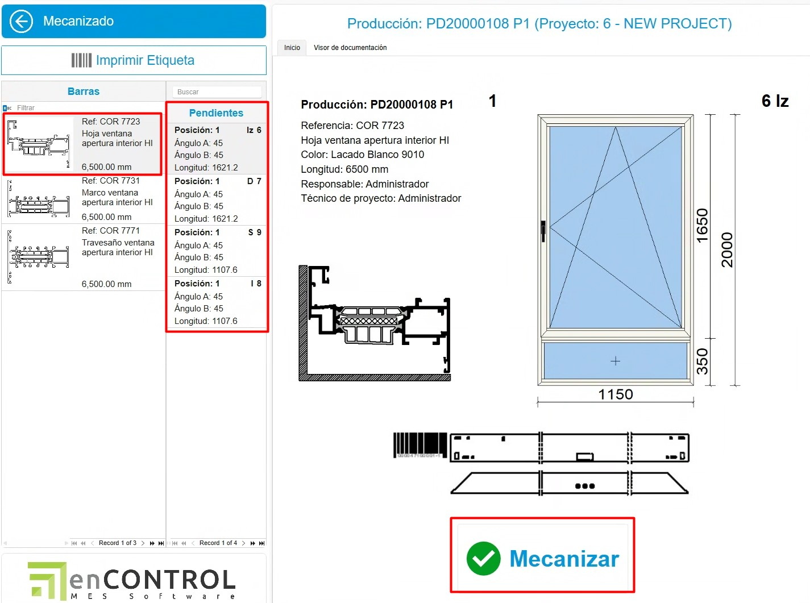
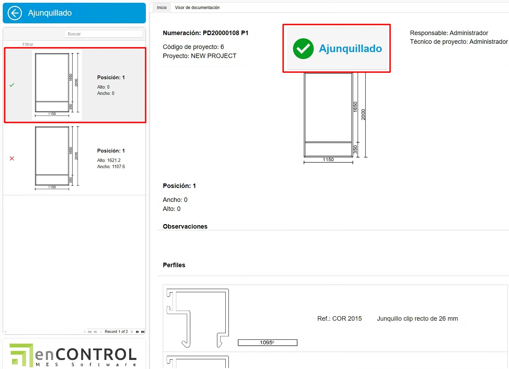
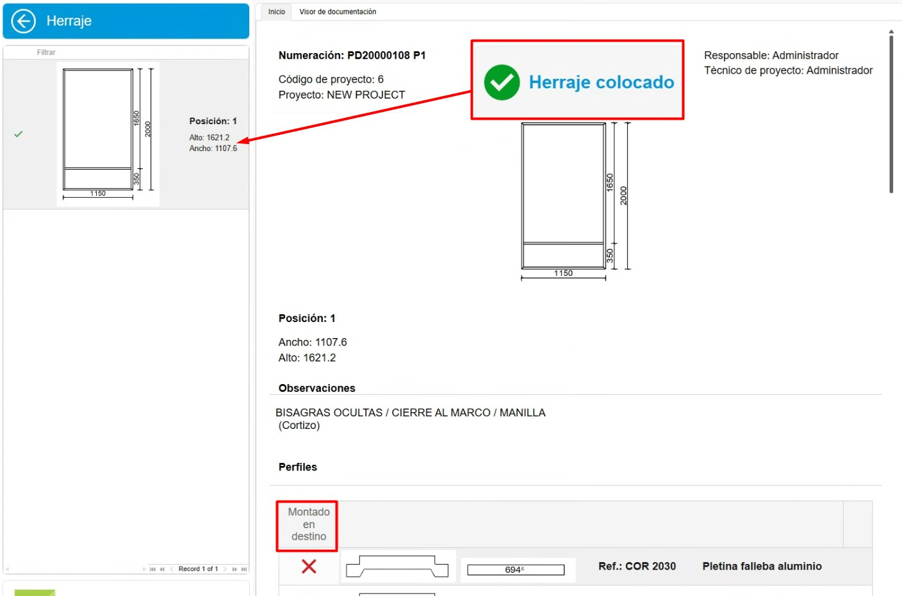

# Sistema di controllo delle scorte enCONTROL

---

## 1. Scopo

Questo manuale è progettato per i nuovi utenti del sistema di controllo delle scorte utilizzato dai Clienti ed Endades. L'obiettivo principale è fornire una guida dettagliata per la gestione efficiente dei progetti, dalla creazione degli ordini all'ottimizzazione del processo produttivo in enCONTROL ed enSITE. Questo documento copre i passaggi necessari per eseguire le operazioni chiave del sistema ed è strutturato in modo sequenziale per facilitarne la comprensione.

---

## 2. Ricezione dei materiali
### 2.1. Ricezione in enSITE

- Una volta creato l'ordine di acquisto, da ENBLAU in **Magazzini**, accedere all'opzione **"In attesa di ricevere"** nella sezione Magazzini. Si aprirà una scheda con tutti i materiali in attesa di essere ricevuti per ogni progetto.

> **Nota:** Per informazioni più dettagliate sugli ordini di acquisto, segui questo link: [2.1. Ordini di acquisto](3.PR_Manual_Stock_ENBLAU.md#21-ordini-di-acquisto)

- **Modalità di ricezione**: Aprire **enSite** dall'officina tramite wifi con la persona incaricata di ricevere l'ordine.
- In **Ricezione ordini**, individuare l'ordine corrispondente (ordinato per data).

- Registrare la ricezione in **Nuova bolla di consegna** creando una bolla dalla sezione **Magazzino**.

- In ENBLAU, la scheda **In attesa di ricevere** di **Magazzini** si sincronizza e non vedrai più i materiali per quell'ordine.
- In **Ordini di Acquisto**, puoi verificare la tracciabilità.
- In **enSite**, indicare le quantità ricevute e l'ubicazione dove verranno stoccati (Magazzino, Piano, Zona, Sottozona...). Successivamente potrai vedere l'ubicazione di ogni materiale.

- Dall'app **enSITE**, è anche possibile cercare per articoli e vedere tutte le ubicazioni dove si trova quell'articolo. Per poi spostare o scalare gli articoli.

     
    

> **In caso di materiali danneggiati o altre anomalie**, puoi allegare documenti o scattare foto e allegarle alla bolla. Poi potrai rivederle da ENBLAU.

### 2.2. Ricezione in ENBLAU

- Da ENBLAU, una volta creato l'ordine di acquisto, è possibile generare una bolla di ricezione materiali dell'ordine.

- Dalla bolla potrai indicare la ricezione di ogni materiale specificando la quantità. Per impostazione predefinita saranno tutti marcati con la quantità dell'ordine.

- Successivamente occorre indicare l'ubicazione della bolla nella scheda magazzini della bolla.

> **Nota:** Per informazioni più dettagliate sulla ricezione dei materiali in ENBLAU, segui questo link: [4.2. Ricezione del materiale](1.PR_Ventas_Compras.md#42-ricezione-del-materiale)

---

## 3. Produzione e enCONTROL

### 3.1. Produzione

- Crea progetti di produzione basati sugli ordini cliente in ENBLAU.
  - Creare produzione.

    

  - Il passo successivo è **Invia in produzione**.

    
    

  - In produzione, si può vedere in **scorta necessaria** i materiali scalati e si può scalare manualmente.

    
    

> **Nota:** Per informazioni più dettagliate sulla creazione della fase di produzione in ENBLAU, segui questo link: [3.5. Produzione](1.PR_Ventas_Compras.md#35-produzione)

### 3.2. enCONTROL

- Apri **enCONTROL**. Appaiono i progetti di produzione. Se sei un utente amministratore, vedrai tutti i progetti, altrimenti solo quelli assegnati.

- Apri il **monitor di controllo**. Puoi aprirlo facendo doppio clic su uno qualsiasi dei filtri (nell'intestazione) o facendo doppio clic sul progetto e selezionando la postazione **Controllo** se l'hai configurata nel computer.

    

    

- Quando si invia in produzione (Officina), viene messo in coda di produzione nella scheda **Gestione Produzione**. Il responsabile di produzione decide la priorità.

    

- Per togliere da "In coda", basta trascinarlo nel pannello "In produzione" e si aprirà una finestra **Attività** per proporre una data, indicare lo stato, la classificazione, ecc.

    

    

- Nella scheda Pianificazione produzione definisci a chi viene assegnato, trascinando i progetti a ciascun responsabile. Devi selezionare il responsabile e trascinare il progetto (si possono selezionare più responsabili con ctrl + tasto destro). Si può anche cambiare la priorità da sinistra a destra e dall'alto in basso:

  

  Per rimuovere il progetto assegnato, devi selezionare il responsabile, selezionare il progetto e usare ctrl + canc.

- Nella scheda Calendario produzione viene mostrato un diagramma di Gantt basato sui tempi di Logikal (nell'esempio) date di ingresso e uscita dalla produzione.

  

- Ottimizza i processi secondo le aree di produzione (taglio, lavorazione meccanica, assemblaggio, ecc.). Nella schermata principale del progetto con doppio clic sul progetto desiderato, si aprirà una finestra Seleziona una postazione. (Le postazioni sono definite come decide il cliente e si vedranno in base all'utente) esempi:

  

- Entrando in qualsiasi postazione si aprirà la schermata con il pulsante **Avvia**:

  

  All'avvio viene conteggiato il tempo fino a quando si mette in pausa o si termina il lavoro.

- Tutte le schermate hanno alcuni campi in comune:
    - Commento - Si può aggiungere un commento e scegliere una gravità nel menu a tendina. L'ultimo commento positivo è quello che sblocca.

      

      

    - Pausa - Mettendo in pausa il lavoro ti obbliga a indicare dall'elenco il motivo della pausa. Poi si può riprendere indicando di nuovo la stessa postazione.

      

    - Termina - Si termina quando finisci il lavoro in quella postazione. Poi si può riprendere indicando di nuovo la stessa postazione.

      

    - Documentazione - Dalla sezione documentazione si potranno vedere i documenti di produzione esportati da Logikal nel visualizzatore di documentazione. Si può anche aggiungere un percorso generico per aggiungere quello che si vuole. Catalogo, manuali, ecc.

      

#### 3.2.1 Postazioni di lavoro

 **1. Preparazione Materiale**

  - Tutto pronto – Segna i materiali con un segno di spunta verde indicando che è pronto.
  - Niente Pronto – Segna i materiali con una X rossa indicando che non è pronto.
  - Ubicazione Materiale – A seconda di come hai configurato enCONTROL, si potrebbe indicare dove ubicare i materiali. Affinché si scalino quei materiali solo da quell'ubicazione.

      

**2. Taglio**

  - Nel taglio si indica la lunghezza della barra e lo scarto dei ritagli. Si apre una finestra di ritagli e si può cambiare la lunghezza secondo necessità.

    

    

  - Poi in ENBLAU **Movimenti** di magazzino si rifletterà un'uscita della barra totale es. 6500 e poi un'entrata dello stesso materiale di es. 4100 come indicato nella postazione di taglio.

    

  - Nella sezione **Tagliati** nella parte destra del monitor viene mostrato l'elenco dei tagli effettuati e si possono stampare le etichette per ogni barra.

    

**3. Lavorazione meccanica**

  - Non si scalano materiali, è semplicemente informativo per tempo. Confronta tempo reale.

    

**4. Montaggio**

  - Si scalano materiali (accessori) per ogni posizione del quadro.

    

  - Nell'elenco dei materiali hai l'opzione di indicare gli articoli che verranno montati in destinazione. Questi materiali verranno poi aggiunti all'elenco della postazione **Picking**.

  

**5. Montaggio guarnizioni**

  - Si scalano materiali (Guarnizioni, spessori, schiuma, ecc.) per quadro.

  

  - Nell'elenco dei materiali hai l'opzione di indicare gli articoli che verranno montati in destinazione. Questi materiali verranno poi aggiunti all'elenco della postazione **Picking**.

    

**6. Assemblaggio**

  - Informazioni del quadro, ma non si scalano materiali.

  

**7. Ferramenta**

  - Si scalano materiali (ferramenta) per anta.

    

  - Nell'elenco dei materiali hai l'opzione di indicare la ferramenta che verrà montata in destinazione. Questi materiali verranno poi aggiunti all'elenco della postazione **Picking**.

    

**8. Saldatura**

  - Non si scalano materiali, è semplicemente informativo per tempo. Confronta tempo reale.

    

**9. Controllo finale**

  - Non si scalano materiali. Ma, una volta terminato il controllo si può ubicare in Magazzino e poi stampare un'etichetta del prodotto finito.

     

    

    

  - Da ENBLAU nella sezione Magazzini nella sezione **Prodotto finito** ci sono due elenchi:

      **Ubicazione prodotti:** Mostra dove è ubicato il prodotto finito di ogni progetto e produzione. Da questo elenco si può dare uscita, spostare di ubicazione e aprire il documento di produzione, selezionando sulla posizione con il tasto destro.

      

      **Movimenti prodotti:** Mostra i movimenti del prodotto finito come entrata, trasferimento, uscita e reso. Da questo elenco si può fare un reso, selezionando sulla posizione di uscita con il tasto destro.

      

**10. Trasformazione**

  - In questa postazione puoi indicare un gruppo di materiali o distinta base per trasformare in un prodotto, esempio: Ringhiera.

    

  - Come in altre postazioni nell'elenco dei materiali hai l'opzione di indicare gli articoli che verranno montati in destinazione. Questi materiali verranno poi aggiunti all'elenco della postazione **Picking**. Inoltre di poter poi stampare l'etichetta e ubicare il prodotto.

**11. Pulizia**

  - Non si scalano materiali, è semplicemente informativo per tempo. Confronta tempo reale.

    

**12. Picking**

  - La postazione mostra l'elenco dei materiali marcati precedentemente in altre postazioni che verranno montati in destinazione.

    
  
  - Puoi creare i pacchi e assegnare per ogni materiale. E poi stampare l'etichetta per il pacco.

    

    - Indicare l'ubicazione di picking per ogni materiale.

      

**13. Lavagna**

  - Mostra l'evoluzione di ogni progetto e il suo stato.

    

**14. Controllo**

  - Apre il monitor Controllo progetti. Dove si può anche vedere lo stato di ogni progetto che è in fabbrica.

    

> **Nota**: Assegna priorità e risorse per garantire la fluidità nella produzione.

> **Configurazione enCONTROL** - Configurare enCONTROL preventivamente. Per maggiori informazioni, segui questo link: [2. Configurazione Iniziale di enCONTROL](/Configurazioni/2.%20CO_Configuracion_Inicial_enCONTROL/) :

> **Gestione dei filtri** - Usare filtri e filtri personalizzati per ottimizzare la ricerca negli elenchi. Per maggiori informazioni, segui questo link: [4. Gestione dei filtri](/Utilita/4.UT_Gestion_Filtros/)

---

## 4. Controllo scorte e report

- Monitora le scorte necessarie dalla sezione "Produzione".
- Identifica materiali riservati e in attesa in tempo reale.
- Genera report di inventario per valutare l'utilizzo dei materiali e pianificare futuri acquisti.

---

## 5. Risoluzione dei problemi comuni

- **Errore nell'importazione dei riferimenti**: Verifica che i riferimenti siano configurati nel database.
- **Materiali in eccesso o mancanti**: Assicurati di registrare correttamente le ubicazioni e le quantità quando ricevi i materiali.
- **Problemi con il layout del magazzino**: Rivedi la configurazione delle zone e regola secondo necessità.

---

## 6. Conclusione

Questo manuale offre una guida passo passo per i processi principali nel sistema di controllo delle scorte. Seguendo queste istruzioni, gli utenti potranno gestire efficientemente gli inventari, migliorare la produzione e ottimizzare il rapporto con i fornitori. Per supporto aggiuntivo, contattare l'amministratore del sistema.
