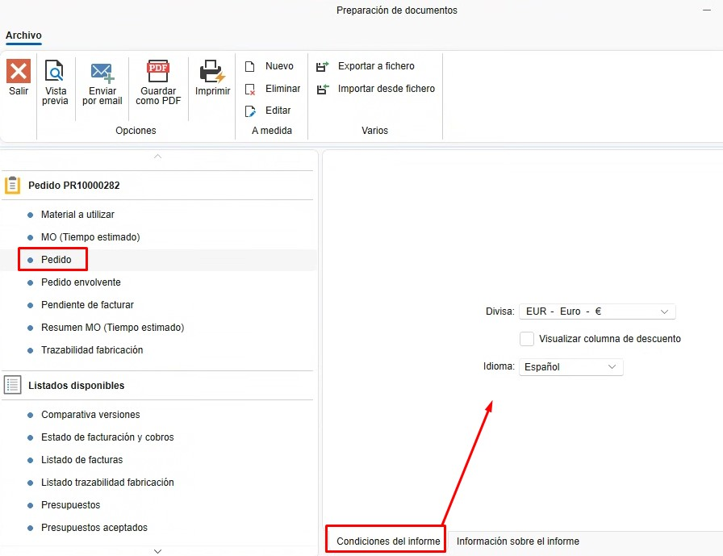

# Report

---

## 1. Introduzione
Questo manuale è progettato per guidare gli utenti su come generare documenti e report in ENBLAU. In questo modo, possono essere stampati o inviati via email.

---

## 2. Tipi di report
Per ogni documento di vendita o acquisto, è possibile generare diversi tipi di report secondo necessità.

### 2.1. Documenti di vendita
- Preventivo
- Ordine
- Misurazione
- Produzione
- Bolla di consegna
- Fattura

### 2.2. Documenti di acquisto
- Ordine
- Bolla di consegna
- Fattura

---

## 3. Stampare/Salvare/Inviare report
Da qualsiasi elenco di documenti (ad esempio, Documenti di vendita), seleziona qualsiasi tipo di documento e fai clic su **Stampa**.

  

### 3.1. Preparazione del documento
Nella finestra **Preparazione documenti**, appare un elenco di report nella parte destra della finestra relativi al documento.

  

#### 3.1.1. Condizioni del report
- Selezionando il tipo di report, nella scheda "Condizioni del report" vengono mostrate le condizioni che il documento deve soddisfare per poter essere emesso.

  

#### 3.1.2. Informazioni sul report
- Per ogni tipo di report, nella scheda "Informazioni sul report" viene mostrata una breve spiegazione sul report.

  

#### 3.1.3. Anteprima
- Prima di stampare o inviare il report via email, puoi fare un'anteprima per verificare il documento.

  

#### 3.1.4. Salvare come PDF
- Esiste l'opzione di salvare come PDF. Questa opzione aprirà il percorso predefinito relativo al documento di vendita o acquisto. (È possibile modificare questo percorso durante l'esportazione).

  

#### 3.1.5. Stampare
- Per stampare i report, seleziona il pulsante **Stampa**, scegli la stampante che hai configurato nel server e stampalo.

  

#### 3.1.6. Inviare via email
- Per inviare il report via email, seleziona **Invia via email**. Si aprirà una finestra "Nuova email" con l'email dell'utente predefinita (questa configurazione è stata effettuata precedentemente nella sezione "Account email". Per maggiori informazioni, segui questo link: [1. Configurazione Iniziale di ENBLAU](/Configurazioni/1.%20CO_Configuracion_Inicial_ENBLAU)).

  

- Dalla finestra "Nuova email", puoi allegare altri documenti, scrivere nel corpo dell'email, aggiungere email in copia, ecc.

---