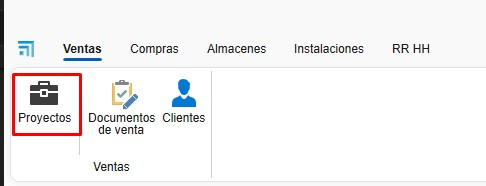
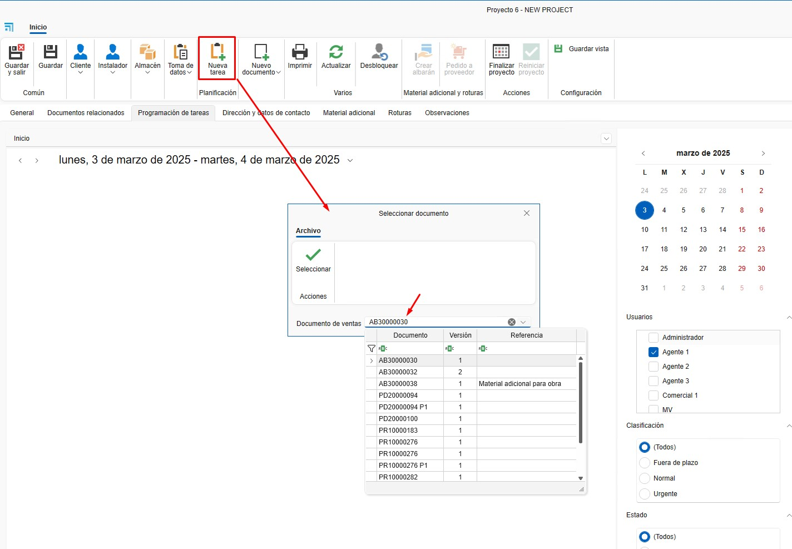

# Progetti, Clienti e Fornitori

---

## 1. Introduzione
Questo manuale è progettato per guidare gli utenti nella creazione di Progetti, Clienti e Fornitori in ENBLAU. In questo modo, possono essere correttamente assegnati ai documenti di vendita e acquisto.

---

## 2. Progetti
Il progetto è come il "cantiere". A un progetto si possono associare tutti i documenti di vendita e acquisto necessari.

### 2.1. Creazione di progetti
- Dalla sezione Vendite, puoi accedere a Progetti.

  

#### 2.1.1. Nuovo progetto
- Crea un progetto dal pulsante "Nuovo".

  

- Assegna un nome e seleziona il cliente.

  

#### 2.1.2. Dettagli del progetto
- Dalla scheda **Generale**:
  - Azienda
  - Tecnico di cantiere
  - Commerciale
  - Responsabile acquisti
  - Responsabile fatturazione
  - Ecc.

  

#### 2.1.3. IVA e ritenuta
- Puoi confermare l'IVA e la ritenuta con il cliente per il progetto, il che potrebbe evitare errori nelle fatture.

  

#### 2.1.4. Documentazione del progetto
- Da **Documentazione del progetto**, puoi caricare documentazioni, manuali, ecc., tutto ciò che è relativo al progetto.

  

- Con un doppio clic sulla cartella principale, si apre il percorso dove si trova l'ID del cantiere.

  

- Le sottocartelle possono essere create direttamente nel percorso o precedentemente dalla configurazione nei progetti **Directory predefinite**.

  

### 2.2. Documenti correlati
#### 2.2.1. Documenti di vendita e acquisto
- Tutti i documenti relativi al progetto sono raggruppati qui.

  

#### 2.2.2. Programmazione delle Attività
- Gestisce le attività associate al progetto. Le attività possono essere assegnate per documento.

  
  
  

---

## 3. Clienti
Il cliente è associato a uno o più progetti.

### 3.1. Creazione del cliente
- Dalla sezione Vendite, puoi accedere a Clienti.

  

#### 3.1.1. Nuovo cliente
- Crea un cliente dal pulsante "Nuovo".

  

#### 3.1.2. Dettaglio del cliente
- Assegna un nome e compila i campi necessari del cliente.
  - Nome
  - Nome Commerciale
  - Indirizzo
  - Codice Fiscale/Partita IVA
  - Ecc.

  

#### 3.1.3. Altri dati
- Si possono compilare altri dati del cliente accedendo ad altre schede.
  - Dati di contatto
  - Altri contatti
  - Dati bancari
  - Informazioni commerciali
  - Ecc.

  

#### 3.1.4. Documentazione
- Da **Documentazione**, puoi caricare documentazione relativa al cliente.

  

- Con un doppio clic sulla cartella principale, si apre il percorso dove si trova il codice del cliente.

  

---

## 4. Fornitori
Il fornitore è associato a uno o più progetti.

### 4.1. Creazione del fornitore
- Dalla sezione Acquisti, puoi accedere a Fornitori.

  

#### 4.1.1. Nuovo fornitore
- Crea un fornitore dal pulsante "Nuovo".

  

#### 4.1.2. Dettaglio del fornitore
- Assegna un nome e compila i campi necessari del fornitore.
  - Nome
  - Nome Commerciale
  - Indirizzo
  - Codice Fiscale/Partita IVA
  - Ecc.

  

#### 4.1.3. Altri dati
- Si possono compilare altri dati del fornitore accedendo ad altre schede.
  - Dati di contatto
  - Altri contatti
  - Dati bancari
  - Informazioni commerciali
  - Ecc.

  

#### 4.1.4. Documentazione
- Da **Documentazione**, puoi caricare documentazione relativa al fornitore.

  

- Con un doppio clic sulla cartella principale, si apre il percorso dove si trova il codice del fornitore.

  

---