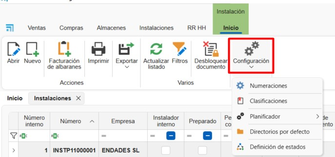
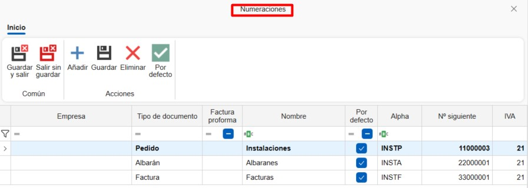

# Installazioni

## 1. Introduzione
Questo manuale è progettato per guidare gli utenti nella creazione e pianificazione di installazioni e montaggi da ENBLAU. In questo modo, le installazioni pianificate possono essere assegnate a installatori interni ed esterni attraverso la piattaforma.

---

## 2. Installazioni
Nel modulo **Installazioni** puoi accedere a:

- **[Installazione](#21-installazione)**
- **[Installatori Esterni](#22-installatori-esterni)**
- **[Pianificatore di Installazione](#23-pianificatore-di-installazione)**

### 2.1. Installazione

#### 2.1.1. Configurazioni
Da **Installazione** puoi accedere a **Configurazioni** per definire i parametri del sistema.

**1. Sequenze di Numerazione**
Definisci sequenze di numerazione per ogni tipo di documento.

**2. Classificazioni**
Stabilisci classificazioni da assegnare ai documenti di installazione.

**3. Pianificatore**
Definisci **Classificazioni** e **Stati** per le attività del pianificatore.

> **ℹ️ Nota:** Queste classificazioni e stati saranno disponibili quando si crea una nuova attività nel **Pianificatore di Installazione**.

**4. Directory Predefinite**
Configura le cartelle che verranno generate automaticamente con ogni installazione.

> **ℹ️ Nota:** Le directory predefinite sono cartelle che vengono generate automaticamente con ogni nuova installazione.

**5. Definizione Stati**
Configura gli stati disponibili per ogni tipo di documento.

#### 2.1.2. Creare un Ordine di Installazione

**1. Nuovo**
Per creare un'installazione, vai a **Installazione → Nuovo**. Si aprirà una finestra in cui devi completare i campi obbligatori:
- Tipo documento
- Numerazione
- Numero documento
- Installatore esterno
- Progetto

**2. Ordine di Installazione**

Nella barra superiore del documento, sono disponibili alcune funzioni:
- Stampa → Stampa report del documento di installazione.
- Prezzi → Modifica i prezzi predefiniti dell'Installatore Esterno.
- Nuova Previsione → Crea una previsione di installazione da riflettere nel pianificatore di installazioni.

***Scheda Dettagli***
Questa scheda mostra tutti i campi precedentemente completati (modificabili). In basso puoi aggiungere posizioni definendo:
- Nome articolo
- Descrizione
- Unità
- Prezzo, ecc.

***Scheda Stati e Osservazioni***
Questa scheda configura campi come:
- Metodo di pagamento
- Date di richiesta e cancellazione
- IVA, ecc.

***Scheda Pianificazione***
Qui indichi le date di inizio e fine per la pianificazione e assegni installatori interni.

***Scheda Osservazioni per Installazione***
Spazio per aggiungere note specifiche per l'installazione.

**3. Bolla di Installazione**

Da un ordine di installazione, puoi generare una bolla di installazione. Specifica la modalità di bollatura e poi stampala.

**4. Fatture Installatori Esterni**

- Dalla sezione **Installazione**, vai a **Fatturazione Bolle**.

      

- Da **Fatturazione Bolle**, indica l'installatore esterno a cui verrà emessa la fattura.

      

- Apparirà un elenco delle bolle da fatturare per l'installatore selezionato. Indica nella colonna **Da Fatturare** cliccando e selezionando la casella per le bolle da fatturare. Ci sono anche opzioni nei pulsanti della barra superiore per *Seleziona Tutto* o *Deseleziona Tutto*.

      

- Prima di generare la fattura, puoi specificare la modalità **Raggruppa contenuto per bolla** (selezionata per impostazione predefinita) o **Contenuto Dettagliato**. Puoi anche indicare a quale progetto emettere la fattura.

      

- Una volta generata la fattura, puoi stamparla o modificarla se necessario.

      

#### 2.1.4. Creare Installazione da un Documento di Vendita
Da un documento di vendita (ordine, misurazione o produzione) puoi:

- Creare una previsione di installazione
- Creare un'installazione direttamente

**1. Previsione di Installazione**

Ti permette di indicare una previsione configurando:

- Installatore esterno
- Data stimata
- Importi concordati

**2. Crea Installazione**

Quando crei l'installazione da un documento di vendita, devi indicare le unità da installare per ogni posizione. Successivamente, puoi aggiungere installatori esterni o interni a quell'installazione.

#### 2.1.3. Stampare Report di Installazione
Permette la stampa dei report disponibili:

- Report di Installazione
- Report dei Tempi
- Ordine di Installazione

Prima della stampa, vengono mostrate le condizioni e una breve descrizione del report selezionato.

---

### 2.2. Installatori Esterni
Per registrare nuovi installatori esterni:

1. Vai a **Installazione → Installatori Esterni → Nuovo**
2. Completa i campi richiesti:

      - Nome
      - Indirizzo
      - Partita IVA (NIF)
      - Dati di contatto
      - Prezzi, ecc.

         

---

### 2.3. Pianificatore di Installazioni
Da **Installazioni → Pianificatore di Installazioni** puoi visualizzare e gestire le attività in un calendario per ogni installatore (interno o esterno).

Dalla barra delle opzioni, puoi organizzare la visualizzazione del calendario (giorno, settimana, mese) e raggruppare le attività per risorse o date.

**1. Crea Attività**

Per creare una nuova attività:

- Seleziona **Nuova Attività**
- Nella finestra *Nuovo Evento di Installazione*, assegna:

      - Installatore
      - Numero installazione
      - Progetto

         

- Nella finestra *Attività*, dettaglia:

      - Stati e classificazioni
      - Data e ora di inizio/fine
      - Descrizione breve
      - Note

         

**2. Calendario**

Le attività assegnate appaiono nel calendario. Passando il cursore su un'attività, vengono visualizzate informazioni di base:

- Nome progetto
- Numero installazione
- Descrizione breve

I colori indicano lo stato e la classificazione (definiti in precedenza nella configurazione). Puoi anche modificare facendo doppio clic sull'attività.

