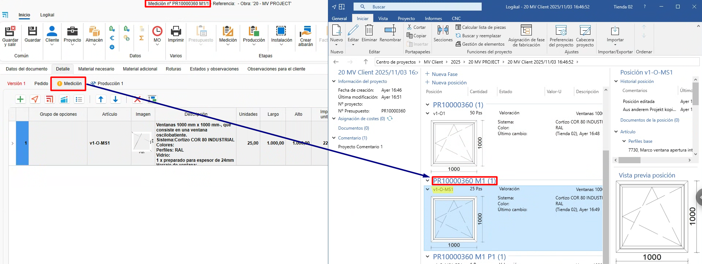
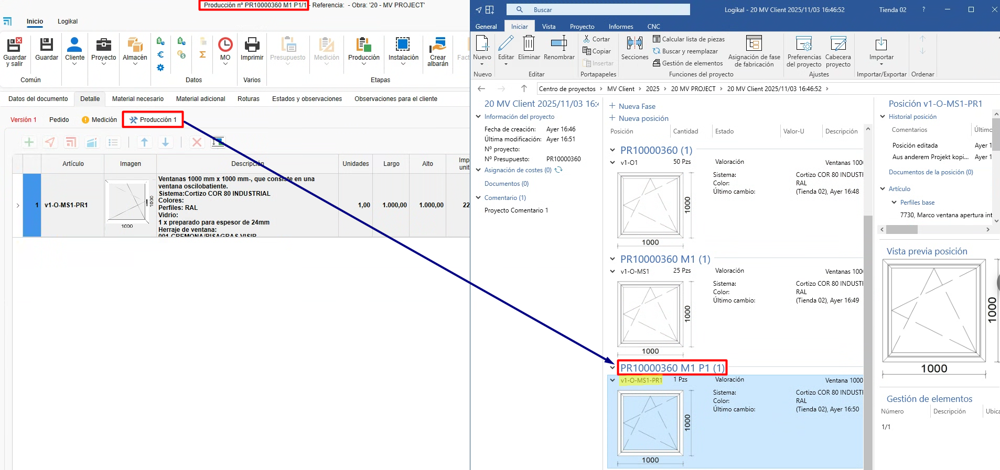
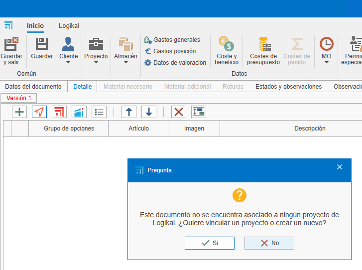

# Relazione tra fasi e progetto in ENBLAU e Logikal

---

## 1. Introduzione
Spiegazione della relazione tra le fasi di un progetto in ENBLAU e Logikal.

---
## 2. Modalità di lavoro in Logikal

### 2.1. Modalità per fasi (modalità predefinita)
La modalità per fasi sposta le posizioni e le quantità di ogni fase del documento ENBLAU nelle fasi del progetto in Logikal.

- Creare un preventivo da ENBLAU:

  **1. Versione 1**  
      - Alla creazione di un preventivo in ENBLAU, questa versione sarà visualizzata in Logikal in *"Posizioni (1)"* all'interno dello stesso progetto.  
        

  **2. Ordine**  
      - Confermando l’ordine in ENBLAU, verrà generato un ordine e successivamente una fase in Logikal denominata *"Preventivo accettato"*. Le posizioni verranno spostate dalla fase precedente alla fase successiva dell’ordine.
        

  **3. Produzione 1**  
      - Dall’ordine in ENBLAU, creando una produzione, verrà generata una nuova fase in Logikal chiamata *"nº preventivo P1"*. Le posizioni e le quantità indicate verranno spostate dalla fase precedente alla fase successiva di produzione.
        

  **4. Misurazione 1**  
      - Dall’ordine in ENBLAU, creando una misurazione, verrà generata una nuova fase in Logikal chiamata *"nº preventivo M1"*. Le posizioni e le quantità indicate verranno spostate dalla fase precedente alla fase successiva di misurazione.
        

  **5. Produzione 2**  
      - Dalla misurazione in ENBLAU, creando una produzione (considerando le modifiche nella misurazione), verrà generata una nuova fase in Logikal con il nome *"nº preventivo M1 P2"*. Le posizioni e le quantità indicate verranno spostate dalla fase precedente alla fase successiva di produzione.
        

> ⚠️ **Importante!** In questa modalità le posizioni eliminate da ENBLAU vengono rimosse definitivamente in Logikal.

---

### 2.2. Modalità per progetti
La modalità per progetti sposta le posizioni e le quantità di ogni fase del documento ENBLAU, ma in Logikal viene creato un progetto (con lo stesso numero di preventivo) per ogni fase di ENBLAU.

- Creare un preventivo da ENBLAU:

  **1. Versione 1**  
      - Alla creazione di un preventivo in ENBLAU, questa versione sarà visualizzata come progetto in Logikal nella fase *"Posizioni (1)"*.  
        

  **2. Ordine**  
      - Confermando l’ordine in ENBLAU, verrà generato un ordine e successivamente un nuovo progetto in Logikal con lo stesso *"nº preventivo"*.
        

  **3. Misurazione 1**  
      - Dall’ordine in ENBLAU, creando una misurazione, verrà generato un nuovo progetto in Logikal con lo stesso numero di *"nº preventivo M1"* con le posizioni e le quantità indicate dalla fase precedente alla fase successiva di misurazione in ENBLAU.
        

  **4. Produzione 1**  
      - Dalla misurazione in ENBLAU, creando una produzione (considerando le modifiche nella misurazione), verrà generato un nuovo progetto in Logikal con lo stesso numero di *"nº preventivo M1 P1"* con le posizioni e le quantità indicate dalla fase precedente alla fase successiva di produzione in ENBLAU.
        

> ℹ️ **Nota:** Questa modalità può causare un leggero rallentamento a seconda della quantità di posizioni e unità del documento.

### 2.3. Modalità per fasi duplicando le posizioni
La modalità per fasi duplicando le posizioni copia le posizioni e le quantità di ogni fase del documento ENBLAU nelle fasi del progetto in Logikal, mantenendo sempre una copia in ogni fase.

- Creare un preventivo da ENBLAU:

  **1. Versione 1**  
      - Alla creazione di un preventivo in ENBLAU, questa versione sarà visualizzata in Logikal in *"Posizioni (1)"* all'interno dello stesso progetto.  
        

  **2. Ordine**  
      - Confermando l’ordine in ENBLAU, verrà generato un ordine e successivamente una fase in Logikal denominata *"Preventivo accettato"*. Le posizioni verranno copiate dalla fase precedente alla fase successiva dell’ordine.
        

  **3. Misurazione 1**  
      - Dall’ordine in ENBLAU, creando una misurazione, verrà generata una nuova fase in Logikal denominata *"nº preventivo M1"*. Le posizioni e le quantità indicate verranno copiate dalla fase precedente alla fase successiva di misurazione.
        

  **4. Produzione 1**  
      - Dalla misurazione in ENBLAU, creando una produzione (considerando le modifiche nella misurazione), verrà generata una nuova fase in Logikal con il nome *"nº preventivo M1 P2"*. Le posizioni e le quantità indicate verranno copiate dalla fase precedente alla fase successiva di produzione.
        

> ℹ️ **Nota:** Questa modalità può causare un leggero rallentamento a seconda della quantità di posizioni e unità del documento.

> ⚠️ **Importante!** In questa modalità le posizioni eliminate da ENBLAU vengono rimosse definitivamente in Logikal.

## 3. Creazione del progetto in Logikal
Alla creazione di un preventivo in ENBLAU e successiva aggiunta di una posizione di Logikal, questa sarà collegata a un progetto in Logikal o, in caso contrario, ne verrà creato uno nuovo.

  

  

  

---
