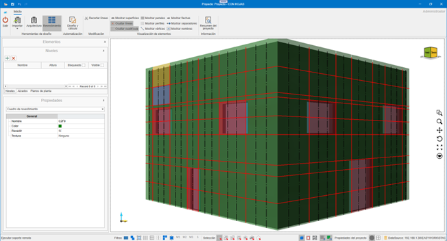
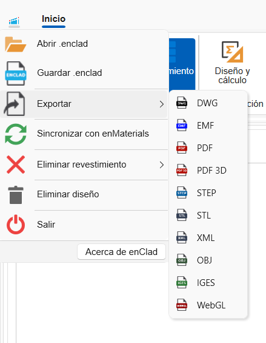
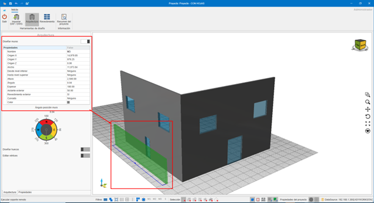
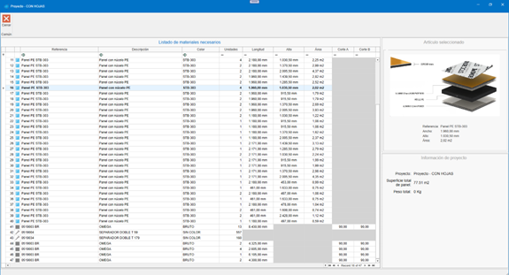
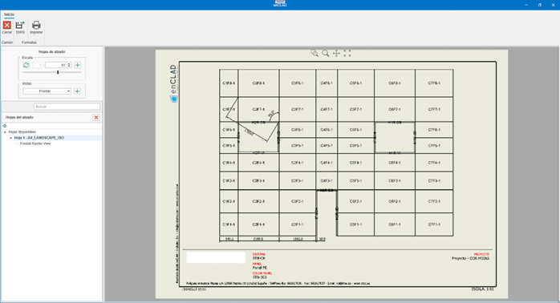
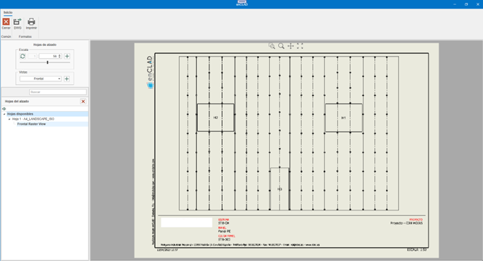
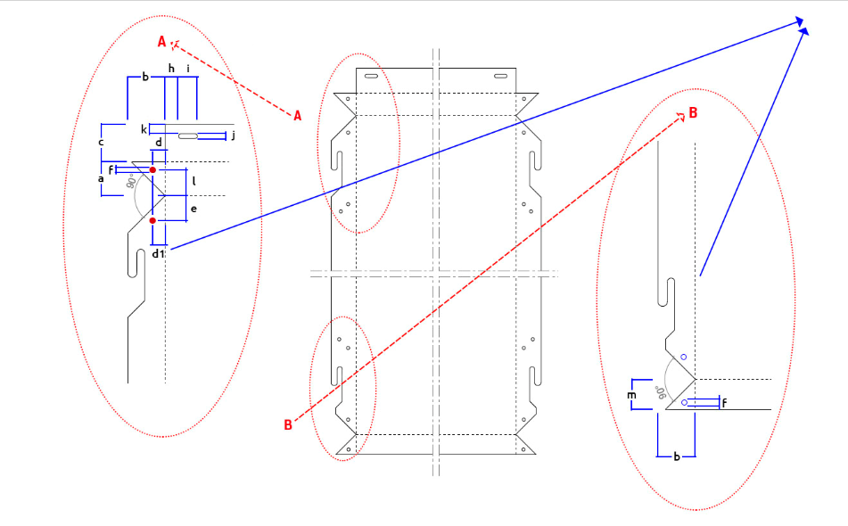
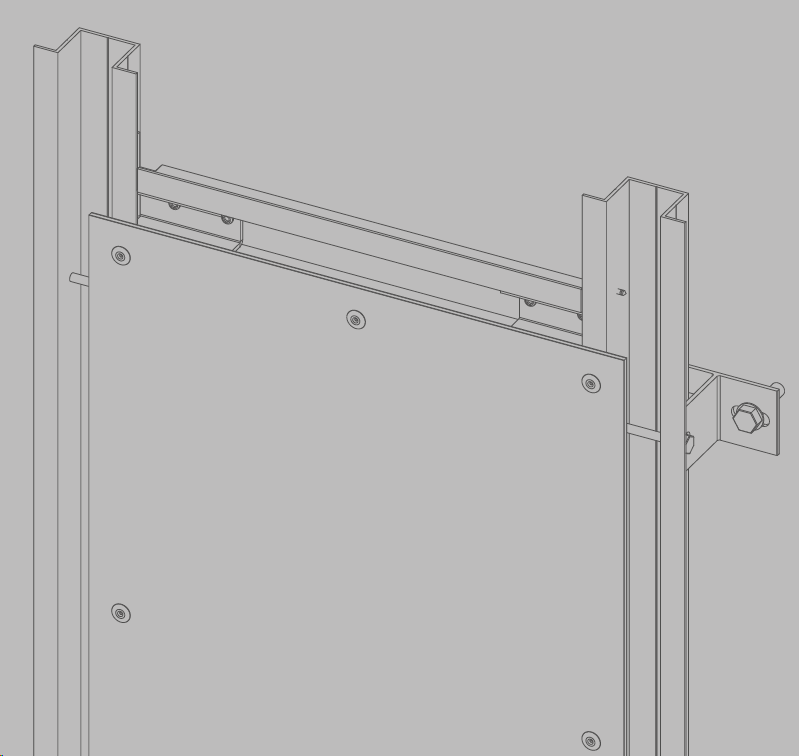

# enCLAD

---

## 1. Introduzione

Lo scopo di questo documento è fornire conoscenze di base sul funzionamento di **enCLAD**, per semplificare la gestione dei processi nel rivestimento di un edificio.

Prima di iniziare a lavorare con enCLAD, è necessario disporre di un database con i sistemi e i materiali definiti in **enMATERIALS**.

---

## 2. Nomenclature specifiche di enCLAD

### 2.1. Linea maestra
Guide utilizzate per il disegno delle impronte dell'edificio o dei montanti intermedi.

- **Linee di taglio**: colore rosso, continue
- **Linee di rinforzo**: colore nero, discontinue

  

### 2.2. Quadro di rivestimento
Area situata tra le linee.

- **Verde**: zone da rivestire
- **Rosso**: zone non rivestite
- **Proprietà Rivestire**: `Sì / No`

  Utilizzato per il calcolo automatico dei pannelli dal pulsante **Progettazione e calcolo**.

  

### 2.3. Superficie di rivestimento
Zona visibile del rivestimento, indipendente dal muro strutturale.

Proprietà modificabili:

- **Coronamento**
- **Altezza di coronamento**
- **Distanza dal muro**

  

### 2.4. Foro di rivestimento
Questo foro è indipendente dal foro originale nel muro strutturale e dal foro disegnato sulla superficie di rivestimento.

Include proprietà automatiche come ad esempio:

- **Contorni**
- **Stipite**
- **Architrave**
- **Davanzale**

  

### 2.5. File `.enclad`
Formato proprio di enCLAD per l'archiviazione e lo scambio.

> **Importante!**⚠️ Richiede lo stesso database di sistemi e materiali per aprirsi correttamente.

---

## 3. Funzionamento e Navigazione

### 3.1. LogIn

Schermata di accesso con nome utente e password.

  

### 3.2 Home

Vista principale dopo l'accesso all'applicazione.

  

---

## 4. Menu Superiore

Contiene tutte le azioni sul progetto.

### 4.1. Pulsante Menu

**Progetto:**

- **Apri:** Apre un progetto salvato in formato `.enclad`.
- **Salva:** Salva il progetto attualmente aperto in formato `.enclad`.
- **Esporta:** Esporta le informazioni del progetto secondo il formato selezionato.

  

**Formati di esportazione:**

- **DWG**: Esporta la vista corrente del progetto in DWG. Formato AutoCAD.
- **EMF**: Esporta la vista corrente del progetto in EMF. Formato immagine file di Windows.
- **PDF**: Esporta la vista corrente del progetto in PDF. Formato file Adobe (Portable Document Format).
- **PDF 3D**: Esporta il progetto corrente in PDF 3D. Formato 3D dei file Adobe.
- **STEP**: Esporta il progetto corrente in STEP. Standard for the Exchange of Product Data, noto anche come ISO 10303.
- **STL**: Esporta il progetto corrente in STL. Formato di trasmissione dati standard per eccellenza nell'industria della prototipazione rapida.
- **XML**: Esporta il progetto corrente in XML. (Extensible Markup Language). Memorizza i dati in modo che possano essere letti sia da computer che da persone. Un file .xml è un formato di dati basato su testo compatibile con la maggior parte degli editor di testo.
- **OBJ**: Esporta il progetto corrente in OBJ. L'estensione OBJ è un formato di file immagine 3D.
- **IGES**: Formato di file per software di Computer Aided Design (CAD).
- **WebGL**: Standard web aperto per visualizzare grafica in qualsiasi browser compatibile, senza bisogno di plugin aggiuntivi.

  

### 4.2. Esporta pannelli
Esporta i pannelli sviluppati in formato DWG, secondo i valori selezionati nella finestra di esportazione, pronti per essere inviati al taglio.

  

  

  

- Configurazione dei layer per l'esportazione in DWG.

  

- Esporta pannelli in DWG
- Esporta irrigidimenti in DWG
- Esporta pannelli in XML
- Esporta irrigidimenti in XML

  

### 4.3. Elimina rivestimento
Il menu a discesa **Elimina rivestimento** offre diverse possibilità. Eliminare parti di un rivestimento, o l'intero rivestimento.

Opzioni:

- **Linee:** Ci dà la possibilità di eliminare le linee di rivestimento dal nostro progetto. Eliminare le linee di rivestimento implica l'eliminazione dei materiali che dipendono da questa linea, come montanti o ancoraggi.
- **Quadri:** Eliminando i quadri di rivestimento non si elimina alcun materiale. Questi quadri sono solo le aree definite che verranno pannellizzate durante il calcolo dei pannelli. Una volta creati i pannelli, non ne avremo bisogno e potremo eliminarli.
- **Fori:** Elimina i fori dalla superficie di rivestimento. Se abbiamo già i pannelli necessari, non è necessario avere i fori di rivestimento.
- **Pannelli:** Elimina i pannelli dal progetto.
- **Rivestimento completo:** Elimina il rivestimento dal/dai muro/i selezionato/i, o in mancanza da tutti i muri. Superficie di rivestimento e suoi fori, linee di rivestimento, quadri di rivestimento, pannelli, montanti, ancoraggi, ...

  

### 4.4. Elimina progetto

Elimina tutto il contenuto del progetto.

---

## 5. Strumenti di Progettazione

Permettono la costruzione dell'edificio.

### 5.1. Importa DXF / DWG

Importa:

- Livelli
- Muri
- Fori
- Linee maestre

  

**Requisiti DXF / DWG**
- Muri come polilinee chiuse a 4 vertici.
- Fori come polilinee chiuse
- Testo interno per il nome del muro: `Name: "Muro Nord"`
- Livelli definiti da riquadri con:
  - `N: "Nome Livello", "Altezza"`

  

  

---

## 6. Architettura

### 6.1. Progetta muri
Creazione manuale di muri sul livello selezionato.

  

### 6.2. Progetta fori
Fori in muri strutturali o superfici di rivestimento.

  

### 6.3. Modifica vertici
Modifica di vertici indipendenti di muri strutturali, fori e della superficie di rivestimento.

  

---

## 7. Rivestimento

### 7.1. Automazione

#### 7.1.1. Progettazione e calcolo

Automazione del calcolo del rivestimento dell'edificio. Utilizzando la procedura guidata di progettazione e calcolo possiamo ottenere in modo automatizzato il rivestimento necessario per i muri che abbiamo selezionato in quel momento, o per tutti i muri dell'edificio in mancanza.

  

  - Verranno disegnate le linee importate dal file CAD e verrà creata una superficie di rivestimento se necessario.

  

  - Modulazione importata.

  

##### 7.1.2. Progettazione rapida
La progettazione rapida ci permette di ottenere un calcolo della modulazione dell'edificio, per ottenere un'approvazione iniziale da parte dell'architetto/cliente coinvolto.

  

Opzioni:

- **Inizializza superficie:** Inizializza una superficie di rivestimento, alla distanza indicata in base all'arretramento della facciata indicato. Questo arretramento sarà a faccia vista del pannello.
- **Inizializza linee:** Inizializza le impronte orizzontali e verticali che definiranno il nostro modello. Nella progettazione rapida vengono calcolate solo le impronte (linee di taglio).
  Le linee possono essere di taglio o di rinforzo. Le linee di taglio definiranno le impronte del modello, le linee di rinforzo definiranno i montanti intermedi. Le linee saranno calcolate in base ai fori e alle dimensioni dei pannelli scelti.
- **Inizializza quadri:** I quadri saranno calcolati in base alle linee di rivestimento e saranno gli spazi definiti tra di esse.
- **Inizializza pannelli:** I pannelli saranno calcolati per ciascuno dei quadri del progetto, a patto che non abbiamo impostato alcun quadro come 'Non rivestire'. Terrà conto dei fori o dei contorni che si trovano al loro interno. Trattandosi di una progettazione rapida, questo calcolo dei pannelli non prevede ali o lavorazioni. Ci mostrerà solo una vista frontale della modulazione calcolata.

> **Nota:** Non include ali o lavorazioni.

##### 7.1.3. Calcolo completo
Il calcolo completo ci fornirà sia la modulazione, sia il calcolo reale dei pannelli e tutta la sottostruttura necessaria per realizzare il nostro progetto. I controlli che troviamo da gestire differiscono dai controlli della progettazione rapida.

  

Include:

- **Inizializza pannelli:** Saranno calcolati come nella progettazione rapida, ma calcolandoli completamente, ci fornirà le ali necessarie e altre informazioni da inviare al taglio.
- **Calcola rinforzi:** Calcola i rinforzi necessari tra le impronte.
- **Calcola profili:** Disegna i profili necessari.
- **Calcola ancoraggi:** Disegna gli ancoraggi necessari.

---

### 7.2. Parametri di Progettazione Rapida

  

- **Sistema**: Selezione del sistema di rivestimento.
- **Pannello**: Selezione del pannello per rivestire.
- **Colore**: Colore del pannello.
- **Selezione Dimensioni**: Dimensioni pannello disponibili.

  

- **Contorni**: Contorni da applicare sulla superficie di rivestimento. Possono essere modificati successivamente selezionando la superficie di rivestimento.
- **Distanza estremità**: Distanza dell'impronta/rinforzo dalle estremità.
- **Distanza coronamento**: Distanza dell'impronta dal coronamento della facciata.
- **Distanza inferiore**: Distanza dell'impronta dal bordo inferiore della facciata.
- **Montanti estremi**: Indica se posizionare o meno il montante alle estremità.
- **Montanti estremi dividono**: Indica se convertire il montante d'estremità in un'impronta.
- **Regola orizzontali a fori o contorni**: Regola le impronte orizzontali su fori o contorni.
- **Regola verticali a fori o contorni**: Regola le impronte verticali su fori o contorni.
- **Muro guida**: Indica il muro da cui verranno stabilite le impronte orizzontali. Se non si sceglie nessuno, ogni muro verrà calcolato separatamente.

  

- **Ottimizzazione**: Indica come utilizzeremo i relativi pannelli o bobine.
- **Freccia**: Indica la direzione della freccia del pannello per l'ottimizzazione.
- **Lunghezza massima**: Lunghezza massima del pannello da utilizzare.
- **Distanza impronta**: Larghezza dell'impronta. Inizialmente ottenuta dal sistema scelto, e qui vengono indicati i parametri minimo e massimo.
- **Modalità di calcolo**: Migliore ottimizzazione.

---

### 7.3. Parametri di Calcolo Completo

  

- **Montante**: Montanti disponibili in base al sistema. Intercambiabile dopo il calcolo. Successivamente, può essere modificato selezionando la superficie di rivestimento.
- **Montante intermedio**: Montanti intermedi disponibili in base al sistema. Successivamente, può essere modificato selezionando la superficie di rivestimento.

  

- **Arretramento facciata**: Arretramento del rivestimento alla faccia vista del pannello. Successivamente, può essere modificato selezionando la superficie di rivestimento.
- **Spessore isolante**: Spessore dell'isolante da utilizzare. Successivamente, può essere modificato selezionando la superficie di rivestimento.
- **Distanziatore**: Distanziatori disponibili in base all'arretramento della facciata. Successivamente, può essere modificato selezionando la superficie di rivestimento.

  

- **Distanza distanziatori**: Distanza di calcolo per i distanziatori necessari. Successivamente, può essere modificato selezionando la superficie di rivestimento.
- **Distanza montanti**: Indica la distanza massima tra montanti. Successivamente, può essere modificato selezionando la superficie di rivestimento.
- **Distanza staffe**: Indica la distanza massima tra staffe in un pannello a sospensione. Nel caso di un pannello rivettato, vedremmo la distanza massima tra rivetti.
- **Architrave**: Architravi disponibili nel sistema. Successivamente, può essere modificato selezionando la superficie di rivestimento.

  

- **Stipite**: Stipiti disponibili nel sistema. Successivamente, può essere modificato selezionando la superficie di rivestimento.
- **Davanzale**: Davanzali disponibili nel sistema. Successivamente, può essere modificato selezionando la superficie di rivestimento.
- **Angolo**: Angoli disponibili nel sistema. Successivamente, può essere modificato selezionando la superficie di rivestimento.
- **Coronamento e altezza**: Coronamenti disponibili nel sistema e distanza che deve superare il muro strutturale. Successivamente, può essere modificato selezionando la superficie di rivestimento.
- **Chiusura**: Chiusure disponibili nel sistema. Successivamente, può essere modificato selezionando la superficie di rivestimento.
- **Bordo inferiore**: Bordi inferiori disponibili nel sistema. Successivamente, può essere modificato selezionando la superficie di rivestimento.

---

## 8. Visualizzazione Elementi

Permette di mostrare o nascondere:

- **Superfici**
- **Linee**
- **Griglia**
- **Pannelli**
- **Profili**
- **Vertici**
- **Frecce**
- **Distanziatori**
- **Nomi**

---

## 9. Riepilogo Progetto

Mostra l'elenco dei materiali necessari (distinta) per realizzare il progetto. Questo elenco può essere copiato e incollato in un file Excel.

  

---

## 10. Barra Inferiore

  

1. **Supporto remoto** (TeamViewer)
2. **Filtri**: Filtra la selezione delle entità, secondo i filtri applicati.
3. **Modalità di selezione**: Passa da una modalità di selezione all'altra.
4. **Viste**: Blocco, filo di ferro, pianta. Mostra una vista in blocco del progetto 3D.
5. **Snap a griglia**: Aggancia il puntatore alla griglia.
6. **Snap a oggetto**: Aggancia il puntatore alle diverse entità del progetto.
7. **Proprietà progetto**: Permette di modificare alcune configurazioni del progetto e impostare alcuni valori predefiniti.

    

    

    

    

8. **Origine**: Mostra o nasconde il punto di origine nel progetto.
9. **Griglia**: Mostra o nasconde la griglia del progetto.

---

## 11. Pannello Laterale Sinistro

  

### 11.1. Livelli
Gestione e visibilità dei livelli.

  

### 11.2. Prospetti
Definizione dei prospetti del nostro progetto. Possiamo averne di due tipi, di sottostruttura o di modulazione. A seconda del tipo scelto visualizzeremo elementi diversi.

  

- **Modulazione e disegni**

  

  

- **Sottostruttura e disegni**

  

  

  

### 11.3. Piante
Definizione dei piani del progetto.

  

  

### 11.4. Proprietà
Pannello delle proprietà dell'elemento selezionato. Esempi:

  

  

  

  

  

  

---

## 12. Istruzioni per l'uso

### 12.1. Scorciatoie da tastiera

- `CTRL + A` → Seleziona tutto
- `CTRL + I` → Inverti selezione
- `CTRL + CANC` → Elimina
- `CTRL + F` → Zoom automatico
- `CTRL + + / -` → Zoom
- **Frecce** → Rotazione
- `ESC` → Annulla

### 12.2. Comandi tattili

- **Doppio tocco** → Selezione
- **Trascina** → Rotazione
- **Pizzico** → Zoom
- **Due dita** → Spostamento
- **Rotazione con due dita** → Rotazione senza capovolgimento

---

## 13. Sistemi di Facciata Ventilata in enCLAD

Ci sono 4 sistemi di facciata ventilata disponibili in enCLAD:

### 13.1. Sistema a sospensione

Il **sistema a sospensione** è un sistema di ancoraggio meccanico nascosto.

  

  

### 13.2. Sistema maschio-femmina

Il **sistema maschio-femmina** è un sistema di assemblaggio per incastro.

  

  

### 13.3. Sistema incollato

Il **sistema incollato** è un sistema con adesivo strutturale.

  

  

### 13.4. Sistema rivettato

Il **sistema rivettato** è un sistema di fissaggio meccanico a vista.

  

  

---

## 14. Creazione Materiali in enMATERIALS

Dal modulo enMATERIALS verranno creati i materiali per ogni sistema di facciata ventilata.

Per maggiori informazioni, segui questo link: [Creazione di sistemi e materiali enCLAD](/it/Utilita/2.UT_Crear_Materiales_enMATERIAL/#9-creazione-di-sistemi-e-materiali-enclad)