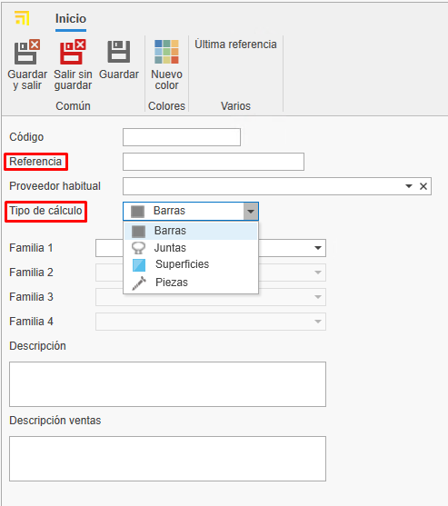

# Creazione di materiali propri in enMATERIALS

---

## 1. Introduzione

Questo manuale ha l'obiettivo di guidare l'utente nel processo di creazione e gestione dei materiali propri in enMATERIALS. Segui le istruzioni dettagliate per garantire una corretta definizione e organizzazione dei materiali.

---

## 2. Definizione dei materiali

I materiali possono essere classificati in diversi tipi in base alle loro proprietà e caratteristiche. Di seguito sono descritti i principali tipi:

### 2.1. Tipi di materiali

- **Pezzi**: Si calcolano per unità e sono i materiali più comuni e semplici da definire.
- **Barre**: Si calcolano per metro lineare e richiedono informazioni aggiuntive, come la lunghezza.
- **Superfici**: Si calcolano per metro quadrato e possono includere caratteristiche aggiuntive.
- **Giunti**: Si calcolano per metro lineare e hanno specifiche particolari per la loro applicazione.

### 2.2. Articoli e colori

I materiali si definiscono nella sezione "Articoli", mentre le finiture si gestiscono in "Colori" e la materia prima in "Materiali".

---

## 3. Creazione dei materiali

Per registrare un materiale, segui questi passaggi:

### 3.1. Definire un articolo

1. Accedi alla sezione "Articoli".

   
   

2. Nella scheda **Generale** assegna una referenza, un tipo di calcolo e un materiale.

   

3. Organizza gli articoli per livelli utilizzando i campi "Famiglia1", "Famiglia2", ecc.

   

4. Compila la descrizione di acquisto (per i fornitori) e quella di vendita (per i clienti).

   

5. Assegna un materiale base trascinando un materiale dall'albero dei materiali nella barra a destra.

   

6. Aggiungi immagini al materiale. Ottimizza le immagini per evitare rallentamenti nel database.

   

7. Nella sezione **Informazioni Magazzino** indicare per quell'articolo alcuni campi come:

   - **Magazzino principale**: Definisce il magazzino dove l'articolo sarà ubicato per impostazione predefinita nel sistema.
   - **Ubicazione**: Specifica la localizzazione fisica esatta all'interno del magazzino (scaffale, corridoio, livello, ecc.).
   - **Montato a destinazione**: Selezionando questa casella, l'articolo sarà configurato per il montaggio a destinazione per impostazione predefinita. Questi materiali appariranno nella postazione di Picking di enCONTROL.
   - **Controllo stock**: Attivando questa opzione, l'articolo sarà incluso nella sezione di reintegro scorte per il tracciamento dell'inventario.

      

> **Nota:** La scheda "Generale" dell'articolo è uguale per tutti i tipi di calcolo.

### 3.2. Creazione dei colori

1. Accedi alla sezione "Colori".

   
   

2. Assegna una referenza, un nome e un colore o texture.

   

3. Assegna un fornitore dalla scheda "Fornitore" trascinando il fornitore dalla finestra a destra.

   

### 3.3. Creazione di un materiale Base

1. Accedi alla sezione "Materiali".

   
   

2. Indica il nome, il colore e seleziona la casella "Material" affinché appaia come materia prima.

   

> **Nota:** Per generare automaticamente la tavolozza RAL dei colori e il materiale base, seleziona il pulsante **Essenziali** nella barra "Home".

   

   
   

---

## 4. Gestione dei fornitori

Prima di registrare un materiale, verifica se il fornitore è già presente in ENBLAU nella sezione "Acquisti > Fornitori". Se non è registrato, crealo seguendo gli standard definiti.

   

---

## 5. Commerciale e magazzino

Una volta definito il materiale, completa le informazioni nelle sezioni commerciale e magazzino.

### 5.1. Dati di acquisto e fornitori

Assegna fornitori, unità e prezzi di acquisto per ogni colore del materiale.

   

> **Nota:** Puoi aggiungere una referenza del fornitore se è diversa da quella registrata nel database.

### 5.2. Assegnazione delle referenze

Ogni colore e materiale avrà una referenza unica _(Referenza Articolo + Referenza Colore)_. Trascina uno o più colori dalla scheda colori nella finestra a destra.

   

---

## 6. Tipologia di materiali e dati aggiuntivi

### 6.1. Pezzi

- Materiali singoli gestiti per unità (accessori, viti, ecc.).
- Vengono valutati per unità.
- Nella scheda "Proprietà Comune", puoi aggiungere campi aggiuntivi se necessario.

   

### 6.2. Barre

- Materiali definiti per lunghezza e altri attributi tecnici.
- Vengono valutati per metro lineare.
- Nella scheda "Proprietà Comune", indica la lunghezza della barra (obbligatorio).

   

- Per profili, aggiungi informazioni aggiuntive come distanza di sicurezza e sfrido minimo/massimo. Queste informazioni sono opzionali.

   

> **Nota:** Sezioni come Tipologia, Ruolo, Dati Tecnici, Sconti e Regole non sono necessarie per la creazione di materiali propri, poiché sono informazioni rilevanti solo per i materiali disegnati.

### 6.3. Superfici

- Materiali definiti per metro quadrato (vetri, lamiere, ecc.).
- Vengono valutati per M2.
- Nella scheda "Proprietà Comune", indica altezza e larghezza della superficie.

 

- Nella scheda "Valutazione e dati tecnici", indica alcuni dati a seconda del tipo di superficie e della sua necessità. Ad esempio: Spessore, tipo di superficie, prezzi per M2 (seleziona la casella "M2 per fornitore" se il prezzo è calcolato per fornitore), ecc. 

 

### 6.4. Giunti

- Materiali definiti per metro lineare.
- Vengono valutati per metro lineare.
- Nella scheda "Proprietà Comune", è possibile indicare la lunghezza se lo ritieni necessario.

   

---

## 7. Standard da seguire

Per garantire una corretta gestione, segui questi standard:

- Usa maiuscole in nomi e referenze.
- Verifica l'esistenza di fornitori e materiali prima di registrarli.
- Mantieni un formato uniforme nelle referenze di materiali e colori.
- Salva sempre le modifiche.

---

## 8. Creazione di documenti di acquisto ENBLAU

Per verificare se l'articolo è registrato, apri ENBLAU e crea un documento di acquisto:

1. Crea un ordine di acquisto e seleziona il fornitore.
2. Nell'ordine di acquisto cerca e aggiungi il materiale dalla finestra a destra. Trascina e seleziona il colore associato.

   

3. Verifica il prezzo assegnato al fornitore.

   

   - Se il materiale ha più di un fornitore assegnato, puoi selezionare il fornitore desiderato con un doppio clic sul fornitore.

---

## 9. Creazione di sistemi e materiali enCLAD

Creazione di sistemi e materiali per **facciate ventilate** in **enCLAD**.

---

### 9.1. Sistemi

Dalla finestra iniziale, nella barra superiore, accedere a **Sistema**.

- Per creare un nuovo sistema, selezionare **Nuovo** nella barra superiore.

---

#### 9.1.2. Proprietà

Dalla scheda **Proprietà**, situata nella parte inferiore, si definiscono i seguenti campi del sistema:

- **Nome**
- **Descrizione**
- **Fornitore**
- **Famiglia 1 e 2** (organizzazione per livelli)
- **Immagine**
- **Stato**: Attivo, Disabilitato temporaneamente o Fuori catalogo.
- **Tipologia del sistema**  
  In questo caso, spuntare la casella **Facciata ventilata**.

Dalla scheda **Articoli correlati**, nella parte inferiore, viene visualizzato l'elenco dei materiali collegati al sistema.

---

#### 9.1.3. Facciata ventilata

Dalla scheda **Tipo di sistema**, nella parte superiore, verrà visualizzata una finestra dove è possibile selezionare il tipo di sistema:

- Sistema a sospensione
- Sistema maschio-femmina
- Sistema incollato
- Sistema rivettato

Nella ***finestra laterale sinistra*** vengono definiti i parametri specifici del tipo di sistema.

Nella ***finestra inferiore*** vengono definiti altri parametri comuni tra i diversi tipi di sistema, come:

  - Distanza estremità abituale
  - Impronta minima – Verticale
  - Impronta massima – Verticale
  - Impronta abituale – Verticale
  - Impronta minima – Orizzontale
  - Impronta massima – Orizzontale
  - Impronta abituale – Orizzontale
  - Contorno minimo
  - Contorno massimo
  - Contorno abituale
  - Permetti contorno (casella)

Nella ***finestra centrale*** viene mostrato il design della facciata ventilata corrispondente al tipo di sistema selezionato.

  Se il tipo di sistema è **Sistema a sospensione**, viene abilitata una finestra aggiuntiva per la definizione del design della lavorazione:

  - **Scheda Lavorazione sospensione**  
    Permette di importare il disegno in formato `.dwg/.dxf`.
  - **Scheda Altre lavorazioni**  
    Permette di definire la lavorazione tramite parametri.

Nella ***finestra laterale destra***, **Materiali del sistema**, si aggiungono gli articoli corrispondenti al sistema tramite campi a discesa:

  - Guida scorrevole
  - Rivetto sagomato
  - Supporto di sospensione
  - Piattina sagomata
  - Rinforzo staffa

> ℹ️ **Nota:** A seconda del tipo di sistema selezionato, verranno abilitati parametri diversi.

Dalla scheda **Opzioni**, nella parte inferiore, verrà visualizzata una finestra con le opzioni di **angolo** disponibili a seconda del tipo di sistema.

Dalla scheda **Remati**, nella parte inferiore, verrà visualizzata una finestra dove definire:

**Opzioni di remate:** Definire le opzioni di remate per il sistema nella distribuzione delle opzioni.

   - Coronamento
   - Remate inferiore
   - Chiusura della camera
   - Finestra architrave
   - Finestra davanzale
   - Finestra stipite
   
**Valori:** Definire i valori per ogni opzione selezionata. 

**Pieghe:** Definire la lunghezza e la rotazione delle pieghe per ogni valore selezionato. 

Dalla scheda **Irrigidimenti** (disponibile solo per sistemi di tipo sospensione), viene visualizzato l'elenco dei materiali di tipo irrigidimento collegati al sistema.

---

#### 9.1.4. Clonare sistemi

Da **Sistemi**, nella barra multifunzione superiore, è disponibile l'opzione **Clona**.

Questa funzionalità copia tutte le proprietà del sistema selezionato nell'elenco.

---

### 9.2. Definizione articoli enCLAD

Definire gli articoli dal modulo articoli:

Creare un nuovo articolo:

---

**1. Generale**  

Compilare i campi delle informazioni generali in base al tipo di calcolo selezionato:

   - **Barra**
   - **Pezzo**
   - **Giunto**
   - **Superficie**

   

   > ℹ️ **Nota:** È obbligatorio indicare il sistema di facciata ventilata a cui sarà collegato il materiale.

---

**2. Proprietà comuni**  

Compilare i campi delle proprietà comuni.  
A seconda del tipo di calcolo del materiale, appariranno campi diversi.

   **Esempi:**

   - **Barra**

   - **Pezzo distanziatore**

---

**3. Ruolo**  

Spuntare il tipo di ruolo del profilo (solo per articoli di tipo **barra**) e definirne il valore nella sezione facciata ventilata.

   

---

**4. Dati tecnici** 

Importare il file `.dwg/.dxf` del materiale e definire le dimensioni del disegno, come:

   - Dimensioni interne
   - Dimensioni esterne
   - Profondità
   - Punto di inserimento
   - Altri parametri

> ℹ️ **Nota:** La scheda **Dati tecnici** è disponibile solo per i tipi di calcolo **barra** e **giunto**.

---

**5. Regole**  

Assegnare una regola al profilo (solo per barre), trascinando una regola precedentemente definita dalla finestra laterale destra inferiore, nella scheda **Regole**.

**6. Commerciale e stock (assegnare colori)**

Ogni colore e materiale avrà un riferimento univoco _(Riferimento Articolo + Riferimento Colore)_. Trascinare uno o più colori dalla scheda colori nella finestra destra, dalla scheda **Commerciale e stock**.

   

> ℹ️ **Nota:** Informazioni su come creare nuovi colori andare a [3.2. Creazione di colori](#32-creazione-di-colori).

---

### 9.3. Definizione delle regole

Dalla sezione iniziale, accedere all'elenco **Regole di aggiunta articoli** e selezionare **Regole nei profili**.

Creare una **Nuova** regola nei profili.

---

**1. Proprietà**  

Compilare i campi delle proprietà della regola:

   - Nome
   - Descrizione
   - Famiglie (livelli di cartelle)

---

**2. Articoli correlati**  

Correlare gli articoli di tipo **barra** trascinandoli dalla finestra laterale destra in **Articoli**.

---

**3. Sistemi restrittivi**  

Indicare i sistemi da restringere per quella regola, trascinandoli dalla finestra laterale destra in **Sistemi**.

---

**4. Accessori**  

Indicare l'opzione e/o l'articolo che verrà generato, trascinandolo dalla finestra laterale destra in **Accessori**.

> ℹ️ **Nota:** È possibile definire una configurazione diversa per ogni tipo di calcolo dalla scheda corrispondente nella parte inferiore della finestra.

## 10. Conclusione

Seguendo questo manuale, potrai registrare e gestire i materiali in modo efficiente nel sistema, garantendo una corretta organizzazione e ottimizzazione dei processi di acquisto e vendita.

---
