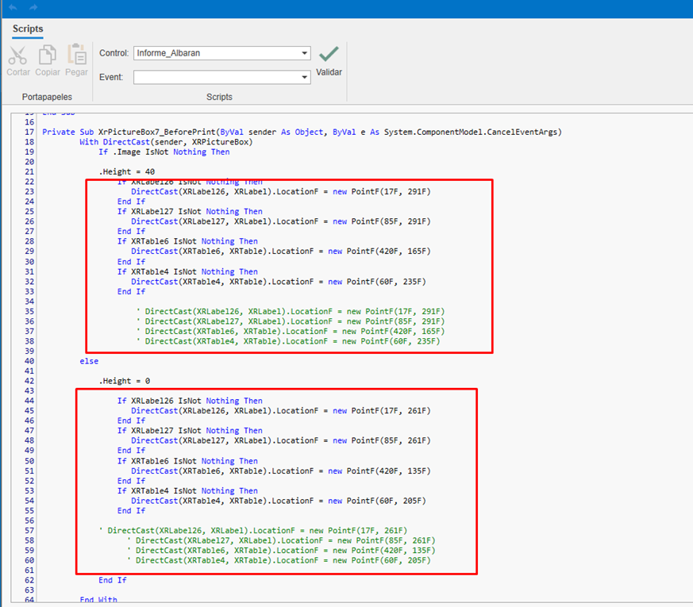
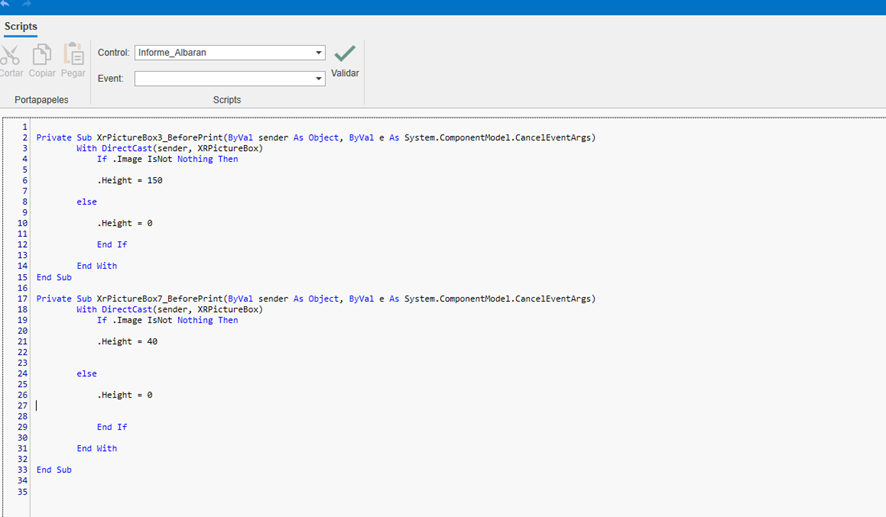

# Creazione e modifica di report personalizzati

---

## 1. Introduzione
Questo manuale ha lo scopo di guidare gli utenti nella creazione e nella modifica di nuovi modelli di report personalizzati senza la necessità di configurare un modello da zero. Il processo è pensato per essere semplice e chiaro, permettendo agli utenti di adattare i report alle proprie esigenze in modo efficiente.

---

## 2. Creazione di un report personalizzato
Per generare un report basato su uno esistente, segui questi passaggi:

1. **Individuare il report di base**:  
    - Naviga fino al report che desideri utilizzare come base per il tuo nuovo report personalizzato.

2. **Creare una copia del report**:  
    - Seleziona l'opzione per creare un nuovo report a partire da quello esistente. Verrà generata una copia esatta del report originale, che potrai modificare senza alterare il report base.

    

    
---

## 3. Modifica del report
Una volta creata la copia del report, segui questi passi per personalizzarlo:

1. **Individuare il report appena creato**:  
    - Accedi al report che hai appena copiato.

2. **Accedere all'opzione di modifica**:  
    - Seleziona l'opzione di modifica per iniziare a effettuare i cambiamenti.

    

3. **Apportare le modifiche necessarie**:  
    - Modifica i campi, le sezioni o i dati necessari. Puoi aggiungere, eliminare o adattare le informazioni secondo le tue esigenze. Usa le risorse di modifica disponibili per editare il modello:

    

4. **Salvare il report**:  
   - Una volta effettuate le modifiche, salva il documento per completare l'operazione.

        

---

## 4. Eliminazione di elementi aggiuntivi
Se il report richiede modifiche più profonde, puoi rimuovere sezioni o dati non necessari prima di salvare la versione finale. Per farlo:

1. **Identificare elementi non necessari**:  
   - Rivedi il report e determina quali sezioni o dati non sono rilevanti per il tuo scopo.

2. **Rimuovere elementi**:  
   - Usa l'opzione di eliminazione per togliere gli elementi non desiderati.

    

    - Per alcuni report (ad esempio la bolla di consegna), è necessario rimuovere parte dello script. Accedi alla sezione Script:

     

    - Se quelle righe sono presenti nello script, eliminale:

    

     

    - Torna quindi alla sezione Designer:

         

3. **Salvare le modifiche**:  
   Assicurati di salvare il report dopo aver effettuato le eliminazioni.

---

## 5. Utilizzo del nuovo modello
Una volta creato il nuovo report, selezionalo e vai su "Anteprima":

   

      

---

## 6. Considerazioni finali
- **Non è necessario configurare un nuovo modello**:  
  Questo processo ti permette di modificare i report senza dover creare un modello da zero.

- **Processo rapido e semplice**:  
  La clonazione e la modifica dei report è un metodo efficiente per personalizzare i documenti.

- **Revisione finale**:  
  Prima di salvare il report, assicurati di rivederlo attentamente per garantire che soddisfi i requisiti desiderati.

---
