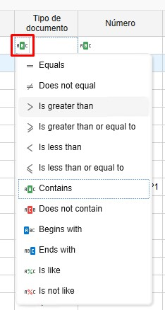
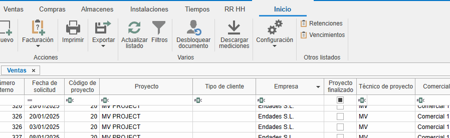
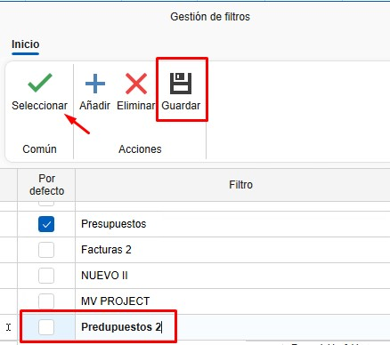
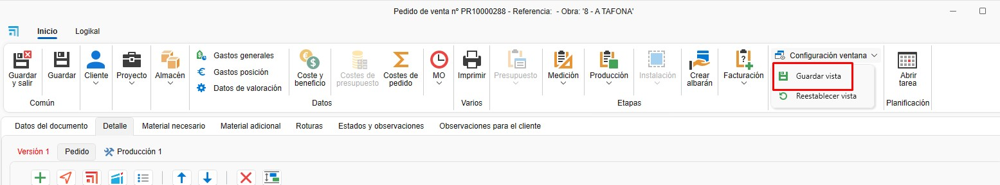

# Gestione dei filtri

---

## 1. Introduzione
Questo manuale è pensato per orientare gli utenti sull'utilizzo dei filtri e dei filtri personalizzati. La loro funzione principale è ottimizzare la velocità di ricerca e migliorare l'organizzazione della visualizzazione in tutti gli elenchi dell'applicazione.

## 2. Gestione dei filtri nelle liste

I filtri permettono di personalizzare la visualizzazione dei documenti nelle liste. Segui questi passaggi:

### 2.1. Accedere ai filtri
- Nella testata delle liste, usa i filtri per definire quali colonne e quali dati desideri visualizzare.

  

- Ad esempio, puoi filtrare per "Preventivi" in modo da mostrare solo le colonne necessarie (azienda, progetto, data di richiesta, stato del documento, tecnico del progetto, tipo di documento, ecc.).

  

- Nel campo di ricerca sotto la testata è presente un'icona **ABC** dove è possibile selezionare le condizioni che devono essere soddisfatte per cercare un valore.

   

- Per filtrare in base ai valori disponibili, dalla testata clicca sull'icona a forma di imbuto e seleziona i valori che vuoi filtrare.

  

- Usa `Ctrl + F` per cercare all'interno della lista.

  

### 2.2. Salvare filtri personalizzati
- Organizza le colonne in base alle tue esigenze. Puoi eliminare, aggiungere e modificare la posizione delle colonne facendo clic destro su qualsiasi intestazione.

  

- Un'alternativa per cambiare la posizione o eliminare colonne è trascinarle.

  

- Da "Filtri", accedi a "Gestione filtri" e aggiungi un nuovo filtro.

  

- Salva il filtro con un nome specifico (es. "Preventivo 2").

  

### 2.3. Salvare la vista
- Da qualsiasi elenco o progetto puoi organizzare le colonne o i filtri e poi salvare la vista da Configurazione finestra - **Salva vista**:

  

  Ogni volta che rientrerai vedrai la vista precedentemente salvata.

> **Nota:** Ogni utente può avere i propri filtri e le proprie viste salvate.

