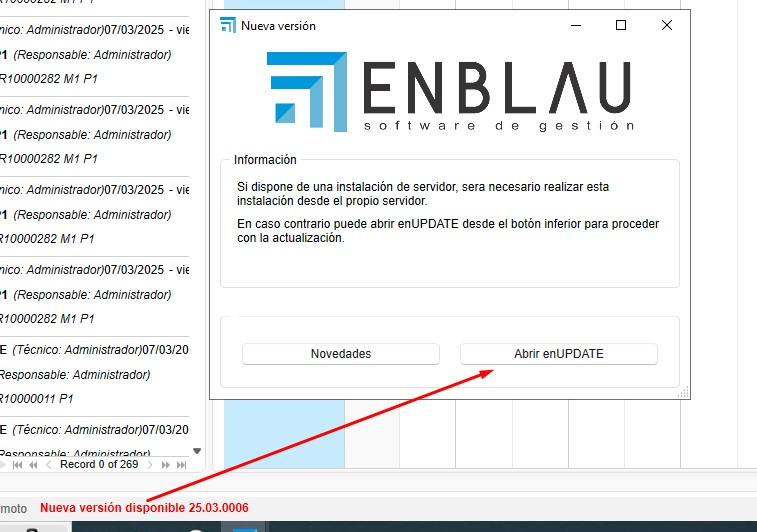
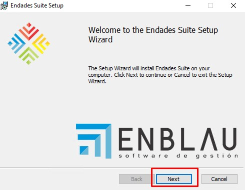
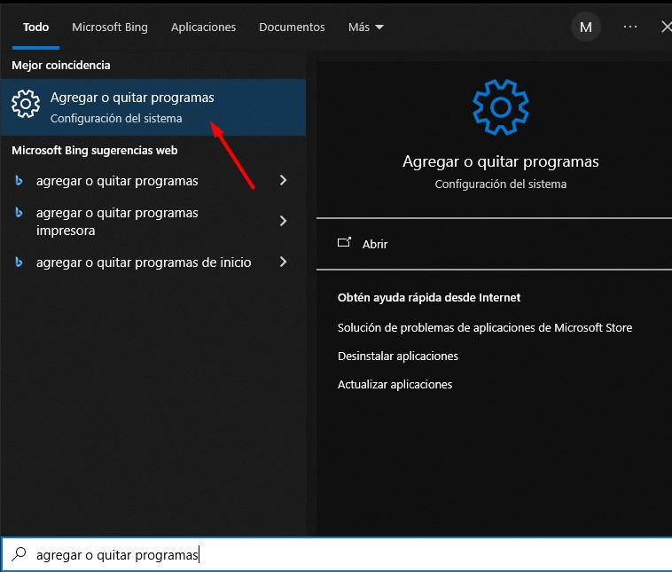
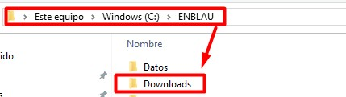
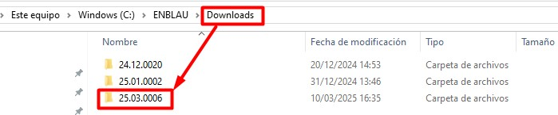
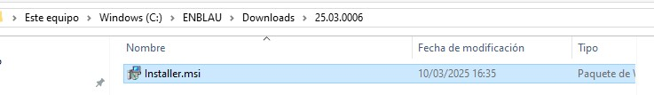

# Aggiornamento di ENBLAU

---

## 1. Introduzione

Questo manuale è pensato per guidare gli utenti nel processo di aggiornamento di ENBLAU all'ultima versione disponibile.

---

## 2. Passaggi per l'aggiornamento

> ⚠️ **Importante!** Prima di iniziare, assicurati che **nessun utente sia connesso a ENBLAU**. Da **Strumenti amministrativi - Gestione computer - Cartelle condivise - File aperti** puoi verificare eventuali sessioni attive.

   
   
   

Se ENBLAU è installato su un server, l'aggiornamento deve essere eseguito **su quel server** e **mai** da una postazione montata tramite unità di rete.

### 2.1. ENBLAU

1. Accedi a ENBLAU (dal server, se applicabile).
2. Nella parte inferiore della schermata iniziale, clicca su **"Nuova versione disponibile"** (apparirà in rosso insieme al numero dell'ultima versione disponibile).

   

3. Si aprirà una finestra denominata **"Nuova versione"**, dove potrai consultare le novità prima dell'installazione. Clicca sul pulsante **"Apri enUPDATE"** per proseguire.

   

### 2.2. enUPDATE

1. Aprendo *enUPDATE* da ENBLAU verrà mostrata la finestra corrispondente. È possibile eseguire l'operazione anche direttamente da enUPDATE senza aprire prima ENBLAU.
2. Nella parte superiore della barra multifunzione, clicca su **"Scarica e installa"**. Verrà scaricata automaticamente l'ultima versione di ENBLAU (potrai visualizzare l'avanzamento nella barra di progresso).

   

3. Al termine del download apparirà un messaggio di conferma e verrà richiesta l'autorizzazione per procedere con l'installazione.

   

### 2.3. Installazione

> ⚠️ **Importante!** Assicurati che ENBLAU sia **completamente chiuso** prima di avviare l'installazione.

1. Confermando l'installazione si aprirà la finestra di **Endades Suite Setup**. Segui i passaggi indicati:

     

   - Accetta i termini della licenza selezionando la casella corrispondente e prosegui.

     

   - Verifica che il percorso di installazione di ENBLAU sia corretto.

       

   - Clicca su **"Installa"** per avviare il processo.

      

   - Completa l'installazione.

     

### 2.4. Aggiornamento del database

1. Al termine dell'installazione, avvia ENBLAU dalla postazione su cui hai eseguito l'aggiornamento.
2. All'avvio il sistema potrebbe richiedere l'aggiornamento del database. Clicca su **"Sì"** per procedere.

   

---

Fatto! Ora puoi utilizzare l'**ultima versione aggiornata di ENBLAU**.

---

## 3. Disinstallare e reinstallare ENBLAU

Se l'aggiornamento di ENBLAU non è andato a buon fine — ad esempio perché erano presenti utenti connessi o si è verificato un altro tipo di errore — sarà necessario disinstallare l'applicazione e procedere con una nuova installazione.

### 3.1. Disinstallare Endades Suite

1. Nella macchina su cui è installato ENBLAU, apri il menu Start di Windows e cerca **"Aggiungi o rimuovi programmi"** (la dicitura può variare a seconda della versione del sistema operativo).

   

2. Si aprirà la finestra di impostazioni. Nella sezione **App e funzionalità**, cerca **Endades Suite**.

3. Clicca sull'applicazione e seleziona **Disinstalla**. La procedura è la stessa prevista per qualsiasi applicazione di Windows.

   

   

### 3.2. Installare ENBLAU

1. Dopo la disinstallazione, apri la cartella di installazione di ENBLAU. Ad esempio:  
   **`C:\ENBLAU`**

2. All'interno di quella cartella, apri la directory **Downloads**.

   

3. Troverai diverse versioni dell'installer. Ordina i file per nome o data per individuare l'**ultima versione disponibile**.

   

4. Apri la cartella della versione più recente ed esegui il file **`Installer.msi`** con un doppio clic.

   

5. Si aprirà la finestra di **Endades Suite Setup**. Segui i passaggi indicati nella sezione [2.3. Installazione](#23-instalacion).

---

📌 **Nota**: Se, dopo la reinstallazione, il sistema richiede nuovamente l'aggiornamento del database, segui la procedura descritta in [2.4. Aggiornamento del database](#24-actualizacion-de-la-base-de-datos).

