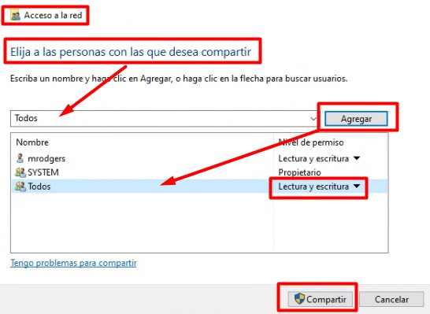
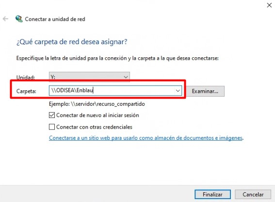

# Collegare un'unità di rete

---

## 1. Introduzione

Questo manuale spiega passo dopo passo come collegare un'unità di rete condivisa in un computer Windows, utilizzando le cartelle condivise di **ENBLAU** e **Enblau Documentos**.

> **Cos'è un'unità di rete?**  
> Un'unità di rete è una cartella condivisa su un altro computer o server nella rete locale, che puoi mappare come se fosse un'unità del tuo PC (ad esempio C: o D:).

---

## 2. Condividere le cartelle dal server

1. Sul server, condividi le cartelle **ENBLAU** e **Enblau Documentos** con gli utenti della rete.

   

2. Vai alla scheda **Condivisione** e clicca sul pulsante **Condividi...**.

   

3. Nella finestra **Accesso alla rete**, seleziona **Tutti** nell'elenco utenti (se non appare, scrivilo manualmente) e clicca su **Aggiungi**.  
   Assicurati che abbia i permessi di **Lettura e scrittura** e quindi clicca su **Condividi**.

   

   

---

## 3. Requisiti preliminari

Prima di iniziare, assicurati di avere:

- Connessione alla rete locale o aziendale.
- L'indirizzo della cartella condivisa (es.: `\\server\cartella`).
- I permessi di accesso necessari.
- Credenziali (utente e password) se la cartella le richiede.

---

## 4. Collegare l'unità di rete

### 4.1. Aprire Esplora file

- Premi `Windows + E` o clicca sull'icona della cartella nella barra delle applicazioni.

### 4.2. Accedere a "Questo PC"

- Nel pannello laterale sinistro, seleziona **Questo PC**.

   

### 4.3. Collegare unità di rete

- In alto, clicca sulla scheda **Computer**, quindi su **Connetti unità di rete**.

   

### 4.4. Scegliere una lettera di unità

- Seleziona una lettera disponibile (es.: `Y:`).

   

### 4.5. Inserire il percorso della cartella condivisa

- Nel campo **Cartella**, inserisci il percorso in formato UNC (es.: `\\server\cartella`).

   

- Se desideri mantenere la connessione dopo il riavvio, seleziona **Riconnetti all'accesso** (Connettere nuovamente all'accesso).

   

### 4.6. Inserire le credenziali (se richiesto)

- Inserisci nome utente e password con accesso alla cartella condivisa.

### 4.7. Completare

- Clicca su **Fine**. Se tutto è corretto, l'unità di rete si aprirà come una cartella aggiuntiva in Esplora file.

   

---

## 5. Verifica

- Controlla che l'unità di rete sia presente in **Questo PC**, con la lettera che hai scelto.

> **Se non si connette:**

> - Verifica che il percorso sia corretto.

> - Assicurati che le credenziali siano valide.

> - Controlla la connessione di rete.

---
