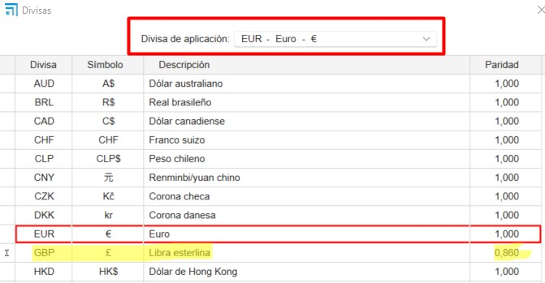
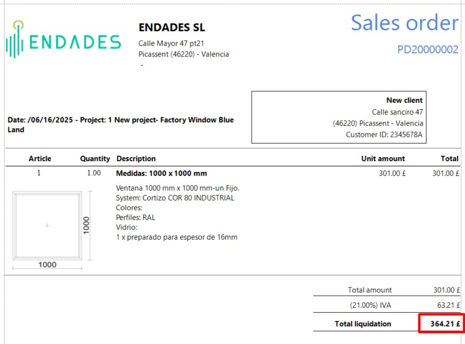
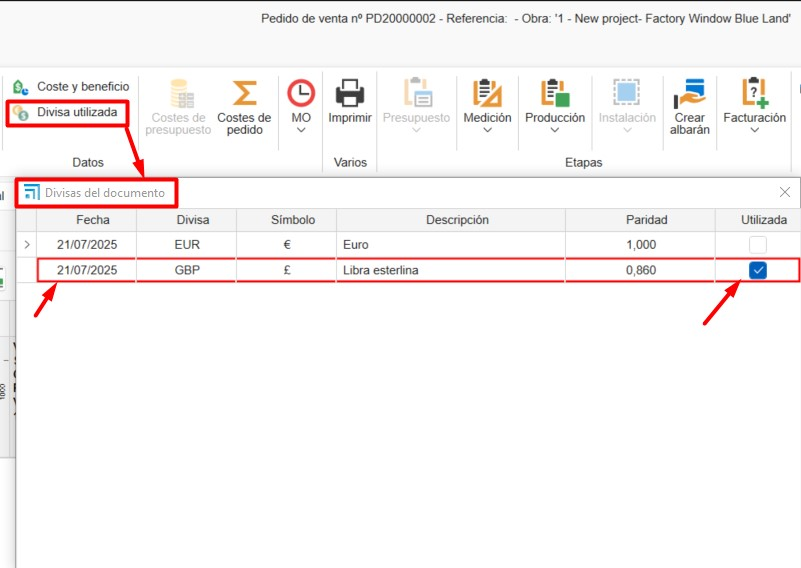

# Valute

---

## 1. Introduzione

Questo manuale spiega passo dopo passo come utilizzare le valute in ENBLAU e come rifletterle correttamente nei report, rispettando la parità di ogni moneta.

---

## 2. Definizione delle valute

Dalla sezione **Valuta**, è possibile definire la parità tra le monete.  
Per esempio:

- **Valuta di applicazione: EUR**
- **Parità definita:** 1 € = 0.86 £ (**GBP**)

Questo permette di lavorare con più valute nei documenti di vendita.

  

---

## 3. Applicazione nei report

Per utilizzare una valuta nei documenti di vendita (come un ordine):

1. Seleziona la **valuta desiderata** (es. GBP – Sterlina britannica).
2. Opzionalmente, scegli anche la **lingua** del documento.
3. Stampa il report.

Il sistema applicherà automaticamente la conversione dei valori secondo la parità definita in quel momento.

  

---

## 4. Valuta utilizzata

L'opzione **Valuta utilizzata** permette di conservare uno storico delle parità applicate in ogni documento.

Questo è utile per:

- Mantenere la parità originale senza necessità di modificarla manualmente.
- Assicurare coerenza nei documenti storici, anche se il tasso di cambio è cambiato successivamente.

### Come utilizzarla?

1. Apri un documento di vendita (es. un ordine).
2. Vai alla sezione: **Dati → Valuta utilizzata**.
3. Si aprirà la finestra **Valute del documento**.
4. Spunta la casella nella colonna **Utilizzata** per applicare la parità corrispondente alla data selezionata.

---

> **Nota:** Questa funzionalità è particolarmente utile per documenti con date precedenti o per operazioni che richiedono di conservare il tasso di cambio originale.
