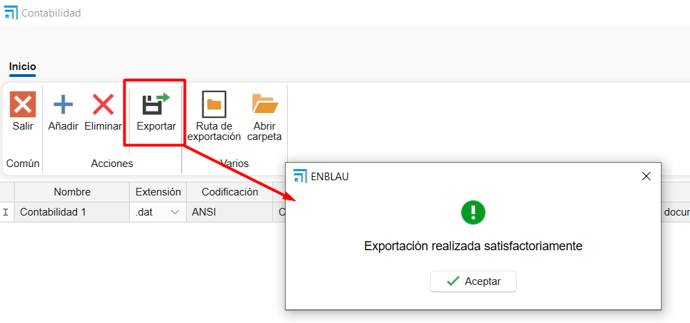

# Importazione programma di contabilità

## 1. Obiettivo

Stabilire i requisiti tecnici necessari affinché ENBLAU possa generare file compatibili con il programma di contabilità, utilizzando la trasformazione dei dati tramite **XSLT** ed esportazione in formati specifici, con le codifiche accettate.

---

## 2. Requisiti generali

### 2.1. Formato di Input

- Il sistema esterno dovrà generare file in formato **XML** come base per la trasformazione.
- Il file XML deve rispettare la struttura stabilita nello schema XSD (se applicabile).
- Deve essere fornito un protocollo chiaro di mappatura dei campi.

### 2.2. Trasformazione

- La trasformazione dell'XML in formato di importazione sarà realizzata mediante un file **XSLT** fornito dal fornitore o sviluppato internamente.
- Il file XSLT deve rispettare la specifica 1.0 o 2.0 in base alla compatibilità con il motore XSLT del sistema.

### 2.3. Formato di esportazione

- Il risultato della trasformazione deve essere generato in uno dei seguenti formati, in base a quanto definito per ciascun tipo di operazione contabile:

   | Tipo di File | Descrizione                         |
   |--------------|-------------------------------------|
   | `.dat`       | Formato di testo strutturato        |
   | `.txt`       | Testo delimitato (es. tab, virgola) |
   | `.xml`       | Struttura XML compatibile           |
   | `.xlsx`      | Foglio di calcolo (Excel)           |

### 2.4. Codifica del testo

- La codifica dei file deve essere una delle seguenti, in base al tipo di file:

   | Codifica | Raccomandato per |
   |----------|------------------|
   | ANSI     | `.txt`, `.dat` vecchi |
   | UTF-8    | `.xml`, `.txt` moderni |
   | UTF-16   | `.xml` con caratteri speciali |
   | UNICODE  | Generale per file multilingua |

---

## 3. Protocollo di integrazione

### 3.1. Link del template XSLT

Il fornitore del sistema contabile dovrà fornire il file XSLT base e la documentazione con il protocollo con il formato del file per eseguire la trasformazione.

### 3.2. Specifiche di Mappatura dei Campi

   Deve essere fornito un documento che dettagli:

   - Nome del campo nel sistema di origine
   - Posizioni
   - Lunghezza (caratteri)
   - Tipo di dato (numerico, testo, data)
   - Formato richiesto (es: `dd/MM/yyyy`, `#,##0.00`, ecc.)

**Esempio di tabella di mappatura:**

Di seguito si dettagli la struttura prevista per il file di importazione secondo il **Tipo di registro = 0**, corrispondente a **Registrazione di Scritture senza IVA**.

    | Posizioni | Lunghezza (caratteri) | Descrizione del Campo   | Commenti                                                                 |
    |-----------|----------------------|------------------------|--------------------------------------------------------------------------|
    | 1         | 1                    | Tipo di Formato        | Costante `5`                                                              |
    | 2 a 6     | 5                    | Codice azienda        | Valori tra `00001` e `99999`                                             |
    | 7 a 14    | 8                    | Data registrazione    | Formato `aaaammgg` (Esempio: 1 febbraio 2000 → `20000201`)               |
    | 15        | 1                    | Tipo di Registro      | Costante `0`                                                              |
    | 16 a 27   | 12                   | Conto                 | Livello 6 a 12. Se il conto non esiste, verrà creato automaticamente.    |

> **Note**:

- Questo formato deve essere generato come file di testo semplice (`.txt` o `.dat`) con codifica **ANSI**.
- I campi devono occupare esattamente le posizioni indicate. Non devono esserci delimitatori.
- Tutti i record devono rispettare la struttura a lunghezza fissa per essere validi.

---

## 4. Trasformazione da XML con XSLT

La struttura precedente può essere generata da un file XML di input, trasformato con un template XSLT. Si raccomanda che il file XML abbia i seguenti nodi minimi:

### 4.1. Esempio di File Generato

Di seguito si mostra un esempio di riga generata per il file `.dat` con formato a larghezza fissa secondo i campi definiti:

1. **Valori di esempio:**

    - Tipo di Formato: `5`
    - Codice Azienda: `00001`
    - Data Registrazione: `20250728` (28 luglio 2025)
    - Tipo di Registro: `0`
    - Conto: `430000000001`

2. **Risultato nel file `.dat`:**

500001202507280430000000001

- **Dettaglio per sezioni:**

    | Posizioni | Contenuto      | Descrizione           |
    |-----------|----------------|------------------------|
    | 1         | `5`            | Tipo di Formato       |
    | 2 a 6     | `00001`        | Codice azienda        |
    | 7 a 14    | `20250728`     | Data registrazione    |
    | 15        | `0`            | Tipo di Registro      |
    | 16 a 27   | `430000000001` | Conto                 |

> ⚠️ **Importante!**   
- Non si devono includere separatori, spazi aggiuntivi, né interruzioni di riga tra i campi.  
- Ogni riga rappresenta una registrazione. Se ci sono registrazioni multiple, devono essere su righe separate, una per registrazione.

- **Esempio con registrazioni multiple:**

    500001202507280430000000001

    500002202507280410000000010

    500003202507280460000000050

---

## 5. Validazioni preliminari

- Il file XML deve superare la validazione strutturale (ben formato e, se applicabile, valido contro XSD).
- L'output dell'XSLT deve essere verificato per assicurare la compatibilità con il formato di importazione contabile.

---

## 6. Processo di importazione ed esportazione da ENBLAU

1.	Scarica i due file .xls (vendite e acquisti) forniti da Endades, salvali nel seguente percorso: **Enblau Documenti\Documenti\Contabilità**. (Raccomandiamo questa posizione perché è una cartella condivisa). Se la cartella Contabilità all'interno di Documenti non esiste, creala.

    

2.	Apri ENBLAU e vai a:
    - Vendite → Documento di vendita → Esporta → **Contabilità**.

        

3.	Si aprirà una finestra di Contabilità.
    - Fai clic su Aggiungi una riga.
    - Si aprirà l'esploratore file per selezionare il percorso dove si trova il file esempio: **transform_ventas.xls**.

        

4.	Verrà generata automaticamente una riga con il nome Contabilità 1 (puoi modificarlo, per esempio, Contabilità Vendite).
5.	Seleziona i parametri:
    - Estensione: .dat, .xlsx, .txt o .xml. 
    - Codifica: ANSI, UNICODE, UTF-8 o UTF-16.
6.	Verrà mostrato il percorso dove sarà esportato il file nel formato dell'estensione scelta.

    

7.	Poi Esporta il file:

    

    -  Nel percorso di esportazione (in questo caso, lo stesso del file di esportazione), vedrai che è stato generato un file con le informazioni della fattura di vendita.
    - Se hai qualche filtro applicato nell'elenco dei documenti di vendita, appariranno solo i dati che soddisfano quel filtro.
    - Il file esportato avrà il formato secondo l'estensione selezionata e il file .xsl che applica la trasformazione del file (nel percorso file di esportazione). Esempio:

        
    
    - Una volta esportato il file nel formato corretto da ENBLAU, il passo successivo è importarlo nel programma di contabilità che state utilizzando.

---

**Note**

- Qualsiasi modifica nel formato sorgente XML o nella struttura del file XSLT deve essere documentata e validata prima di essere implementata in produzione.
- È consigliabile mantenere un controllo di versione sia degli XSLT che degli schemi XML.

---

