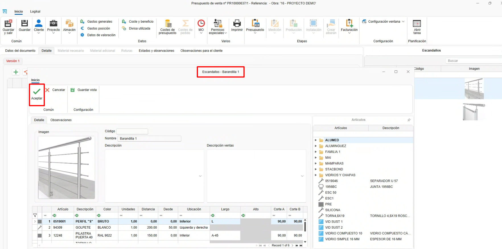

# Distinte base (Raggruppamento materiali)

---

## 1. Introduzione

Questo manuale spiega passo dopo passo come utilizzare la funzionalità delle **Distinte base**.  
Le distinte base si definiscono da **ENBLAU**, raggruppando materiali propri creati da **enMATERIALS**.  
Inoltre, è possibile raggruppare questi materiali e generare le unità necessarie secondo diverse condizioni, come le dimensioni, la posizione delle sezioni, la distanza o mediante formule.

---

## 2. Distinte base

- Accedere alle distinte base da **Magazzini → Distinte base**.

  

---

### 2.1. Creazione di Distinte base

- Per creare una distinta base, segui questi passi:

  1. Dall'elenco delle distinte base, seleziona il pulsante **Nuovo** per creare una nuova distinta base.

     

  2. Si aprirà una finestra dove dovrai definire i seguenti campi:

     - **Nome**: Definisce il nome della distinta base che stai creando.  
     - **Famiglia**: Campo opzionale dove si indicano le cartelle e sottocartelle in cui si desidera aggiungere la distinta base. Questo campo si rifletterà successivamente nell'albero delle distinte base all'interno della sezione **Documenti di vendita**.  
     - **Descrizione**: Breve descrizione della distinta base.  
     - **Descrizione vendite**: Indica se la descrizione per le vendite è diversa dalla descrizione generale della distinta base.  
     - **Immagine**: Permette di aggiungere un'immagine o cattura rappresentativa della distinta base.

       

  3. La sezione **Prodotto finito** è ad uso esclusivo della postazione di **Trasformazione** in enCONTROL. In questo campo deve essere indicato il riferimento di un materiale di tipo *pezzo* creato in precedenza in enMATERIALS. Una volta che il prodotto è passato dalla postazione di Trasformazione, i materiali definiti nella distinta base verranno automaticamente scaricati e verrà generato un carico di magazzino con il riferimento del materiale indicato in questa sezione.

     

---

### 2.2. Raggruppare materiali

- Una volta creata la distinta base, i passi seguenti permettono di **raggruppare e generare i materiali** corrispondenti:

    1. Dall'albero degli articoli, situato a destra, trascina i materiali che devono essere generati per quella distinta base.

        

    2. Poi definisci le seguenti condizioni secondo necessità:

        - **Unità**: Indica le unità che devono essere generate del materiale.  
        - **Distanza**: Specifica ogni quanto tratto deve essere generato il materiale.  
          Esempio: *1 vite ogni 100 mm di tratto.*  
        - **Da**: Definisce, insieme alla distanza, da quale punto si inizia a contare.  
        - **Posizione**: Mostra un elenco per indicare la posizione del tratto dove deve essere generato il materiale.  
          Esempio: *Superiore, inferiore, destra, sinistra.*  
        - **Lunghezza**: Permette di indicare una lunghezza fissa o usare una formula.  
          Esempio: *L-50 → calcola la lunghezza della barra meno 50 mm.*  
        - **Altezza**: Permette di indicare un'altezza fissa o usare una formula.  
          Esempio: *A-50 → calcola l'altezza della superficie meno 50 mm.*  
        - **Taglio A**: Definisce il tipo di taglio del lato **A** della barra.  
          Esempio: *Taglio a 90° o 45°.*  
        - **Taglio B**: Definisce il tipo di taglio del lato **B** della barra.  
          Esempio: *Taglio a 90° o 45°.*

          
      
> **Nota:** I campi si attivano in base al tipo di calcolo del materiale (pezzo, barra, giunto o superficie).

---

## 3. Come usare le distinte base

- Da qualsiasi documento di vendita (**Preventivo**, **Ordine**, **Produzione**, ecc.), accedi alla sezione **Distinte base**, situata nella parte destra del documento.  
  Quindi, segui questi passi:

    1. Trascina una distinta base nella posizione del documento.

        

    2. Si aprirà una finestra dell'editor delle distinte base, dove potrai modificare i valori prima di accettare.

        

    3. Una volta accettato, potrai modificare le misure, i prezzi e gli sconti.  
      Se i materiali hanno associata una tariffa di vendita, il prezzo sarà calcolato automaticamente per componente.

        
    
    4. Accedi a **Materiale necessario** per elencare i materiali con le unità definite secondo le condizioni della distinta base ed effettuare l'ordine di acquisto al fornitore.

        
