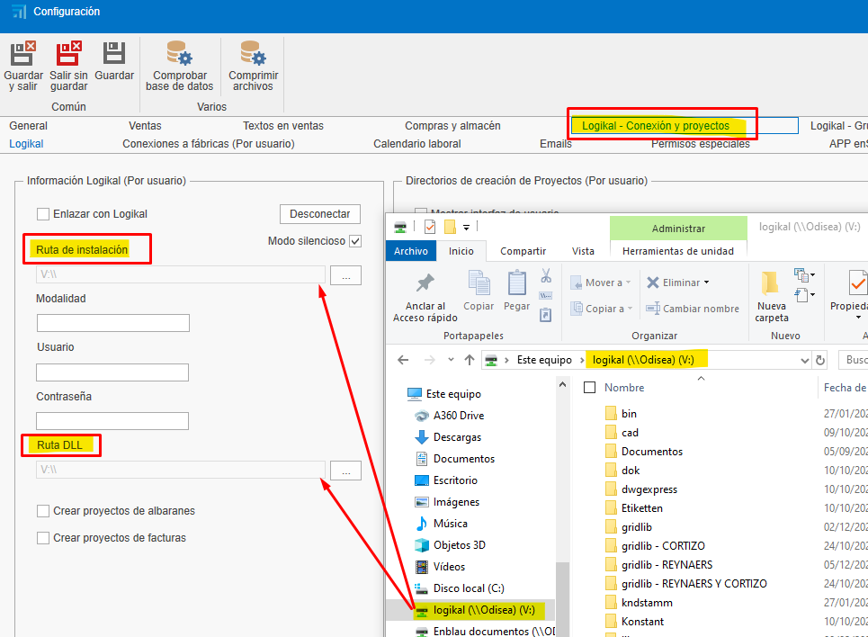
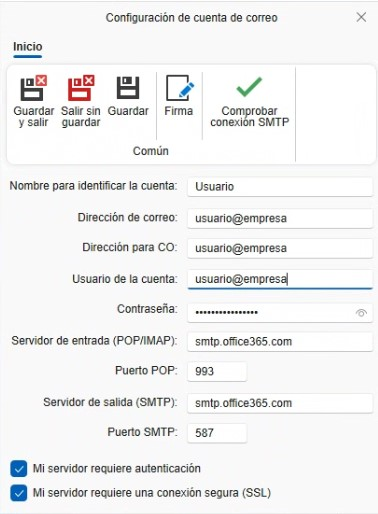
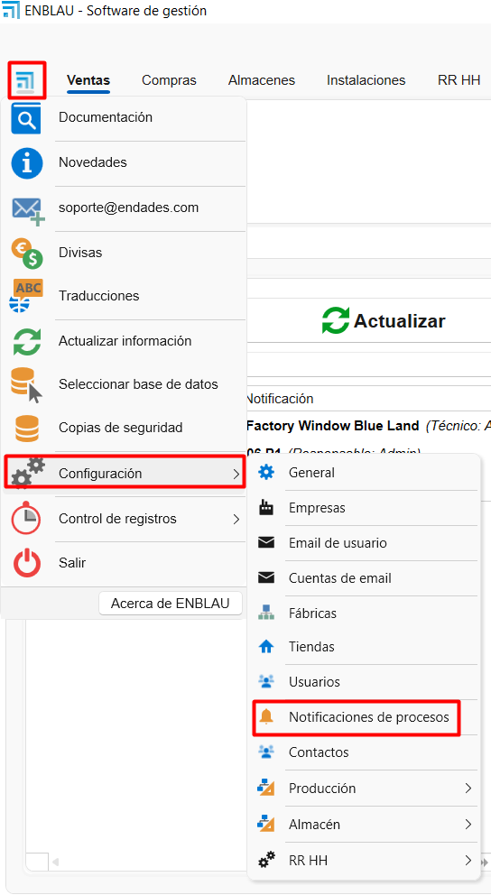

# Configuração inicial do [ENBLAU](https://endades.com/software/software-enblau/)

---

## 1. Propósito

Este manual foi elaborado para orientar os novos usuários na configuração inicial do ENBLAU. Esta configuração inclui tudo o que é necessário para que o cliente possa realizar vendas, compras e emissão de faturas.

---

## 2. Configuração geral

  

### 2.1. Configuração de conexão com Logikal

- Para conectar com a fábrica e os projetos do Logikal, é necessário indicar o caminho de instalação e a DLL do Logikal (unidade de rede onde o Logikal aponta).

- No menu **Geral**, acesse **Logikal - Conexão e Projetos**.

  

- Para conectar à fábrica no Logikal, vá até a parte inferior da janela principal do **ENBLAU**, clique com o botão direito em **Conexão fábrica** e selecione **Conectar**.

  

---

### 2.2. Geral

- **Caminho de armazenamento**: Indicar o caminho onde os documentos do ENBLAU e do Logikal serão salvos (unidade de rede). Exemplo:

  

  > **Nota:** Recomenda-se utilizar uma unidade de rede. Caso não exista, crie-a.

- **Informações da empresa**: Preencher os campos necessários com as informações da empresa, como nome, CNPJ, endereço, logotipos, etc.

  

---

### 2.3. Textos em vendas

- Adicione textos para documentos de vendas, como observações, condições, etc.

  

  Exemplo de relatório de pedido:

    

---

## 3. Gestão de usuários

- Para cadastrar novos usuários, acesse **Usuários**.

  

- Em **Novo**, você pode criar novos usuários.

  

- Uma janela será aberta para configurar as informações do usuário (nome, endereço, email, telefone, etc.), o tipo de usuário (Técnico, Comercial, Oficina, etc. É possível atribuir mais de um tipo) e as permissões. As permissões só podem ser atribuídas por usuários do tipo administrador.

  

- Uma vez cadastrado, o usuário poderá ser editado a qualquer momento.

---

## 4. Configuração de contas de email

- Para configurar a conta de email do usuário, acesse **Email usuário:** 

  

  

- Para configurar as contas de email de cada usuário, acesse **Contas de email:** 

  

  

- Em cada seção, você pode configurar o email, nome de usuário, assinatura e servidores de entrada e saída (IMAP e SMTP). A configuração do servidor de entrada/saída e das portas deve estar corretamente definida de acordo com o provedor utilizado. Dessa forma, será possível enviar e receber emails a partir de relatórios ou notificações conforme a configuração.

### 4.1. Configuração geral de emails

- No menu **Geral** - **Emails**, você tem a opção de definir cópias, assunto e modo de envio de emails por padrão.

  

    

### 4.2. Possíveis erros de autenticação Microsoft

- Ao tentar enviar um email, podemos nos deparar com este tipo de erro.

  

  **LOG**  
    Erro: 535: 5.7.139 Authentication unsuccessful, SmtpClientAuthentication is disabled for the Tenant. Visit [Envio SMTP autenticado no Exchange Online](https://learn.microsoft.com/es-es/exchange/clients-and-mobile-in-exchange-online/authenticated-client-smtp-submission) para mais informações.

  O erro é de autenticação com a conta de email. Isso pode ocorrer devido a uma mudança no protocolo de segurança do Microsoft 365.

  - **Solução:** Contate a pessoa responsável com permissões no centro de administração do Microsoft 365. É necessário seguir os passos do link acima para configurar a conta do Outlook para que você possa sincronizar os emails em outro aplicativo.

    

    Certifique-se de que todas as caixas estejam marcadas na seção de gerenciamento de aplicativos de email do Microsoft 365.

    

> **Nota:** Para emails do Microsoft Exchange, recomenda-se que em **Modo de envio de emails** na seção Geral, a opção **Modo de envio 2** esteja selecionada.

  

---

## 5. Gestão de empresas

- Caso haja várias empresas, você pode criá-las na seção **Empresas**, em **Adicionar**. Em seguida, preencha as informações em **Geral** e **Textos em Vendas** conforme necessário para cada empresa.

  

  

  > ⚠️ **Importante!** Se nenhuma outra empresa for indicada, os projetos utilizarão por padrão a empresa adicionada anteriormente na configuração básica de **Geral**. Caso vá emitir faturas com **facturae**, é necessário que as informações da empresa estejam na seção **Empresas**.

---

## 6. Configuração de projetos

- Na seção **Vendas**, selecione **Projetos** e acesse **Configuração**.

  

  

- Na configuração, você terá um menu suspenso com uma lista para configurar. Para uma configuração inicial, é necessário configurar **Estados** e **Diretórios Padrão**.

  

### 6.1. Estados

- Ao selecionar **Estados**, abrirá uma janela para definir os estados dos projetos (obras).

  

### 6.2. Diretórios padrão

- Ao selecionar **Diretórios Padrão**, abrirá uma janela para definir os diretórios necessários na pasta do projeto (obra).

  

> **Nota:** Os diretórios padrão são pastas que podem ser configuradas para serem geradas automaticamente com cada projeto.

---

## 7. Configuração de vendas

- Na seção **Vendas**, selecione **Documentos de Vendas** e acesse **Configuração**.

  

  

- Na configuração, você terá um menu suspenso com uma lista para configurar. Para uma configuração inicial, é necessário configurar **Numerações**, **Formas de Pagamento**, **Bancos**, **Modos de Pagamento**, **Conceitos de Quebras**, **Classificações**, **Sujeitos Passivos (IVA)** e **Diretórios Padrão**.

  

### 7.1. Numerações

- Ao selecionar **Numerações**, abrirá uma janela para definir os tipos de numeração para documentos de vendas, atribuindo números sequenciais aos documentos.

  

  - Exemplo: Tipo de documento "Orçamento", prefixo (Alpha) e número (próximo número) - **PR1000272**.

  

### 7.2. Formas de pagamento

- Ao selecionar **Formas de Pagamento**, abrirá uma janela para definir as formas de pagamento necessárias para gerar vencimentos nas faturas.

  

  - Exemplo: Indicar em quantas parcelas e a porcentagem que o cliente deve pagar em cada vencimento.

  

### 7.3. Bancos

- Ao selecionar **Bancos**, abrirá uma janela para indicar as informações do banco. O nome e um código.

  

### 7.4. Modos de pagamento

- Ao selecionar **Modos de Pagamento**, abrirá uma janela para definir os diferentes modos nos quais o pagamento de um vencimento pode ser realizado.

  

### 7.5. Conceitos de quebras

- Ao selecionar **Conceitos de Quebras**, abrirá uma janela onde você poderá adicionar os diferentes conceitos que serão usados ao registrar uma quebra (por exemplo: “defeito de fabricação”, “quebra no transporte”, etc.)

  

### 7.6. Classificações

- Ao selecionar **Classificações**, abrirá uma janela para definir as classificações de orçamentos.

  

  A classificação tem o objetivo de agrupar e filtrar os documentos na lista de Documentos de venda.

### 7.7. Sujeitos passivos (IVA)

- Ao selecionar **Sujeitos Passivos (IVA)**, abrirá uma janela para definir os tipos de sujeitos passivos.

  

### 7.8. Diretórios padrão

- Ao selecionar **Diretórios Padrão**, abrirá uma janela para definir os diretórios necessários na pasta de documentação.

  

> **Nota:** Os diretórios padrão são pastas que podem ser configuradas para serem geradas automaticamente com cada documentação.

---

## 8. Configuração de compras

- Na seção **Compras**, selecione **Documentos de Compras** e acesse **Configuração**.

  

  

- Na configuração, você terá um menu suspenso com uma lista para configurar. Para uma configuração inicial, é necessário configurar **Numerações**, **Formas de Pagamento**, **Classificações** e **Diretórios Padrão**.

  

### 8.1. Numerações

- Ao selecionar **Numerações**, abrirá uma janela para definir os tipos de numeração para documentos de compra, atribuindo números sequenciais aos documentos.

  

  - Exemplo: Tipo de documento "Pedido", prefixo (Alpha) e número (próximo número) - **PE70000082**.

  

### 8.2. Formas de pagamento

- Ao selecionar **Formas de Pagamento**, abrirá uma janela para definir as formas de pagamento necessárias para gerar vencimentos nas faturas. Você verá que é a mesma janela configurada na seção de Documentos de venda.

  

### 8.3. Classificações

- Ao selecionar **Classificações**, abrirá uma janela para definir as classificações de compras. Aqui você pode definir os tipos de classificação:
  •	Quebras  
  •	Materiais adicionais  
  •	Pedido ordinário (padrão, quando um pedido não corresponde aos anteriores)

    
    
Esta configuração é importante para que os dados sejam refletidos corretamente ao realizar um estudo de custos do projeto.

### 8.4. Diretórios padrão

- Ao selecionar **Diretórios Padrão**, abrirá uma janela para definir os diretórios necessários na pasta de documentação.

  

> **Nota:** Os diretórios padrão são pastas que podem ser configuradas para serem geradas automaticamente com cada documentação.

---

## 9. Gestão de notificações

O ENBLAU permite configurar notificações automáticas associadas a diferentes processos do sistema. Essas notificações podem melhorar a rastreabilidade e a comunicação interna.

---

### 9.1. Quando as notificações são geradas?

As notificações podem ser ativadas em eventos como:

- Pagamento da primeira fatura.  
- Envio de uma produção para a fila de produção.  
- Outros processos definidos pelo fluxo de trabalho.

---

### 9.2. Configuração de notificações

Essas notificações são totalmente configuráveis na seção Notificações e processos:

- Podem ser direcionadas a um **papel** específico (ex.: Comercial, Técnico, Produção) ou a uma **pessoa concreta**.  
- Podem ser associadas automaticamente a usuários vinculados a **projetos específicos**.

  
  

---

### 9.3. Onde as notificações são recebidas?

As notificações podem ser recebidas através de diferentes canais:

- **Janela inicial do ENBLAU**  
- **Aplicativo móvel enSITE**  
- **Email**, se a opção correspondente estiver ativada

> ⚠️ Em alguns casos, pode não ser conveniente recebê-las por email, sendo possível optar por exibi-las apenas dentro do ENBLAU ou no enSITE.

---

### 9.4. Envio por email

Para que as notificações cheguem ao email do usuário, a caixa correspondente deve estar marcada em seu perfil:

---

> **Nota:**  
> As notificações são geradas de acordo com os processos executados pelos usuários dentro do sistema.

## 10. Conclusão

Seguindo este manual, você poderá realizar uma configuração inicial do ENBLAU para a criação de documentos de compras e vendas.
