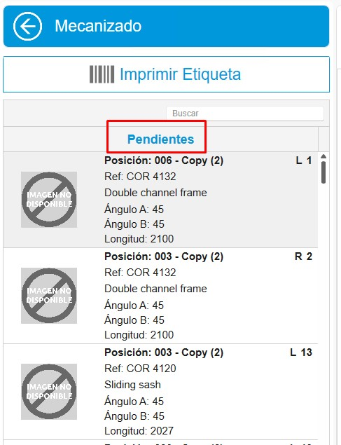
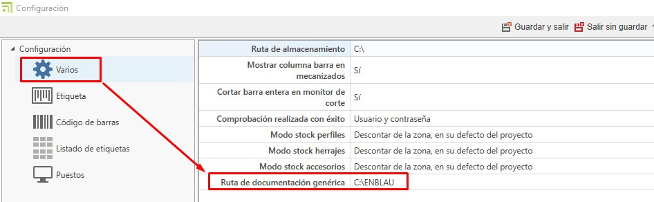
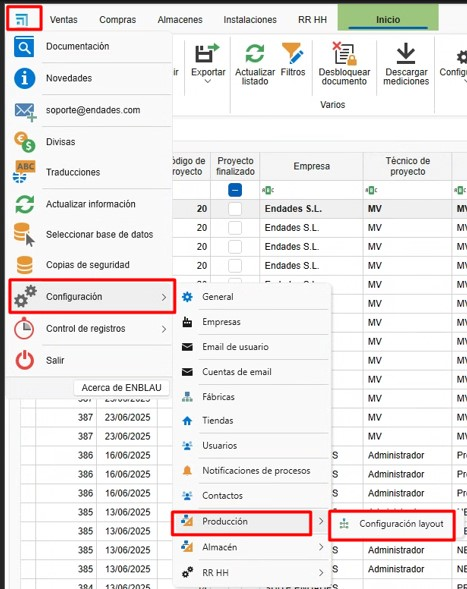
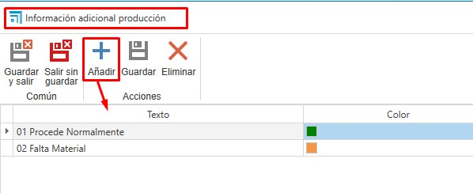

# Configuração inicial do [enCONTROL](https://endades.com/software/encontrol/)

---

## 1. Propósito

Este manual foi desenvolvido para orientar novos usuários na configuração inicial do enCONTROL. Esta configuração inclui tudo o que é necessário para iniciar a produção.

---

## 2. Configuração no enCONTROL

Acesse a configuração do enCONTROL (F10) como usuário administrador. Este processo pode demorar um pouco dependendo do número de estações conectadas à rede.

### 2.1. Diversos

- **Mostrar coluna de barra em usinagens**

  

  - Se o valor for **Sim**, a coluna da barra será exibida no monitor.

    

  - Se o valor for **Não**, apenas a coluna de pendentes de usinar será exibida no monitor.

    

>**Nota:** Por padrão, este valor estará definido como Sim.

  
- **Cortar barra inteira no monitor de corte**

  

  - Se o valor for **Sim**, ao cortar a barra no monitor, todas as posições da barra indicada serão cortadas automaticamente, sem necessidade de cortar cada posição individualmente. 

  - Se o valor for **Não**, o corte será feito posição por posição.

>**Nota:** Por padrão, este valor estará definido como Sim.

- Define-se o modo como os perfis, ferragens e acessórios serão descontados do estoque conforme o avanço da produção.

  

  - **Não descontar**: Nada será descontado.

  - **Descontar do projeto**: Desconta apenas do projeto, independentemente da zona.

  - **Descontar da zona, ou do projeto se não disponível:** O desconto é feito da zona indicada e do projeto. A localização da zona para os materiais a utilizar é definida a partir do posto de **Preparação de Materiais**. Para que o desconto seja aplicado corretamente, o material deve estar na zona indicada e atribuído ao projeto.

  - **Descontar da zona:** O desconto é feito apenas da zona indicada, independentemente do projeto. A localização da zona para os materiais a utilizar é definida a partir do posto de **Preparação de Materiais**. Para que o desconto seja aplicado corretamente, o material deve estar na zona indicada.

  - **Descontar do projeto, caso contrário de qualquer zona**: Desconta do projeto e de qualquer zona.

- Em **Caminho da documentação genérica**, é possível indicar documentações como informações do sistema, entre outras, que podem ser visualizadas no enCONTROL e nas estações.

  

  Exemplo em uma estação:

  

---

### 2.2. Estações

- Em "**Estações**", defina os dispositivos associados a cada estação conectada à rede.

  

---

## 3. Configuração de produção no ENBLAU

### 3.1. Configuração do layout de produção

A **configuração do layout de produção** permite definir a estrutura organizacional da planta dentro do módulo **enCONTROL**, incluindo plantas, linhas de produção e estações de trabalho.

- Acesse o menu: **Configuração → Produção → Configuração de Layout**.

   

- Na interface de **Layout de Produção**, é possível adicionar:

  - **Planta**
  - **Linha de produção**
  - **Estações de trabalho**

   

- Ao selecionar uma linha de produção, será exibida à direita a seção **Horário da linha**, onde é possível configurar:
 
  - Dias da semana operacionais.
  - Horário de início e término de cada turno.

   

- Ao adicionar uma nova estação, devem ser definidos os seguintes campos:

  - **Tipo**: Indica o tipo de estação a ser adicionada (por exemplo: Corte, Montagem, Usinagem, etc.).
  - **Ordem**: Define a ordem sequencial das estações dentro da linha.

    

- No campo **Usuário**, é possível atribuir o responsável pela estação. Este usuário será o encarregado de operar ou supervisionar essa estação dentro do fluxo de produção.

  

> **Recomendação:** Mantenha sempre esta configuração atualizada para garantir um controle de produção preciso e alinhado com a realidade operacional da planta.

---

### 3.2. Classificações de produção

As classificações de produção são usadas de forma informativa ao criar uma produção, para que se reflitam nas linhas das estações no enCONTROL.

- Acesse a seção Vendas - Configuração - **Classificações**.

  

- Em "Classificações", crie as classificações necessárias e indique a linha e as estações do enCONTROL.

  

- Ao criar uma produção a partir de um pedido de venda, será exibido um menu suspenso onde você pode indicar a classificação para essa produção.

  

---

### 3.3. Relatórios de Produção Logikal

- Os relatórios necessários são gerados automaticamente e salvos como documentação Logikal na produção. Esses documentos serão exibidos no caminho de documentação nas estações do enCONTROL.

- No orçamento (produção), acesse a seção Logikal - **Relatórios para Produção**. A partir daí, marque os relatórios que deseja salvar na produção como documentação na coluna **Para documentação**.

  

> **Nota:** Para a documentação, não altere nada nas colunas **Exportação** e **Gestão**.

---

### 3.4. Informações adicionais

As informações adicionais são um campo informativo para quando a produção entra na fila da oficina no enCONTROL, permitindo que o responsável pela oficina as consulte.

- Acesse a seção Vendas - Configuração - **Informações adicionais de produção**.

  

- Em "Informações adicionais de produção", crie as informações adicionais necessárias.

  

- Ao criar uma produção a partir de um pedido de venda, será exibido um menu suspenso onde você pode indicar como essas informações devem aparecer na fila de produção.

  

  

---

## 4. Conclusão

Seguindo este manual, você poderá realizar a configuração inicial do enCONTROL para uso na criação de produção.
