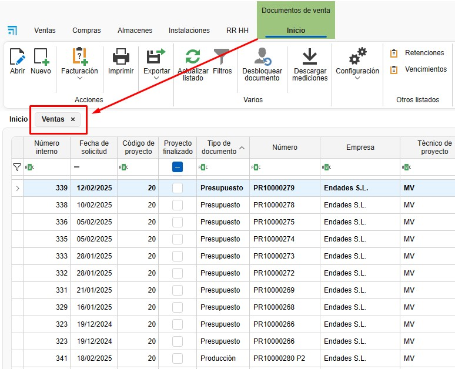
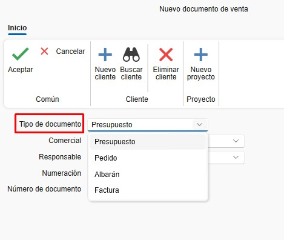
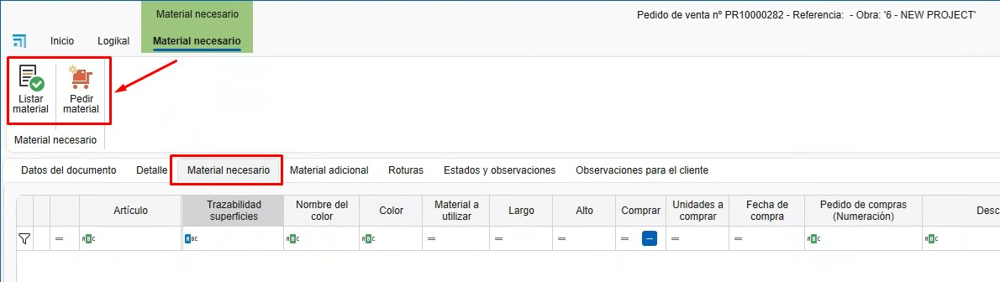
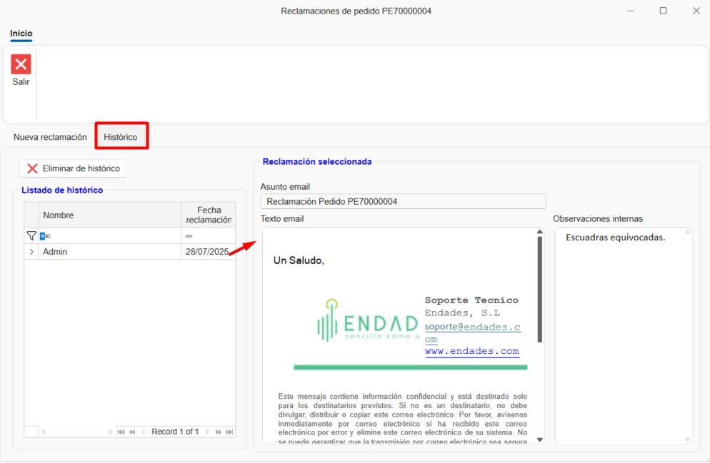
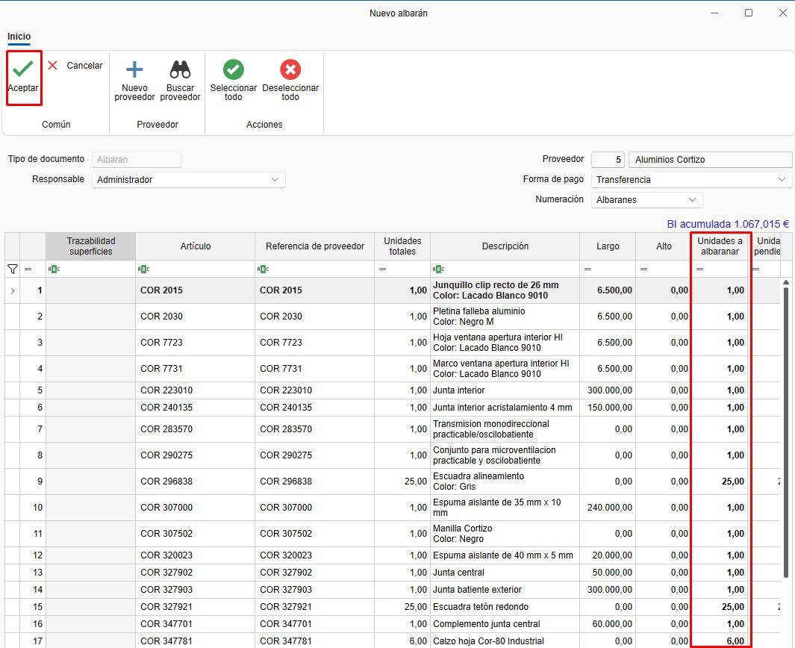
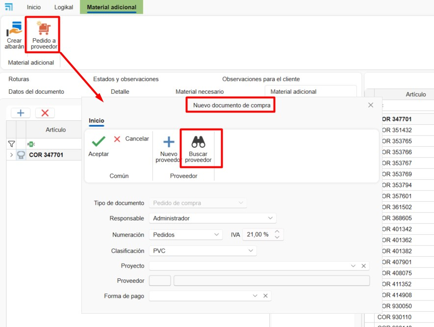
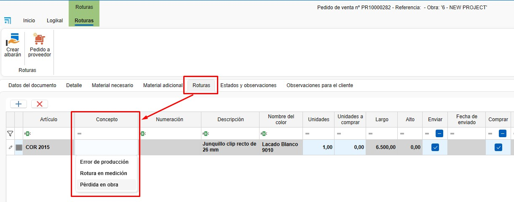

# Vendas e Compras

---

## 1. Introdução
Este manual foi desenvolvido para orientar os utilizadores no uso do sistema de vendas e compras do ENBLAU. Baseado na formação fornecida, abrange os processos principais, desde a criação de projetos até à gestão de pedidos, compras e produção.

---

## 2. Processo
Ao aceder, verá duas secções principais:

### 2.1. Vendas
- **Documentos de venda**: Gestão e listagem de orçamentos, pedidos, guias de remessa e faturas. Criação de projetos e clientes.
  
  

### 2.2. Compras
- **Documentos de compra**: Gestão e listagem de pedidos de compra e receção de materiais. Criação de fornecedores.

  

> **Nota:** Para criar documentos de venda e compra, é importante ter criados **projetos, clientes e fornecedores**. Para mais informações, siga este link: [4. Proyecto, cliente y fornecedores](6.PR_Proyecto_cliente.md).

---

## 3. Vendas
Na secção Vendas encontrará Projetos, Documentos de venda e Clientes.

### 3.1. Documentos de venda
- Ao entrar em **Documentos de venda**, abrir-se-á uma listagem de todos os documentos relacionados com vendas.

  

#### 3.1.1. Tipos de documentos
- Para criar um novo documento, clique em **Novo** na faixa superior.

  

- Abrir-se-á a janela **Novo documento de venda**.

  

- A partir daqui, poderá criar diferentes tipos de documentos de venda, como Orçamento, Pedido, Guia de Remessa ou Fatura.

  

- Ao selecionar o tipo de documento, alguns campos serão preenchidos automaticamente (Comercial, Responsável, Numeração, etc.). Estes campos são editáveis.

  

- Outros campos, como Projeto e Cliente, podem ser configurados para serem preenchidos automaticamente conforme o projeto.

  

- Na faixa superior, pode alterar o cliente ou adicionar um novo cliente ou projeto.

  

### 3.2. Orçamento
- Ao criar um novo orçamento, abrir-se-á uma janela com o número do orçamento de venda.

  

#### 3.2.1. Dados do documento
- Nesta secção, podem ser visualizados e modificados alguns campos do orçamento.

  

#### 3.2.2. Detalhe
- Aqui são adicionadas as posições para a versão do orçamento.

  

- Pode adicionar uma nova posição vazia ou a partir do Logikal (certifique-se de estar ligado à fábrica).

  

- Ao adicionar uma posição do Logikal, abrir-se-á a janela de configuração do Logikal **Tipo de linha**.

  

> ⚠️ **Importante**: Para adicionar uma posição a partir do Logikal, certifique-se de que está ligado à fábrica.

  

- Depois de configurada, a posição será adicionada no ENBLAU.

  

#### 3.2.3. Logikal
- A partir desta secção, pode criar um projeto ou vincular um projeto já criado no Logikal.

  

- Ao vincular o projeto, abrir-se-á uma janela com os projetos disponíveis no Logikal.

  

- Pode criar diferentes versões do orçamento. Clique com o botão direito na etiqueta *Versão 1* ou use o menu de *Presupuesto* na faixa superior.

  
  

- Abrir-se-á a janela **Nova versão de orçamento**, onde pode indicar se pretende copiar as linhas da versão ativa ou criar uma versão em branco.

  

- Para editar uma posição no Logikal, pressione **Ctrl + duplo clique** sobre a posição que pretende editar.

> **Nota:** O nome das etiquetas de versão é editável. Para alterar, clique com o botão direito na etiqueta da versão e selecione *Alterar o nome da versão*.

> ⚠️ **Importante**: Para criar ou vincular um projeto a partir do Logikal, certifique-se de que está ligado à fábrica.

  

### 3.3. Pedido
#### 3.3.1. Criar pedido
- Depois de criada a versão do orçamento, o passo seguinte é aceitá-lo e criar o pedido do cliente.

  
  

#### 3.3.2. Editar posição
- A partir do pedido, pode editar ou adicionar posições, listar materiais, criar medições, produções, etc.

  

#### 3.3.3. Guia de Remessa
- A partir da fase de Pedido, pode criar uma guia de remessa e indicar as unidades a remeter.

  

> **Nota:** Os dados do documento de pedido também podem ser modificados, tal como noutros documentos de venda.

### 3.4. Medição
#### 3.4.1. Criar medição
- A partir do pedido, pode criar uma medição.

  

#### 3.4.2. Selecionar posições
- Ao criar uma medição, abre-se a janela **Nova fase de medição**, onde pode selecionar as posições para a fase de medição.

  

#### 3.4.3. Fase de medição
- Cria-se uma fase de medição onde pode editar as medições sem afetar o pedido.

  

#### 3.4.4. Guia de Remessa
- A partir da fase de Medição, pode criar uma guia de remessa e indicar as unidades a remeter, da mesma forma que no pedido.

> **Nota:** Os dados do documento de medição também podem ser modificados, tal como noutros documentos de venda.

### 3.5. Produção
#### 3.5.1. Criar produção
- A fase de produção pode ser criada a partir do pedido ou da medição.

  

#### 3.5.2. Selecionar posições
- Ao criar uma produção, abre-se a janela **Nova fase de produção**, onde pode selecionar as posições para a fase de produção.

  

#### 3.5.3. Fase de produção
- Cria-se uma fase de produção onde pode editar a posição antes de enviar para produção sem afetar o pedido.

  

#### 3.5.4. Guia de Remessa
- A partir da fase de Produção, pode criar uma guia de remessa e indicar as unidades a remeter, da mesma forma que no pedido.

> **Nota:** Os dados do documento de produção também podem ser modificados, tal como noutros documentos de venda.

---

## 4. Compras

### 4.1. Pedidos de compra
#### 4.1.1. A partir de um orçamento
- Aceite um orçamento para gerar um pedido de cliente.

#### 4.1.2. Material necessário
- Aceda ao separador "Material Necessário" para listar os materiais requeridos.

  

#### 4.1.2 (cont.)
- Ao listar materiais, verá nas colunas de Artigos e Unidades a comprar as cores verde e vermelho. Verde indica que há material suficiente em stock para esse projeto, e vermelho indica que não há suficiente.

  

- Pode escolher se pretende comprar os materiais marcando ou desmarcando a caixa na coluna *Comprar*.

  

> ⚠️ **Importante**: Para listar material a partir de um projeto Logikal, certifique-se de que está ligado à fábrica.

  

#### 4.1.3. Gerar pedido de compra
- Selecione os materiais e gere o pedido de compra em **Pedir material**. Abrir-se-á a janela **Novo documento de compra**, onde pode alterar alguns campos por defeito e escolher o fornecedor.

  

#### 4.1.3 (cont.)
- Atribua um fornecedor e envie o pedido.

  

#### 4.1.4. Pedido de compra
- Depois de criado o pedido de compra, pode revê-lo e modificá-lo conforme necessário (fornecedor, projeto, quantidade de materiais, etc.).

  

#### 4.1.5. Exportar para Cortizo center
- Depois de criado o pedido de compra, pode exportar em formato Excel o pedido para que possa ser carregado no Cortizo center.

  

#### 4.1.6. Reclamações

Depois de gerado um **pedido de compra**, tem a opção de gerir **Reclamações** diretamente a partir do sistema.

- Pode adicionar uma reclamação associada ao pedido a partir da sua própria ficha:

  

- Também é possível **enviar a reclamação automaticamente por correio eletrónico**, agilizando a comunicação com o fornecedor:

  

- O sistema guarda um **histórico automático** das reclamações efetuadas.
  Além disso, pode adicionar registos manuais para documentar o **seguimento** da reclamação.

  

**Nota:** O seguimento adequado das reclamações permite melhorar a rastreabilidade de incidentes com fornecedores e facilita a gestão da qualidade nas compras.

#### 4.1.7. Documentos de compra
- A partir da secção Compras, pode aceder à listagem de compras e a Fornecedores.

  
  
  

#### 4.1.8. Artigos e Artigos importados

- No pedido de compras, no separador **Detalhe** na faixa lateral direita, verá uma secção localizada na parte inferior chamada **Artigos** e **Artigos importados**. Esses artigos podem ser adicionados ao pedido de compra arrastando o material para a listagem.

  - **Artigos**: São materiais próprios criados a partir do **MATERIAL**.

  

  - **Artigos importados**: São os materiais importados a partir dos projetos do **Logikal**. Esses materiais são armazenados e atualizados sempre que se lista material a partir de Material Necessário. São os mesmos materiais que também se encontram no Armazém **Materiales importados**.

  

### 4.2. Receção de material
#### 4.2.1. Guia de remessa de receção
- Gere uma guia de remessa ao receber o material.

  

#### 4.2.2. Unidades recebidas
- Indique as unidades recebidas na coluna *Unidades a remeter*.

  

---

## 5. Material adicional e desperdícios

### 5.1. Material adicional
- Os materiais adicionais podem ser adicionados ao pedido, medição ou produção. Podem ser adicionados materiais próprios criados em enMATERIALS ou artigos importados a partir do Logikal. Para mais informações sobre como criar materiais próprios, siga este link: [2. Criação de materiais próprios em enMATERIALS](/Utilidades/2.UT_Crear_Materiales_enMATERIAL).

  

#### 5.1.1. Adicionar material
- Arraste material adicional a partir da árvore de Artigos (materiais próprios dados de alta em enMATERIAL).

  

- Também pode arrastar a partir de **Artigos importados** do Logikal.

  

- Adicione linhas de texto.

  

- Depois de adicionados os materiais adicionais, tem a opção de gerar um pedido de compra ao fornecedor.

  

- Pode gerar uma guia de remessa para material adicional.

  

#### 5.1.2. Custos
- O material adicional é contabilizado como custo do projeto, mas não é orçamentado ao cliente.

### 5.2. Desperdícios
#### 5.2.1. Adicionar a desperdícios
- A partir da secção "Material Necessário", clique com o botão direito no material e selecione **Adicionar a desperdícios**.

  

- O material será adicionado na secção de **Desperdícios**. Na coluna *Conceito*, pode indicar o motivo do desperdício, selecionando de uma lista predefinida na configuração de [7.5. Conceitos de desperdícios](/Configuraciones/1.%20CO_Configuracion_Inicial_ENBLAU/#75-conceptos-de-roturas).

  

- Tal como no Material adicional, pode adicionar Artigos (material próprio) e Artigos adicionais. Além de gerar pedido de compra e guia de remessa.

  

- Assegure que na secção [8.3. Clasificaciones](/Configuraciones/1.%20CO_Configuracion_Inicial_ENBLAU/#83-clasificaciones) a classificação para desperdícios está corretamente configurada.

> **Nota:** O processo de adicionar e pedir material adicional ou desperdícios também pode ser feito a partir da secção de projetos.

---

## 6. Rastreabilidade

### 6.1. Árvore de rastreabilidade
- Mostra a rastreabilidade completa de um documento, desde o orçamento até à produção. Por exemplo, desde um orçamento (ex. 483) até ao seu envio para produção.

  

### 6.2. Visualização
- Clique em qualquer documento para ver a sua rastreabilidade no painel direito.

  

---

> **Gestão de filtros** Use filtros e filtros personalizados para otimizar a pesquisa nas listagens. Para mais informações, siga este link: [4. Gestão de filtros](/Utilidades/4.UT_Gestion_Filtros/)

---

## 7. Perguntas frequentes

### 7.1. Como gerir incidências pós-venda?
- **Opção 1**: Crie um novo orçamento.
- **Opção 2**: Gere um pedido de cliente com valor zero e envie-o para produção.

### 7.2. Como adicionar material adicional?
- Arraste o material adicional a partir da árvore e gere uma guia de remessa.

### 7.3. Como receber material parcialmente?
- Ao gerar uma guia de remessa, indique as unidades recebidas. Pode criar múltiplas guias de remessa para um mesmo pedido.

---

Este manual foi concebido para o ajudar a navegar e a utilizar o sistema de vendas e compras do ENBLAU de forma eficiente. Para mais detalhes, consulte o vídeo de formação ou contacte o suporte técnico.

### 7.1. ¿Cómo gestionar incidencias postventa?
- **Opción 1**: Crea un nuevo presupuesto.
- **Opción 2**: Genera un pedido de cliente a importe cero y envíalo a producción.

### 7.2. ¿Cómo añadir material adicional?
- Arrastra el material adicional desde el árbol y genera un albarán de envío.

### 7.3. ¿Cómo recibir material parcialmente?
- Al generar un albarán, indica las unidades recibidas. Puedes crear múltiples albaranes para un mismo pedido.

---

Este manual está diseñado para ayudarte a navegar y utilizar el sistema de ventas y compras de ENBLAU de manera eficiente. Para más detalles, consulta el video de formación o contacta con el soporte técnico.