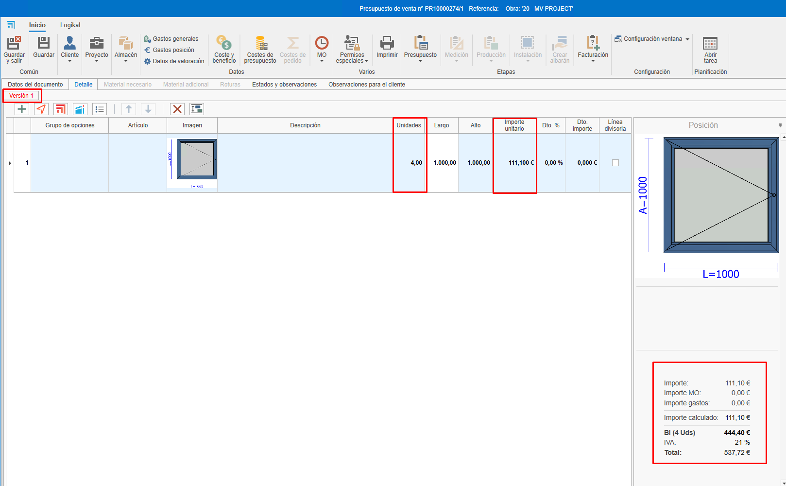
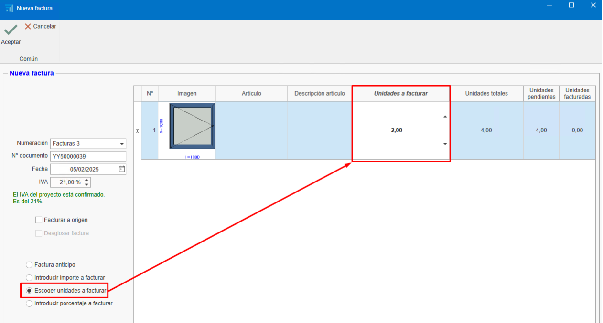
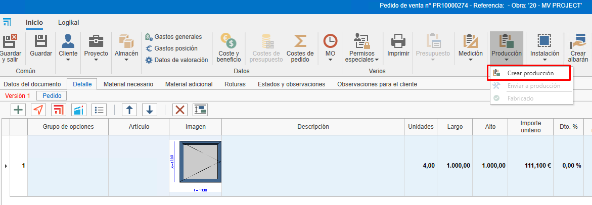
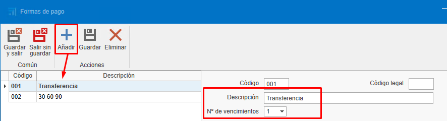
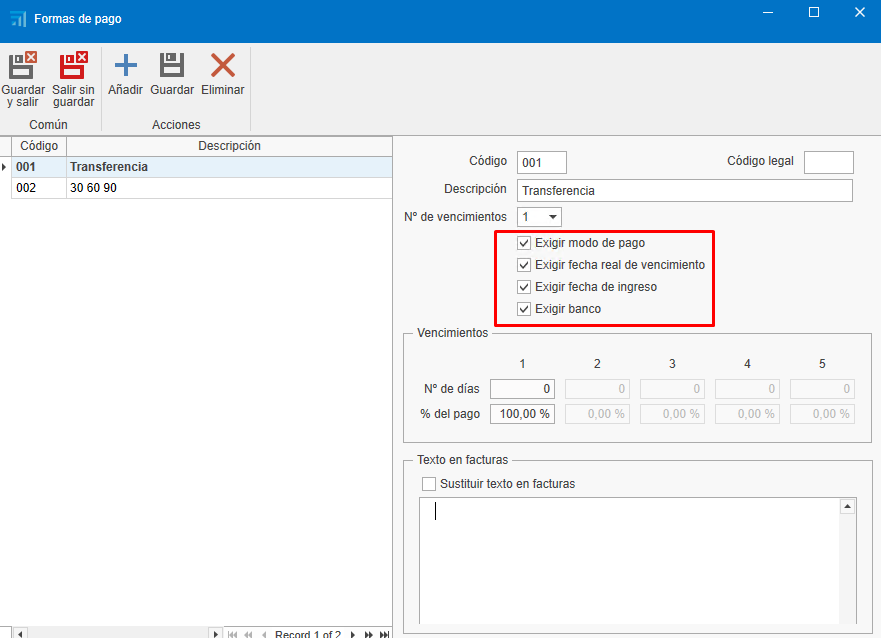
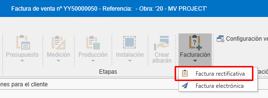
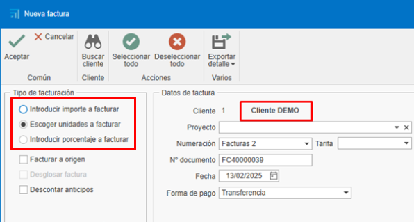
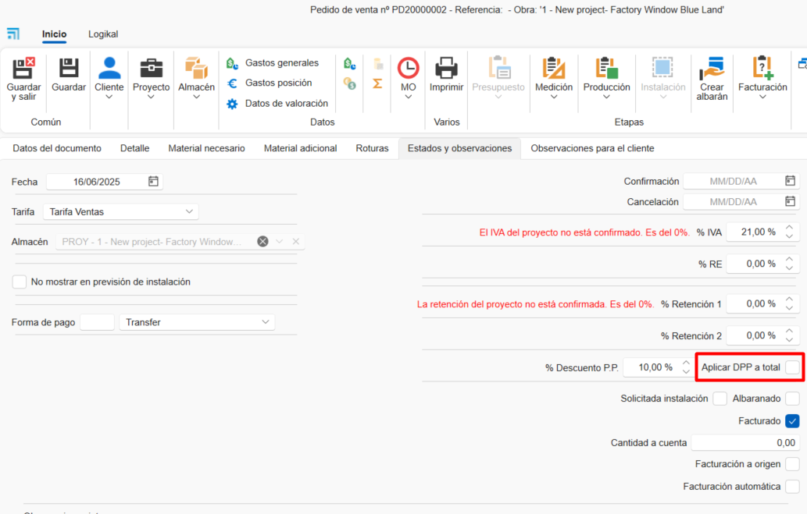

# Faturação

---

## 1. Introdução
Este manual explica o processo de criação, edição e gestão de faturas. Você aprenderá a utilizar filtros, criar faturas a partir de orçamentos, gerir cobranças e realizar ajustes necessários.

---

## 2. Criação de faturas a partir de orçamentos
Para criar faturas a partir de orçamentos, siga estes passos:

### 2.1. Criar um orçamento:

- Adicione linhas com os produtos ou serviços (ex. janelas, chapas).
- Defina quantidades e preços.

    

### 2.2. Gerar a fatura:

- Acesse a seção de faturação.
- Selecione "Criar fatura" a partir do orçamento.

     

- Escolha o tipo de fatura:

    - **Fatura de adiantamento**: Permite cobrar um valor parcial e faturar o restante posteriormente.

        

    - **Fatura por unidades**: Fatura apenas as unidades indicadas que deseja faturar. Em seguida, exige continuar faturando no mesmo modo (marcada por padrão).

        

    - **Inserir valor a faturar**: Permite cobrar um valor específico do total da fatura. Em seguida, exige continuar faturando no mesmo modo.

        

    - **Inserir percentual a faturar**: Permite cobrar um percentual específico do total da fatura. Em seguida, exige continuar faturando no mesmo modo.

        

- __Fatura a origem__ é fatura por certificado.

### 2.3. Enviar a fatura ao cliente:

- Uma vez criada, você pode ver a fatura em visualização antes de enviá-la ou imprimi-la.

    

    

     

- Envie a fatura ao cliente por e-mail ou imprima-a.

    

> **Nota:** A fatura pode ser gerada a partir do orçamento, pedido ou guia de remessa. Recomenda-se gerar as faturas sempre a partir do mesmo documento, ou seja, se fizer a partir do pedido (normalmente acordado com o cliente), continue gerando as faturas sempre daí para uma melhor gestão e rastreabilidade.

### 2.4. Estados e observações

- Ao criar a fatura na aba **Estados e observações** serão exibidos campos como Data, Vencimentos, retenção, RE, Desconto P.P.

---

## 3. Gestão de cobranças

Para gerir as cobranças das faturas:

### 3.1. Marcar faturas como cobradas:

- A partir do próprio documento da fatura, é possível marcar que a fatura foi cobrada.

    

- Outra opção é acessar a lista de vencimentos em "Documentos de vendas".

    

- Filtre as faturas pendentes de cobrança.

    

- Selecione as faturas e marque-as como cobradas. Para selecionar mais de uma fatura, use a tecla **Ctrl + Click** ou **Ctrl + A** para selecionar todas.

    

- Indique o modo de pagamento (transferência, nota promissória, etc.), a data de cobrança e a data de entrada na conta. Os campos marcados em vermelho são obrigatórios. Estes campos podem ser configurados previamente em "Formas de pagamento".

    

    > **Nota:** Nesta seção, assim como em outras listas de documentos, podem ser usados filtros conforme necessário.

- Na lista de documentos de vendas, aparecerá na rastreabilidade do orçamento o estado da fatura como "Cobrado".

    

### 3.2. Relatórios de cobranças:  

- Aceite o orçamento para que gere um pedido (caso tenha faturado a partir do orçamento).

    

- Utilize o relatório "Estado de faturação e cobranças" para ver o estado das faturas (cobradas, pendentes, percentual de faturação, etc.). Filtre pelo orçamento que deseja exibir.

    

    

- Utilize o relatório de lista de faturas para ver as informações da fatura (data, cliente, base tributável, IVA, total da fatura, etc.). Este relatório pode ser listado por intervalo de datas ou marcando um check que indica que se aplique apenas às faturas filtradas na lista.

    

    

    

---

## 4. Faturação a partir de pedidos

Para faturar a partir de pedidos, siga estes passos:

### 4.1. Faturação a partir do pedido

- É possível faturar diretamente a partir de "Pedido", seguindo os mesmos passos do orçamento. 

- Outra maneira de faturar é criar uma produção a partir de um pedido e indicar a quantidade de janelas que deseja nesta fase de produção. 

    

    

    

- Uma vez confirmado que as janelas indicadas foram fabricadas na fase "Produção 1", por exemplo, você pode ir ao pedido e criar uma fatura indicando a quantidade a faturar.

    

> **Nota:** Recomenda-se sempre faturar a partir do pedido, pois é o que foi acordado com o cliente para aceitar o orçamento.

- Se descontar o total da fatura (unidade) e já tiver emitido e cobrado uma fatura de adiantamento, ao tentar confirmar a fatura aparecerá uma mensagem para confirmar ou não o desconto do adiantamento.

    

- Ao confirmar, o adiantamento será descontado da fatura.

    

- Ao gerar a fatura para enviar ao cliente, você verá em detalhe o que foi cobrado e descontado.

    

---

## 5. Faturação a partir de guias de remessa

Se trabalha com guias de remessa, siga estes passos:

### 5.1. Criar guias de remessa a partir de pedidos:

- Gere guias de remessa para as produções realizadas.

    

> **Nota:** Certifique-se de que os preços e descrições estejam corretos.

### 5.2. Faturar a partir das guias de remessa:

- Acesse o pedido correspondente.
- Selecione "Criar fatura" a partir da guia de remessa e siga os mesmos passos anteriores.

    

> **Nota:** Verifique se os preços e as unidades coincidem com o acordado com o cliente, pois podem variar caso haja alguma modificação na produção (ex. alteração da medida da janela), o que pode afetar o preço e gerar fatura com valor diferente do pedido.

---

## 6. Formas e modos de pagamento

Configure as formas e modos de pagamento conforme suas necessidades:

### 6.1. Formas de pagamento:

- Defina como será realizado o pagamento (ex. 30 dias, 60 dias, 90 dias). Podem ser criadas tantas formas quanto necessário, com diferentes configurações. 

    

- Configure se é necessário exigir o modo de pagamento, a data real de vencimento, a data de entrada e o banco. Esta configuração será refletida na seção de lista de vencimentos quando a fatura for marcada como cobrada e os campos vermelhos obrigatórios aparecerem. 

    

- Estabeleça o número de vencimentos e os percentuais de pagamento.

    

### 6.2. Modos de pagamento:

- Indique como será realizado o pagamento (transferência, nota promissória, à vista).

    

- Configure se é necessário exigir a data de cobrança, o banco ou a data de entrada na conta.

    

---

## 7. Retificativas e anulações

Se precisar corrigir ou anular uma fatura:

### 7.1. Faturas recém-criadas: 

- Se a fatura não foi enviada, exclua-a e crie-a novamente com a mesma numeração. Existem diferentes formas de excluir a fatura:

    - Na lista de vendas, localize a fatura, clique com o botão direito sobre a linha e selecione "Excluir".

         

    - Na fatura, abra-a e exclua-a a partir da aba "Fatura", clique com o botão direito e selecione "Excluir".

        

    - Na fatura, no canto superior esquerdo, clique no logo da ENBLAU e selecione "Excluir".

        

### 7.2. Faturas já enviadas:

- Caso a fatura já tenha sido enviada, emita uma fatura retificativa.

    

- Certifique-se de que cumpre os requisitos da Receita Federal.

## 8. Confirmação de fatura (Proforma)

- Para gerar um documento de confirmação (proforma) antes de emitir a fatura ao cliente, você pode fazê-lo a partir de: **Documentos de Venda → Faturação → Faturação de Pedidos**.

    

- Abrirá uma janela **Nova fatura**, onde você deve buscar o cliente para gerar a proforma: 

    

- Na parte inferior aparecerão os pedidos pendentes de faturar desse cliente na aba “Tipo de fatura e cabeçalho”. Na coluna **Faturar**, dê um duplo clique para selecionar os pedidos que deseja gerar: 

    

- Escolha o "Tipo de faturação" de como o documento deve ser gerado:

    

- Na aba “Detalhes das faturas”, você poderá ver todas as posições de cada pedido e, na barra superior, a opção Exportar detalhes permite exportar em .pdf ou .xls: 

    

    - Como exemplo, verá em PDF: 
    
    

---

> **Gestão de filtros** Use filtros e filtros personalizados para otimizar a pesquisa nas listas. Para mais informações, siga este link: [4. Gestão de filtros](/Utilidades/4.UT_Gestion_Filtros)

---

## 9. Desconto por pagamento antecipado

O **desconto por pagamento antecipado** é uma redução aplicada ao valor total de uma fatura quando o cliente realiza o pagamento em um prazo curto previamente estabelecido. Seu objetivo é incentivar o pagamento antecipado e facilitar o fluxo de caixa do fornecedor.

### 9.1. Aplicação recomendada

Recomenda-se **incluir o desconto desde o pedido**, na seção **"Estados e observações"**, para que seja refletido corretamente na fatura final, seja ela gerada a partir do **pedido** ou da **guia de remessa**.

> ⚠️ **Importante**: Aplicar o desconto diretamente na fatura pode gerar **desajustes em relatórios** como *"Estado de fatura e cobranças"*, pois o valor faturado não corresponderá aos valores previstos originalmente.

### 9.2. Cálculo do desconto

Existe um **check de configuração** que determina como o desconto é aplicado:

- Se o check estiver **ativado**, o desconto é aplicado **sobre o total com IVA incluído**.
- Se o check estiver **desativado**, o desconto é aplica **somente sobre a base tributável**, e em seguida calcula-se o IVA sobre o valor líquido.

    

---

## 10. Faturação de guias de remessa

### 10.1. Compras

Na seção **Documentos de compra**, existe uma opção específica para a **Faturação de guias de remessa**.  
Ao selecioná-la:

- Abre-se uma janela onde você pode **escolher o fornecedor**.
- Em seguida, será exibida uma **lista de guias de remessa**, onde é possível:
  - **Filtrar** por projeto, datas, documentos, etc.
  - **Selecionar** as guias que deseja faturar, marcando a caixa correspondente na coluna **Selecionar**.

    

### 10.2. Vendas

No módulo de **Documentos de venda**, existe uma opção semelhante para a faturação de guias de remessa.  
Ao acessar:

- Abre-se uma janela onde você pode **indicar o projeto e/ou o cliente**.
- O sistema exibirá a lista de guias correspondentes.
- Com um **duplo clique** sobre a caixa da coluna **“A faturar”**, você poderá selecionar facilmente os documentos que deseja incluir na fatura.

    

    

---

## 11. Faturação eletrónica (FACTURAE)

- Para gerar uma fatura eletrónica a partir do ENBLAU, é necessário que certos campos obrigatórios estejam preenchidos em **Empresas**, **Clientes** e **Formas de pagamento**.

    **Empresa:** Os campos são NIF, Endereço, Cidade, Código Postal, Província e País. No menu: Configuração - Geral - **Empresa**.
    
    
    
    

    > **Nota:** Se não houver empresa criada na seção **Empresa**, crie-a com as mesmas informações que estão em Configuração - **Geral**.

    **Clientes:** Os campos são Nome comercial, NIF/CIF, Código do país e Tipo de pessoa (**J**: Jurídica, **F**: Física). No menu: Vendas - **Clientes**.
    
    
    
    

    **Formas de pagamento:** O campo Código Legal. No menu: Vendas - Documentos de venda - Configuração - **Formas de pagamento**.
    
    
    
    

    > **Nota:** O código legal das formas de pagamento é um código fornecido pelo escritório de contabilidade ou gestão da empresa.

- Em seguida, na seção **Documentos de venda**, devem ser seguidos os passos:

    - **1-** Abra a fatura que deseja emitir como fatura eletrônica.

    - **2-** Na faixa superior da fatura, clique no botão **Faturação** e selecione a opção **Exportar para Facturae** no menu suspenso.
    
    

    - **3-** Indique o caminho onde a fatura eletrônica será salva em formato XML.
    
    

    - **4-** Ao salvar, abrirá uma janela para selecionar uma assinatura certificada válida. Se necessário, clique em Mais opções, selecione o certificado correspondente e clique em Aceitar.
    
    
    
    

    - Ao clicar em Aceitar, será exibida uma mensagem indicando que a exportação foi concluída corretamente no caminho especificado.
    
    

    > ⚠️ **Importante!** Uma vez exportada a fatura eletrônica, não poderá ser excluída nem modificada.

    - **5-** Após a exportação da fatura eletrônica em formato XML, acesse a página do [Validador e visualizador de faturas](https://face.gob.es/es/facturas/validar-visualizar-facturas) para enviar o arquivo e validar seu conteúdo.
    
    

    - Ative as opções Formato Facturae e Assinatura da fatura para prosseguir com a validação.
    
    

- Ao imprimir o relatório de uma fatura eletrônica a partir do ENBLAU, verá no canto superior direito um código QR. Este QR contém informações relevantes da fatura, como NIF, nome, endereço, cliente, número da fatura, entre outros dados.
    
    
    
    

---

## 12. Considerações finais
- **Mantenha os pedidos atualizados**:  
  Todos os documentos devem estar vinculados a um pedido para facilitar o controle de custos e faturação.

- **Exportação contábil**:  
  Ao final do mês, exporte os dados para contabilidade a partir da lista de vendas ou compras.

- **Dúvidas e suporte**:  
  Se surgir alguma dúvida, envie um e-mail para a equipe de suporte para resolvê-la rapidamente.

---

Este manual permitirá gerir a faturação de maneira eficiente e evitar erros comuns.
