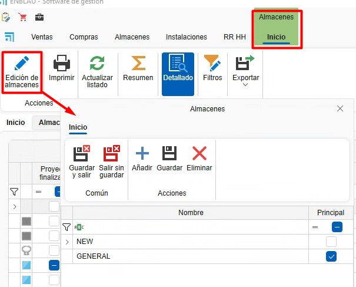
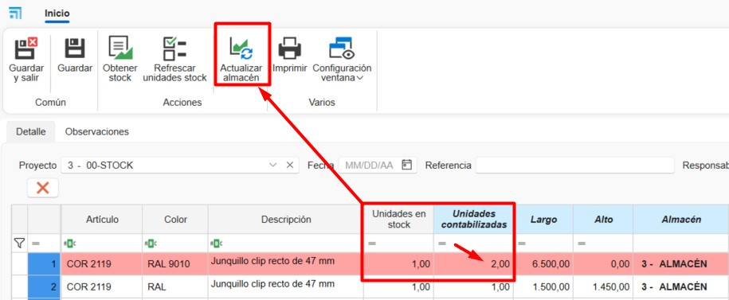

# Sistema de controle de estoque ENBLAU

---

## 1. Propósito

Este manual foi desenvolvido para novos usuários do sistema de controle de estoque utilizado pelos Clientes e Endades. O objetivo principal é fornecer um guia detalhado para a gestão eficiente de projetos, desde a criação de pedidos até a otimização do processo de produção no ENBLAU. Este documento abrange os passos necessários para realizar as operações principais do sistema e está estruturado de forma sequencial para facilitar a compreensão.

---

## 2. Gestão de pedidos de compra

### 2.1. Pedidos de compra

- No menu principal **Compras**, acesse a seção "Pedidos de Compra".
- Especifique os materiais necessários e suas quantidades.
- Em caso de alterações nas referências, adicione-as manualmente se estiverem configuradas na base de dados.
- No pedido de venda (na seção **Venda**), selecione o documento e vá para a aba **Material necessário** para gerar a lista de materiais do pedido.

    - As linhas dos artigos exibidas em verde indicam que há material em estoque para esse projeto ou para o projeto atribuído como **Stock**. As linhas exibidas em vermelho indicam que não há materiais nesse projeto ou em estoque.

    - Você pode indicar se deseja ou não comprar, caso já tenha no depósito. Para cada material será exibida a informação: unidades em estoque, unidades reservadas, unidades pendentes.

    

  > ⚠️ **Importante!** Para atribuir um projeto do tipo stock, vá em Geral - Configuração - **Compras e Armazém**, e indique no campo suspenso **Projeto para stock** um projeto previamente criado para gestão de estoque.

  

- Confirme em **Pedir material** e envie o pedido ao fornecedor correspondente.

- Na seção **Armazéns**, existe a opção **Pendente de receber**, que mostra uma lista com os materiais pendentes de recebimento para cada projeto e pedido de compra.

  

- Sobre a linha do artigo, clique com o botão direito para abrir o pedido de compra desse material:

  

> ℹ️ **Nota:** Para informações detalhadas sobre pedidos de compra, consulte: [Pedidos de Compras](1.PR_Ventas_Compras.md#4-compras)

> ⚠️ **Importante!** Para realizar o pedido de materiais no documento de venda, em alguns casos, são necessárias permissões especiais. Essa permissão também é necessária para fabricar ou instalar.

### 2.2. Atribuir materiais a projeto

- No Material necessário, durante o processo de listar e solicitar materiais, você pode, conforme a necessidade, atribuir artigos de outro projeto ao projeto atual. No menu de locais, clique com o botão direito sobre a linha - **Atribuir**:

  

  - Indique o projeto de destino (por padrão é o atual) e a quantidade (por padrão a necessária para o projeto):

  

  - Ao atribuir o artigo ao projeto atual, a unidade de estoque será automaticamente transferida para o projeto de destino, somando a quantidade atribuída, e será subtraída do projeto de origem. O artigo ficará verde.

> ⚠️ **Importante!** Certifique-se de que os materiais do projeto de origem possam ser utilizados para o traspasse dos artigos.

- Colunas **Tem stock no projeto** e **Tem stock no armazém**. Estas colunas são utilizadas para filtrar os materiais atribuídos ao projeto do documento de venda e os materiais disponíveis no projeto definido para gestão de stock. Desta forma, haverá controlo dos materiais disponíveis antes de emitir uma ordem de compra ao fornecedor.

  

- Opção **Atribuir material**. Esta função permite atribuir automaticamente materiais a partir do projeto definido para gestão de stock.

  

### 2.3. Materiais reservados

- Em documentos de **Vendas**, **Compras** e **Projetos**, é possível reservar materiais para o projeto, utilizando **Materiais reservados** no menu suspenso de **Armazém**.

  

- Abrirá uma janela de Material reservado, e na seção **Material do projeto**, você pode arrastar materiais dos pedidos para o fornecedor:

  

- Na seção de Armazéns, é possível visualizar todos os materiais reservados de um projeto:

  

  

> ℹ️ **Nota:** O uso de material reservado é apenas visual; não impede a utilização dos materiais mesmo que estejam reservados. Recomenda-se o uso de [Atribuir materiais a projeto](#22-asignar-materiales-a-proyecto) para melhor controle de estoque.

### 2.4. Reposição de estoque

- Em **Compras**, existe a opção **Reposição de estoque**, que exibirá uma lista de materiais a solicitar quando estiverem abaixo do mínimo ou do habitual.

  

- Materiais **marcados em vermelho** estão abaixo do **mínimo** ou do **habitual**.  

    - A coluna **Unidades em estoque** mostra a quantidade disponível.  
    - A coluna **Unidades pendentes** mostra a quantidade pendente de receber.
    - A coluna **Unidades a pedir** indica o que falta para atingir o **máximo em estoque**.  
    - Materiais que cumprem o mínimo ou habitual **não aparecem na lista**.

- Materiais **marcados em verde** não possuem máximo definido.  

    - Por padrão, é adicionada **uma unidade** em mínimo e habitual para exibição na lista de reposição.

- Marque a caixa **A importar** para os materiais a solicitar e depois clique em **Importar** para adicionar ao pedido de compra.

  

> ℹ️ **Nota:** Para mais informações sobre como definir mínimo, máximo e estoque habitual, consulte [Configuração de materiais](#61-configuração-de-materiais).

---

## 3. Gestão de armazéns e movimentos

### 3.1. Layout de armazéns

- No menu principal **Armazéns** - **Estoque**, é possível adicionar ou editar armazéns.

  

- Configure o layout do armazém em **ENBLAU** – **Configuração** – **Armazém** – **Layout**:

  

  - Crie zonas, prateleiras e posições para organização clara. Exibido em vista de árvore.
  - Relacione cada posição à área de armazenamento correspondente. Exemplo:
    - **Adicionar Planta**: Adiciona uma planta e permite indicar o armazém.
    - **Adicionar Zona/Subzona**: Adiciona zona ou subzona abaixo do local selecionado.

    

### 3.2. Estoque

- Em **Armazéns - Estoque**, você tem a lista com opções **Resumo, Resumo com localização e Detalhado**:

  

  

  - **Resumo:** Lista resumida de materiais agrupados por projeto. Mostra totais de unidades, unidades pendentes e reservadas.

  - **Resumo com localização:** Lista resumida de materiais por projeto e sua localização.

  - **Detalhado:** Lista detalhada de materiais com projeto de compra, projeto atribuído, localização e separado por documento de guia de compra. Permite descontar, transferir e atribuir artigos.

### 3.3. Movimentos em armazém

- Realize movimentos de materiais entre zonas e projetos:
  - Em **Armazéns - Estoque – Detalhado**, clique com o botão direito sobre o material para transferir, descontar ou atribuir.

  

  - Selecione o material do projeto.
  - **Descontar**: Indique projeto, número do pedido, responsável e quantidade (barras e peças) ou comprimento (juntas).

    

  - **Transferir**: Indique origem, destino, quantidade (barras e peças) ou comprimento (juntas).

    

  - **Atribuir**: Indique projeto de destino, responsável, quantidade (barras e peças) ou comprimento (juntas). Função igual à de Material necessário - [Atribuir materiais a projeto](#22-asignar-materiales-a-proyecto).

     

- Movimentos de entrada, saída, transferência e atribuição são refletidos na **Guia de remessa**. Entradas e saídas podem ser vistas em **Armazém – Movimentos**.

  

  

- Em Movimentos de armazém existe a função **Devolver**. Clique com o botão direito sobre o movimento de saída e selecione devolver:

  

  Abrirá uma janela **Movimento de devolução**, onde indica unidades e localização a devolver. Por padrão, é a localização da saída do material:

  

- A opção **Abrir** na lista detalhada abre a guia (coluna numeração) do artigo selecionado:

  

- A opção **Adicionar retalho**, disponível a partir da lista detalhada, aplica-se exclusivamente a artigos do tipo painel e permite adicionar retalhos de painéis ao stock. Para tal, devem ser indicados a **Localização** e as dimensões **Comprimento x Altura** necessárias. Esta ação irá gerar um movimento de entrada do painel em stock.

   

  

### 3.4. Relatórios de armazém (inventário)

#### 3.4.1. Relatórios de stock

Na secção **Armazéns → Stock** podem ser impressos diferentes tipos de relatórios:

- **Resumo:** Existem dois relatórios: **Inventário** e **Inventário por data**.

  

  **Inventário**  
  Gera um relatório de inventário com base nos filtros aplicados na lista do armazém.  
  Inclui as seguintes colunas: Artigo, Projeto, Unidades, Unidades pendentes e Unidades reservadas.

  

  **Inventário por data**  
  Gera um relatório de inventário até à data selecionada.  
  Inclui as seguintes colunas: Artigo, Descrição, Unidades e Valor.

  

- **Resumo com localização:** Inclui o relatório **Inventário detalhado (resumo)**.

  **Inventário detalhado (resumo)**  
  Gera um relatório de inventário com base nos filtros aplicados na lista detalhada do armazém.  
  Inclui: Localização do armazém, Artigo, Descrição e Unidades.

  

- **Detalhado:** Inclui o relatório **Inventário detalhado**.

  **Inventário detalhado**  
  Gera um relatório de inventário com base nos filtros aplicados na lista detalhada do armazém.  
  Inclui: Projeto, Número da guia de compra, Localização do armazém, Artigo, Descrição e Unidades, agrupadas por referência e comprimento.

  

#### 3.4.2. Relatórios de movimentos de armazém

Na secção **Armazéns → Movimentos de armazém** podem ser impressos os seguintes relatórios:

- **Movimentos**  
  Apresenta uma lista dos movimentos visíveis na lista principal.  
  Inclui: Data do movimento, Responsável, Projeto atribuído, Localização do armazém, Artigo, Descrição, Unidades e Tipo de movimento.

  

- **Movimentos I**  
  Apresenta uma lista alternativa dos mesmos movimentos.  
  Inclui: Tipo de movimento, Data do movimento, Responsável, Documento, Unidades, Valor, Artigo e Descrição.

  

### 3.5. Finalizar projeto (projeto de destino)

Ao finalizar um projeto, você tem a opção de indicar um **Projeto de destino** onde os materiais restantes serão atribuídos. Por exemplo, você pode atribuí-los ao projeto definido para gestão de estoque.

**Processo ao finalizar:**
- Especificar o projeto de destino para os materiais excedentes
- O sistema gera automaticamente um **movimento de entrada** no projeto atribuído
- Os materiais mantêm sua localização original no armazém
- Apenas a atribuição do projeto é modificada, não a localização física

---

## 4. Inventários

- Na seção **Armazéns** - **Inventários** é possível realizar uma normalização no armazém considerando o estoque em tempo real.

  

### 4.1. Novo inventário

  - Para criar um inventário, acesse a seção de Inventários e selecione **Novo**.

    

### 4.2. Contabilização de Estoque

  **1.** Em um inventário, selecione o **Projeto** definido como **Stock**.  

  **2.** Clique em **Obter estoque** para carregar a lista de materiais do projeto **Stock**:  
    
      

  **3.** Na coluna **Unidades contabilizadas**, insira as unidades reais em estoque do artigo, conforme contabilizado na localização do armazém.  
      

  **4.** Após inserir as unidades na coluna **Unidades contabilizadas**, as linhas dos artigos serão exibidas em vermelho, indicando alteração de unidades.  
     Em seguida, clique em **Atualizar armazém** para registrar a regularização de acordo com as unidades contabilizadas.  
      

  **5.** Após atualizar o armazém, as linhas serão exibidas em verde.  

  - Nas colunas **Unidades Stock** e **Unidades contabilizadas** serão refletidas as unidades atualizadas.  
  - Na coluna **Contabilizado** será marcada uma caixa.  
  - Na coluna **Data contabilizada** aparecerá a data da regularização.  

          

  - Este processo gera um movimento de regularização (entrada ou saída) no armazém:  

        

    > ℹ️ **Nota:** Na lista do inventário, apenas **entradas** e **saídas** são refletidas.  
    > Não é possível realizar movimentos do tipo **transferência** a partir desta lista.  

  **6.** Também é possível adicionar novos artigos a partir das árvores de:

  - **Artigos (materiais ENBLAU)**  
  - **Artigos importados (materiais do Logikal)**  

    Para isso:  
    - Arraste o artigo para a lista do inventário.  
    - Indique **unidades**, **dimensões** (barra, superfície ou junta), **localização em estoque** e **preço**.  
        

    > ℹ️ **Nota:** Ao adicionar um artigo novo ao inventário, sempre indique uma **localização**.  
    > Caso contrário, não será atualizado no estoque.  

  **7.** Com o botão **Atualizar unidades em estoque**, as unidades atuais de cada linha do inventário são atualizadas.  

      

---

### 4.3. Relatório de regularização do inventário

- É possível **Imprimir** a lista do inventário, onde são exibidas as colunas:  
  **Artigo**, **Descrição**, **Data da última verificação**, **Unidades em estoque**, **Unidades contabilizadas** e **Localização**.  

  

    

- Este relatório tem como objetivo facilitar a contabilização manual do estoque no armazém antes de proceder à atualização na lista do inventário.  
  Na coluna **Unidades contabilizadas**, deve-se indicar a quantidade real de cada artigo em estoque.  

    

## 5. Estoque necessário

- Uma vez criada a produção e enviada para a oficina, é possível visualizar e descontar os materiais manualmente.

  

- Abre-se uma janela de Estoque necessário, indicando se o material está disponível nos armazéns e em qual posto (monitor) será descontado. Para descontar o material, marque a caixa na coluna **Estoque a descontar** do material.

  

> ⚠️ **Importante!** Se não houver o material em estoque, não será descontado.

> ℹ️ **Nota:** Para um controle mais detalhado do estoque, recomenda-se usar o app móvel enSITE para esse tipo de desconto de material. Para mais informações sobre o app: [2.1. Recepção em enSITE](4.PR_Manual_Stock_enCONTROL.md#21-recepcion-en-ensite)

---

## 6. Materiais importados

Na seção **Armazéns → Material importado** encontra-se a lista de todos os materiais importados do **Logikal**.

---

### 6.1. Configuração de materiais

Nesta seção é possível definir, para cada artigo, uma série de valores padrão que afetam a gestão de compras e produção:

- **Comprar**:  
  Se esta caixa estiver marcada, o material será proposto por padrão como “a comprar” quando for listado na seção **Material necessário**.

- **Montado no destino**:  
  Se esta caixa estiver marcada, o material será montado no destino durante o processo no posto **Picking** dentro do **enCONTROL**.

- **Controle de estoque**:  
  Se esta caixa estiver marcada, o material ficará visível na lista de **Reposição de estoque** a partir da seção do pedido de compra.

- **Estoque mínimo**, **estoque máximo** e **estoque habitual**:
  Permite definir valores de referência para a gestão de estoque, úteis para alertas, reposições ou planejamento.

    

    Na seção de [Reposição de estoque](#24-reposicion-de-stock) em compras, é possível gerar uma lista de materiais abaixo do mínimo ou habitual, conforme os valores definidos para cada material.

> ℹ️ **Nota:** A configuração correta destes campos melhora significativamente o controle de inventário, o planejamento de compras e a rastreabilidade dos materiais durante a produção.

---

## 7. Produto acabado

O **produto acabado** é aquele que foi completamente fabricado e passou pelo posto de **Verificação final** no **enCONTROL**.

Na seção **Armazéns → Produto acabado** encontram-se duas listas principais:

- **Localização de produtos**
- **Movimentos de produto**

  

---

### 7.1. Localização de produtos

- Na lista de **Localização de produtos** é exibida a informação e a localização atual do produto acabado, conforme definido no posto de **Verificação final** no **enCONTROL**.

  

- A partir desta vista, clicando com o botão direito em uma linha, é possível realizar as seguintes ações:

  - Mover o produto para outra localização.
  - Dar saída ao produto.
  - Abrir o documento de produção relacionado a esse produto.

  

---

### 7.2. Movimentos de produto

- Na seção **Movimentos de produto** são registrados todas as operações realizadas com os produtos acabados, incluindo:

  - Entrada.
  - Saída.
  - Transferência.

  

- Clicando com o botão direito em uma linha cujo **tipo de movimento** seja **saída**, habilita-se a opção **Devolver**.

  

- Ao selecionar esta opção, abre-se a janela **Devolução de produto acabado**, onde deve-se:

  1. Indicar a nova **localização** do produto.
  2. Aceitar a operação.

  

Após concluir o processo, o sistema registrará um novo movimento do tipo **Entrada** no histórico do produto.

> ℹ️ **Nota:** Esta funcionalidade é útil para gerenciar devoluções internas, produtos rejeitados ou realocações logísticas dentro do armazém.

---

> ℹ️ **Nota:** A gestão correta do produto acabado garante melhor controle de inventário, facilita a rastreabilidade e agiliza a preparação de expedições ou entregas.

---

## 8. Gestão de retalhos no Logikal

A gestão de retalhos no Logikal permite reutilizar perfis sobrantes, otimizando o consumo de material e reduzindo desperdícios. Existem várias formas de gerir os retalhos, detalhadas a seguir.

---

### 8.1. Importar retalhos do Excel

1. No **ENBLAU**, aceder a **Armazéns → Stock → Detalhado** e filtrar a lista por **retalhos**.

   

   > ℹ️ **Nota:** Recomenda-se aplicar o filtro por **projeto atribuído** para considerar apenas os retalhos que devem ser utilizados.

2. No menu **Exportar → Exportar perfis**, guardar o ficheiro Excel numa localização local do Windows.

   

   

   

3. No **Logikal**, abrir o projeto onde os retalhos serão utilizados. Ir a **Projeto → Retalhos** para abrir a janela **Editar Retalhos**.

4. Selecionar **Importar** e carregar o ficheiro Excel de retalhos previamente exportado do ENBLAU.

   

   

   

   > ℹ️ **Nota:** As referências mostradas em **vermelho** indicam que o perfil não existe no projeto atual.

5. Na janela **Editar Retalhos**, marque a opção **Usar Retalhos** e guarde as alterações.

   
   
   

6. O relatório de **Otimização de Cortes** mostrará os retalhos disponíveis para cada perfil.

   

---

### 8.2. Adicionar retalhos manualmente

No Logikal, na janela **Editar Retalhos**, a opção **Adicionar** permite inserir retalhos manualmente, especificando:

- Referência do perfil (existente no projeto)
- Quantidade
- Comprimento

---

### 8.3. Gerir retalhos a partir do ENBLAU

1. No **ENBLAU**, num documento de vendas, aceder a:  
   **Logikal → Editor de projeto → Preferências → Retalhos**

   Isto abrirá a mesma janela **Editar Retalhos** do Logikal.

   

   > ℹ️ **Nota:** O funcionamento é exatamente o mesmo descrito anteriormente no Logikal.

2. Ao listar o material a partir do documento ENBLAU, será mostrado o comprimento do retalho a utilizar para os perfis do projeto.

   

   > ℹ️ **Nota:** Se o material estiver atribuído, por exemplo, a um projeto de **Stock**, é necessário atribuí-lo ao projeto em que será utilizado.

---

## 9. Controle de estoque e relatórios

- Monitore o estoque necessário a partir da seção "Produção".
- Identifique materiais reservados e pendentes em tempo real.
- Gere relatórios de inventário para avaliar o uso de materiais e planejar futuras compras.

---

## 10. Resolução de problemas comuns

- **Erro ao importar referências**: Verifique se as referências estão configuradas na base de dados.
- **Materiais excedentes ou faltantes**: Certifique-se de registrar corretamente localizações e quantidades ao receber materiais.
- **Problemas com o layout do armazém**: Revise a configuração de zonas e ajuste conforme necessário.

---

## 11. Conclusão

Este manual oferece um guia passo a passo para os principais processos no sistema de controle de estoque. Seguindo estas instruções, os usuários poderão gerir eficientemente os inventários, melhorar a produção e otimizar a relação com fornecedores. Para suporte adicional, contate o administrador do sistema.

