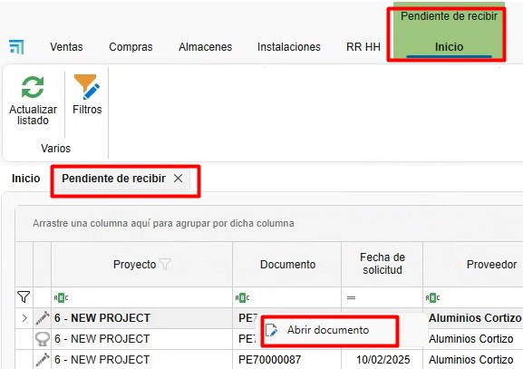
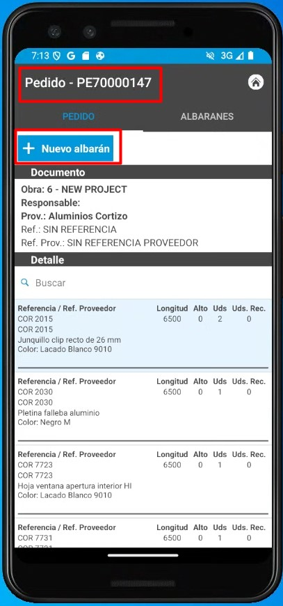
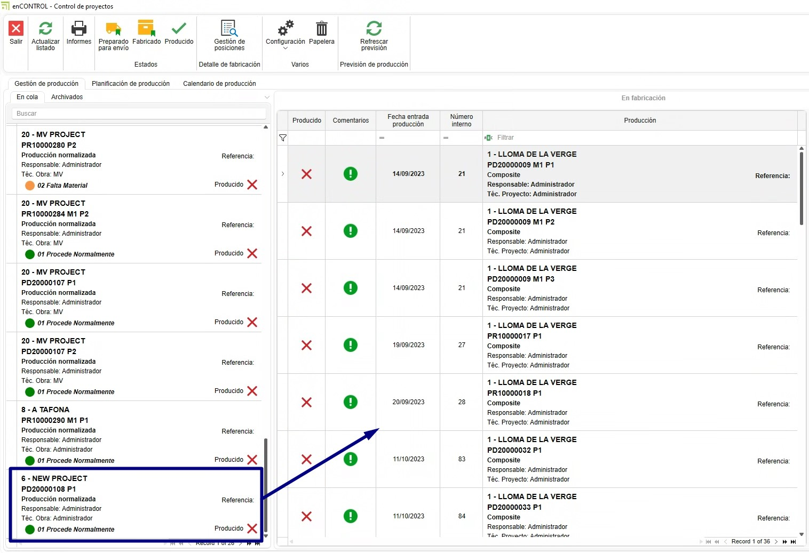
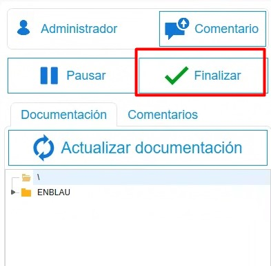
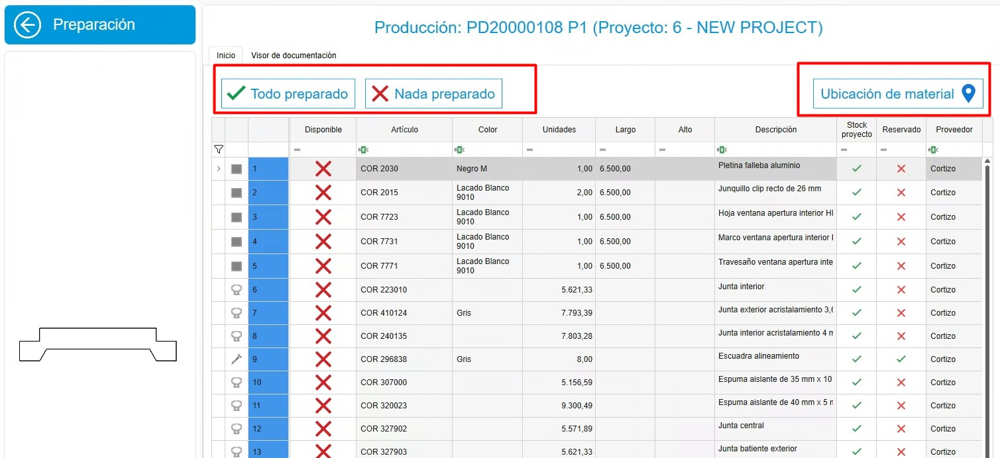
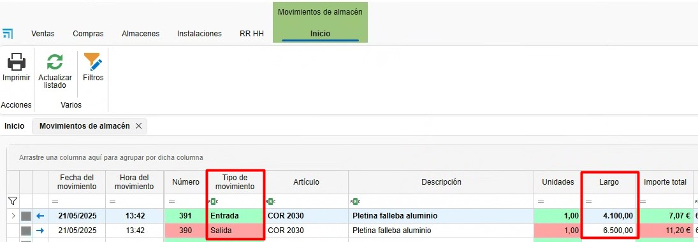
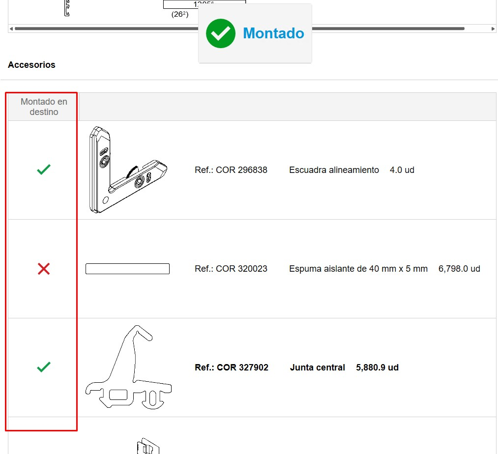
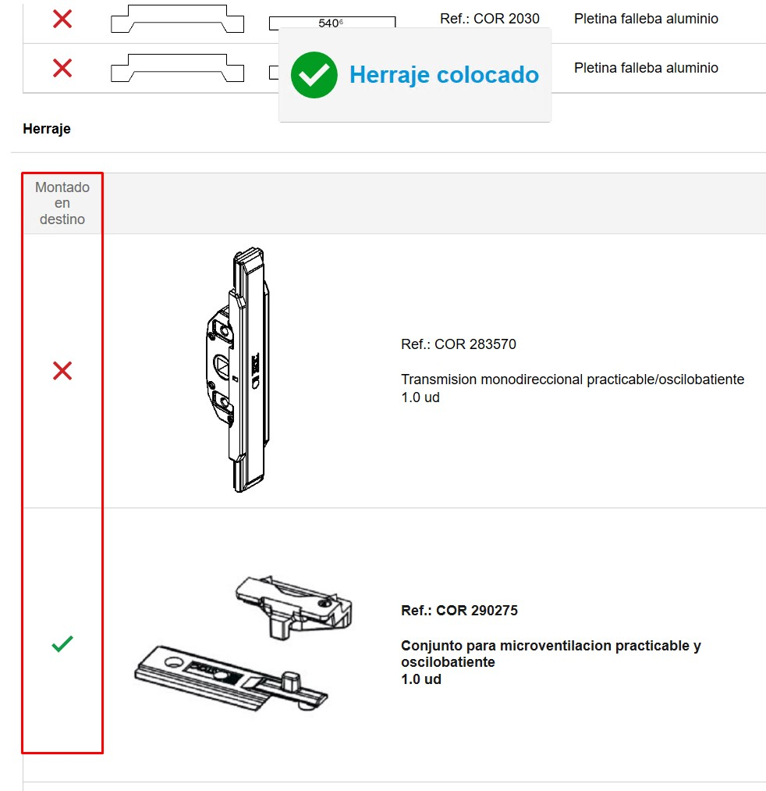
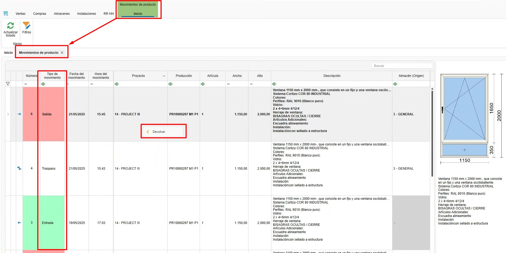
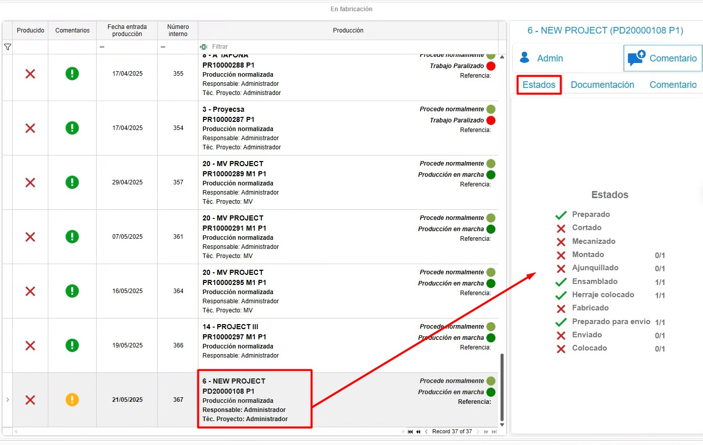

# Sistema de controle de estoque enCONTROL

---

## 1. Propósito

Este manual foi elaborado para novos usuários do sistema de controle de estoque utilizado pelos Clientes e Endades. O principal objetivo é fornecer um guia detalhado para a gestão eficiente de projetos, desde a criação de pedidos até a otimização do processo de produção no enCONTROL e enSITE. Este documento cobre os passos necessários para realizar as operações chave do sistema e está estruturado de forma sequencial para facilitar a compreensão.

---

## 2. Recepção de materiais
### 2.1. Recepção no enSITE

- Uma vez criado o pedido de compra, no ENBLAU em **Armazéns**, acesse a opção **"Pendentes de Receber"** na seção de Armazéns. Será aberta uma aba com todos os materiais pendentes de recebimento para cada projeto.

> **Nota:** Para informações mais detalhadas sobre pedidos de compra, siga este link: [2.1. Pedidos de compra](3.PR_Manual_Stock_ENBLAU.md#21-pedidos-de-compra)

- **Modo de recepção**: Abra o **enSite** a partir da oficina via Wi-Fi com a pessoa responsável pelo recebimento do pedido.
- Em **Recepção de pedidos**, localize o pedido correspondente (ordenado por data).

- Registre a recepção em **Novo Alvará**, criando um alvará na seção **Armazém**.

- No ENBLAU, a aba **Pendente de receber** em **Armazéns** se sincroniza e você não verá mais os materiais desse pedido.
- No **Pedido de Compras**, é possível verificar a rastreabilidade.
- No **enSite**, indique as quantidades recebidas e a localização onde serão armazenadas (Armazém, Andar, Zona, Subzona…). Depois, será possível visualizar a localização de cada material.

- Pelo app **enSITE**, também é possível buscar por artigos e ver todas as localizações onde o artigo está. Depois, pode-se mover ou descontar os artigos.

     
    

> **Em caso de materiais danificados ou outras ocorrências**, você pode anexar documentos ou tirar fotos e adicioná-las ao alvará. Depois, será possível revisar no ENBLAU.

### 2.2. Recepção no ENBLAU

- No ENBLAU, uma vez criado o pedido de compra, é possível gerar um alvará de recebimento de materiais do pedido.

- No alvará, você pode indicar a recepção de cada material informando a quantidade. Por padrão, todos estarão marcados com a quantidade do pedido.

- Em seguida, indique a localização do alvará na aba de armazéns do alvará.

> **Nota:** Para informações mais detalhadas sobre recepção de materiais no ENBLAU, siga este link: [4.2. Recepção de material](1.PR_Ventas_Compras.md#42-recepcion-de-material)

---

## 3. Produção e enCONTROL

### 3.1. Produção

- Crie projetos de produção baseados nos pedidos de clientes no ENBLAU.
  - Criar produção.

    

  - O próximo passo é **Enviar para produção**.

    

  - Na produção, é possível ver em **estoque necessário** os materiais descontados e também descontar manualmente.

    
    

> **Nota:** Para informações mais detalhadas sobre criar fases de produção no ENBLAU, siga este link: [3.5. Produção](1.PR_Ventas_Compras.md#35-produccion)

### 3.2. enCONTROL

- Abra o **enCONTROL**. Os projetos de produção aparecem. Se você for usuário administrador, verá todos os projetos; caso contrário, apenas os projetos atribuídos.

- Abra o **monitor de controle**. Pode ser aberto clicando duas vezes em qualquer filtro (na cabeceira) ou clicando duas vezes no projeto e selecionando o posto de **Controle**, se estiver configurado no equipamento.

    

- Quando enviado para produção (Oficina), ele vai para a fila de produção na aba **Gestão de Produção**. O responsável pela produção decide a prioridade.

    

- Para tirar da "Fila", basta arrastá-lo para o painel "Em fabricação" e abrirá uma janela de **Tarefa** para propor uma data, indicar o status, classificação, etc.

    

    

- Na aba Planejamento de produção, define-se a quem o projeto é atribuído, arrastando os projetos para cada responsável. É necessário selecionar o responsável e arrastar o projeto (é possível selecionar mais de um responsável com ctrl + botão direito). Também é possível alterar a prioridade da esquerda para a direita e de cima para baixo:

  

  Para remover o projeto atribuído, selecione o responsável, selecione o projeto e use ctrl + delete.

- Na aba Calendário de produção, é exibido um diagrama de Gantt baseado nos tempos do Logikal (no exemplo) com datas de entrada e saída da produção.

  

- Otimize os processos de acordo com as áreas de produção (corte, usinagem, montagem, etc.). Na tela principal do projeto, ao clicar duas vezes no projeto desejado, abrirá a janela Selecionar um posto. (Os postos são definidos conforme o cliente e serão exibidos de acordo com o usuário) Exemplos:

  

- Ao entrar em qualquer posto, abrirá a tela com o botão **Iniciar**:

  

  Ao iniciar, o tempo é contado até que seja pausado ou finalizado.

- Todas as telas possuem alguns campos em comum:
    - Comentário - É possível adicionar comentário e escolher a severidade no menu suspenso. O último comentário válido desbloqueia o próximo passo.

      

      

    - Pausar - Ao pausar o trabalho, é necessário indicar o motivo da pausa. Depois, pode-se retomar indicando novamente o mesmo posto.

      

    - Finalizar - Finaliza-se quando o trabalho naquele posto é concluído. Depois, pode-se retomar iniciando novamente o mesmo posto.

      

    - Documentação - Na seção de documentação, é possível visualizar os documentos de produção exportados do Logikal no visualizador de documentos. Também é possível adicionar um caminho genérico para incluir quaisquer arquivos, catálogos, manuais, etc.

      

#### 3.2.1. Postos de trabalho

- Com um duplo clique sobre a produção abrir-se-á a janela do posto de trabalho configurado para cada equipa.

    

 **1. Preparação de Material (Posto 0)**

  - Tudo Preparado – Marca os materiais com uma verificação em verde indicando que está preparado.
  - Nada Preparado – Marca os materiais com um X em vermelho indicando que não está preparado.
  - Localização Material – Conforme configurado noCONTROL, poderia indicar onde localizar os materiais. Para que esse material seja deduzido apenas dessa localização.

      

**2. Corte (Posto 1)**

  - No corte indica-se o comprimento da barra e o desperdício de retalhos. Abre-se uma janela de retalhos e pode-se alterar o comprimento conforme necessário.

    

    

    > ℹ️ **Nota:** No ENBLAU no apartado Configuração - Geral - **Logikal**. Pode-se indicar o **Retalho mínimo** a ter em conta quando se corta uma barra no posto de **Corte**.

      

      

  - Depois no ENBLAU **Movimentos** de armazém reflectir-se-á uma saída da barra total ex. 6500 e depois uma entrada do mesmo material de ex. 4100 conforme indicado no posto de corte.

    

    - Também no ENBLAU pode-se ver no apartado de **Stock** a lista filtrada por **É retalho** todos os retalhos disponíveis em stock.

      

  - No apartado **Cortados** do posto de corte do enCONTROL na parte direita do monitor mostra-se a lista de cortes realizados e podem-se imprimir as etiquetas de cada barra.

    

**3. Mecanização (Posto 2)**

  - Não desconta materiais, simplesmente é informativo por tempo. Contrasta tempo real.

    

**4. Montagem (Posto 3)**

  - Desconta materiais (acessórios) por cada posição de quadro.

    

  - Na lista de materiais tem a opção de indicar os artigos que vai montar no destino. Esses materiais depois serão adicionados na lista do posto de **Picking**.

  

**5. Ajustamento / Aplicação de Juntas (Posto 4)**

  - Desconta materiais (Juntas, calços, espuma, etc.) por quadro.

  

  - Na lista de materiais tem a opção de indicar os artigos que vai montar no destino. Esses materiais depois serão adicionados na lista do posto de **Picking**.

    

**6. Ensamblagem / Junção (Posto 5)**

  - Informação do quadro, mas não desconta materiais.

  

**7. Ferragens (Posto 6)**

  - Desconta materiais (ferragens) por folha.

    

  - Na lista de materiais tem a opção de indicar as ferragens que vai montar no destino. Esses materiais depois serão adicionados na lista do posto de **Picking**.

    

**8. Soldadura (Posto 7)**

  - Não desconta materiais, simplesmente é informativo por tempo. Contrasta tempo real.

    

**9. Persianas (Posto 8)**

  - Desconta materiais (persianas) por quadro.

    

**10. Transformação (Posto 9)**

  - Neste posto pode indicar um grupo de materiais definidas em lista de materiais (BOM) para transformar num produto, exemplo: Grade.

    

  - Assim como noutros postos, na lista de materiais tem a opção de indicar os artigos que vai montar no destino. Esses materiais depois serão adicionados na lista do posto de **Picking**. Além de depois poder imprimir a etiqueta e localizar o produto.

**11. Verificação final (Posto 10)**

  - Não desconta materiais. Mas, uma vez finalizada a verificação pode-se localizar em Armazém e depois imprimir uma etiqueta do produto acabado.

    

    

    

  - No ENBLAU no apartado de Armazéns no apartado de **Produto terminado** há duas listas:

      **Localização de produtos:** Mostra onde está localizado o produto terminado de cada projeto e produção. Desde esta lista pode-se dar saída, mover de localização e abrir o documento de produção, selecionando sobre a posição com o botão direito.

      

      **Movimentos de produtos:** Mostra os movimentos do produto terminado como entrada, transferência, saída e devolução. Desde esta lista pode-se fazer uma devolução, selecionando sobre a posição de saída com o botão direito.

      

**12. Limpeza (Posto 11)**

  - Não desconta materiais, simplesmente é informativo por tempo. Contrasta tempo real.

    

**13. Picking (Posto 12)**

  - O posto mostra a lista dos materiais marcados previamente noutros postos que se montará no destino.

    

  - Pode criar os pacotes e atribuir para cada material. E depois imprimir a etiqueta para o pacote.

    

    - Indicar a localização de picking para cada material.

      

**14. Quadro / Painel (Posto 13)**

  - Mostra a evolução de cada projeto e o seu estado.

    

**15. Controlo (Posto 14)**

  - Abre o monitor Controlo de projetos. Onde também se pode ver o estado de cada projeto que está em fábrica.

    

> ℹ️ **Nota**: Atribua prioridades e recursos para assegurar a fluidez na produção.

> **Configuração enCONTROL** - Configurar o enCONTROL previamente. Para mais informações, siga este link: [2. Configuração Inicial do enCONTROL](/Configuracoes/2.%20CO_Configuracao_Inicial_enCONTROL/) :

> **Gestão de filtros** - Usar filtros e filtros personalizados para otimizar a busca nas listas. Para mais informações, siga este link: [4. Gestão de Filtros](/Utilidades/4.UT_Gestao_Filtros/) :

---

## 4. Controle de estoque e relatórios

- Monitore o estoque necessário na seção "Produção".
- Identifique materiais reservados e pendentes em tempo real.
- Gere relatórios de inventário para avaliar o uso de materiais e planejar futuras compras.

---

## 5. Resolução de problemas comuns

- **Erro ao importar referências**: Verifique se as referências estão configuradas no banco de dados.
- **Materiais excedentes ou faltantes**: Certifique-se de registrar corretamente as localizações e quantidades ao receber os materiais.
- **Problemas com o layout do armazém**: Revise a configuração de zonas e ajuste conforme necessário.

---

## 6. Conclusão

Este manual fornece um guia passo a passo para os principais processos no sistema de controle de estoque. Seguindo estas instruções, os usuários poderão gerenciar os inventários de forma eficiente, melhorar a produção e otimizar a relação com fornecedores. Para suporte adicional, contate o administrador do sistema.
