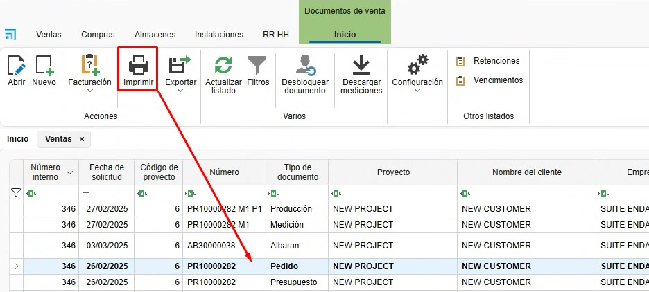
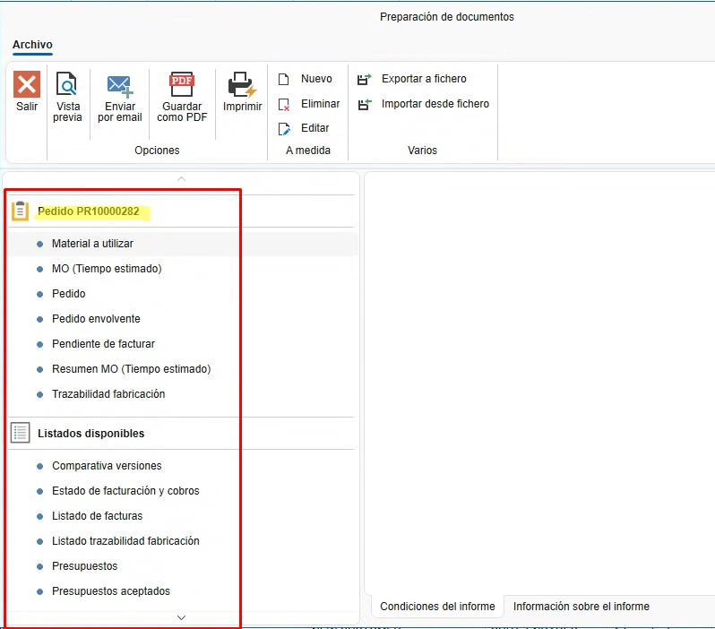
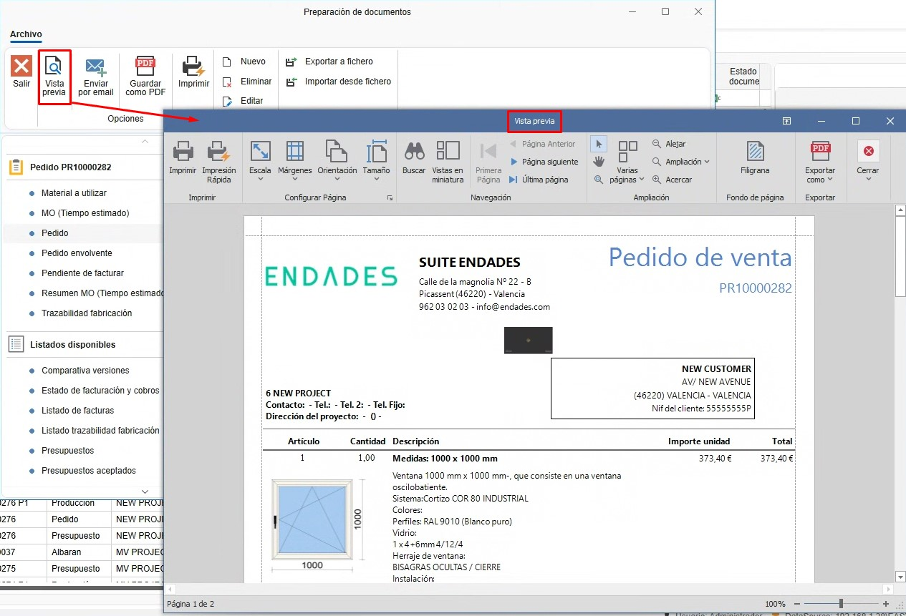

# Relatórios

---

## 1. Introdução
Este manual foi desenvolvido para orientar os usuários sobre como gerar documentos e relatórios no ENBLAU. Desta forma, é possível imprimir ou enviar por e-mail.

---

## 2. Tipos de relatórios
Para cada documento de venda ou compra, é possível gerar diferentes tipos de relatórios conforme necessário.

### 2.1. Documentos de vendas
- Orçamento
- Pedido
- Medição
- Produção
- Nota de entrega
- Fatura

### 2.2. Documentos de compra
- Pedido
- Nota de entrega
- Fatura

---

## 3. Imprimir/Salvar/Enviar relatórios
A partir de qualquer lista de documentos (por exemplo, Documentos de venda), selecione qualquer tipo de documento e clique em **Imprimir**.

  

### 3.1. Preparação do documento
Na janela **Preparação de documentos**, aparece uma lista de relatórios à direita da janela relacionados ao documento.

  

#### 3.1.1. Condições do relatório
- Ao selecionar o tipo de relatório, na aba "Condições do relatório" são exibidas as condições que o documento deve cumprir para que possa ser emitido.

  

#### 3.1.2. Informações sobre o relatório
- Para cada tipo de relatório, na aba "Informações sobre o relatório" é exibida uma breve explicação sobre o relatório.

  

#### 3.1.3. Visualização
- Antes de imprimir ou enviar o relatório por e-mail, você pode visualizar para verificar o documento.

  

#### 3.1.4. Salvar como PDF
- Existe a opção de salvar como PDF. Esta opção abrirá o caminho padrão relacionado ao documento de venda ou compra. (É possível alterar este caminho ao exportar).

  

#### 3.1.5. Imprimir
- Para imprimir os relatórios, selecione o botão **Imprimir**, escolha a impressora configurada no servidor e imprima.

  

#### 3.1.6. Enviar por e-mail
- Para enviar o relatório por e-mail, selecione **Enviar por e-mail**. Será aberta a janela "Novo e-mail" com o e-mail do usuário padrão (esta configuração foi realizada previamente na seção "Contas de e-mail". Para mais informações, siga este link: [1. Configuração Inicial do ENBLAU](/Configuraciones/1.%20CO_Configuracion_Inicial_ENBLAU)).

  

- Na janela "Novo e-mail", você pode anexar outros documentos, escrever no corpo do e-mail, adicionar e-mails em cópia, etc.

---
