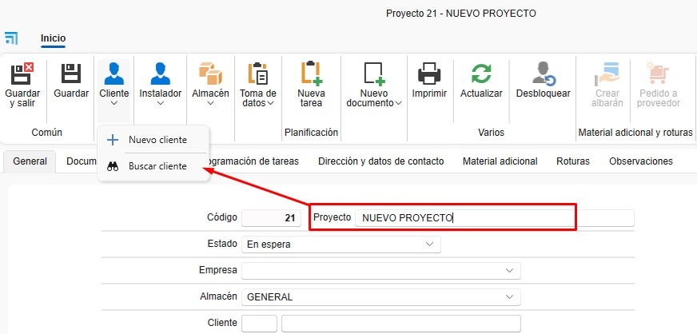
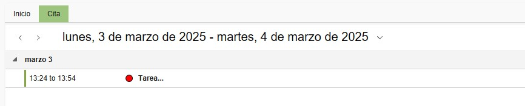

# Projetos, Clientes e Fornecedores

---

## 1. Introdução
Este manual foi desenvolvido para orientar os usuários na criação de Projetos, Clientes e Fornecedores no ENBLAU. Desta forma, eles podem ser atribuídos corretamente aos documentos de venda e compra.

---

## 2. Projetos
O projeto funciona como a "obra". Quantos documentos de venda e compra forem necessários podem ser associados a um projeto.

### 2.1. Criação de projetos
- No menu de Vendas, acesse Projetos.

  

#### 2.1.1. Novo projeto
- Crie um projeto clicando no botão "Novo".

  

- Atribua um nome e selecione o cliente.

  

#### 2.1.2. Detalhes do projeto
- Na aba **Geral**:
  - Empresa
  - Técnico da obra
  - Comercial
  - Responsável de compras
  - Responsável de faturamento
  - Etc.

  

#### 2.1.3. IVA e retenção
- Confirme o IVA e a retenção com o cliente para o projeto, evitando possíveis erros em faturas.

  

#### 2.1.4. Documentação do projeto
- Em **Documentação do projeto**, você pode subir documentos, manuais, etc., todos relacionados ao projeto.

  

- Ao dar duplo clique na pasta principal, abre-se o caminho onde está o ID da obra.

  

- As subpastas podem ser criadas diretamente no caminho ou previamente na configuração de projetos **Diretórios padrão**.

  

### 2.2. Documentos relacionados
#### 2.2.1. Documentos de vendas e compras
- Todos os documentos relacionados ao projeto são agrupados aqui.

  

#### 2.2.2. Programação de Tarefas
- Gerencie as tarefas associadas ao projeto. As tarefas podem ser atribuídas por documento.

  
  
  

---

## 3. Clientes
O cliente é associado a um ou mais projetos.

### 3.1. Criação de cliente
- No menu de Vendas, acesse Clientes.

  

#### 3.1.1. Novo cliente
- Crie um cliente clicando no botão "Novo".

  

#### 3.1.2. Detalhes do cliente
- Atribua um nome e preencha os campos necessários do cliente.
  - Nome
  - Nome Comercial
  - Endereço
  - NIF/CIF
  - Etc.

  

#### 3.1.3. Outros dados
- Outros dados do cliente podem ser preenchidos acessando as demais abas.
  - Dados de contato
  - Outros contatos
  - Dados bancários
  - Informações comerciais
  - Etc.

  

#### 3.1.4. Documentação
- Em **Documentação**, você pode subir documentação relacionada ao cliente.

  

- Ao dar duplo clique na pasta principal, abre-se o caminho onde está o código do cliente.

  

---

## 4. Fornecedores
O fornecedor é associado a um ou mais projetos.

### 4.1. Criação de fornecedor
- No menu de Compras, acesse Fornecedores.

  

#### 4.1.1. Novo fornecedor
- Crie um fornecedor clicando no botão "Novo".

  

#### 4.1.2. Detalhes do fornecedor
- Atribua um nome e preencha os campos necessários do fornecedor.
  - Nome
  - Nome Comercial
  - Endereço
  - NIF/CIF
  - Etc.

  

#### 4.1.3. Outros dados
- Outros dados do fornecedor podem ser preenchidos acessando as demais abas.
  - Dados de contato
  - Outros contatos
  - Dados bancários
  - Informações comerciais
  - Etc.

  

#### 4.1.4. Documentação
- Em **Documentação**, você pode subir documentação relacionada ao fornecedor.

  

- Ao dar duplo clique na pasta principal, abre-se o caminho onde está o código do fornecedor.

  

---
