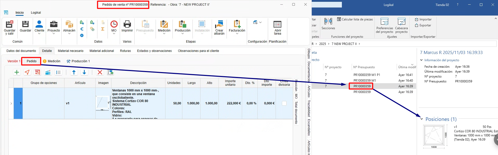

# Relação entre fases e projeto no ENBLAU e Logikal

---

## 1. Introdução
Explicação da relação entre as fases de um projeto no ENBLAU e no Logikal.

---
## 2. Modos de trabalho no Logikal

### 2.1. Modo por fases (modo predefinido)
O modo por fases move as posições e as unidades de cada fase do documento do ENBLAU para as fases do projeto no Logikal.

- Criar um orçamento a partir do ENBLAU:

  **1. Versão 1**  
      - Ao criar um orçamento no ENBLAU, esta versão será refletida no Logikal em *"Posições (1)"* dentro do mesmo projeto.  
        

  **2. Pedido**  
      - Ao confirmar o pedido no ENBLAU, será gerado um pedido e, de seguida, uma fase no Logikal denominada *"Orçamento aceite"*. As posições serão movidas da fase anterior para a fase seguinte do pedido.
        

  **3. Produção 1**  
      - A partir do pedido no ENBLAU, ao criar uma produção, será gerada uma nova fase no Logikal chamada *"nº orçamento P1"*. As posições e as unidades indicadas serão movidas da fase anterior para a fase seguinte de produção.
        

  **4. Medição 1**  
      - A partir do pedido no ENBLAU, ao criar uma medição, será gerada uma nova fase no Logikal denominada *"nº orçamento M1"*. As posições e as unidades indicadas serão movidas da fase anterior para a fase seguinte de medição.
        

  **5. Produção 2**  
      - A partir da medição no ENBLAU, ao criar uma produção (considerando as alterações da medição), será gerada uma nova fase no Logikal com o nome *"nº orçamento M1 P2"*. As posições e as unidades indicadas serão movidas da fase anterior para a fase seguinte de produção.
        

> ⚠️ **Importante!** Neste modo, as posições eliminadas a partir do ENBLAU são removidas de forma permanente no Logikal.

---

### 2.2. Modo por projetos
O modo por projetos move as posições e as unidades de cada fase do documento do ENBLAU, mas no Logikal é criado um projeto (com o mesmo número do orçamento) para cada fase do ENBLAU.

- Criar um orçamento a partir do ENBLAU:

  **1. Versão 1**  
      - Ao criar um orçamento no ENBLAU, esta versão será refletida como um projeto no Logikal na fase *"Posições (1)"*.  
        

  **2. Pedido**  
      - Ao confirmar o pedido no ENBLAU, será gerado um pedido e, de seguida, um novo projeto no Logikal com o mesmo *"nº orçamento"*.
        

  **3. Medição 1**  
      - A partir do pedido no ENBLAU, ao criar uma medição, será gerado um novo projeto no Logikal com o mesmo número *"nº orçamento M1"*, com as posições e as unidades indicadas da fase anterior para a fase seguinte de medição no ENBLAU.
        

  **4. Produção 1**  
      - A partir da medição no ENBLAU, ao criar uma produção (considerando as alterações da medição), será gerado um novo projeto no Logikal com o mesmo número *"nº orçamento M1 P1"*, com as posições e as unidades indicadas da fase anterior para a fase seguinte de produção no ENBLAU.
        

### 2.3. Modo por fases duplicando posições
O modo por fases duplicando posições copia as posições e as unidades de cada fase do documento do ENBLAU para as fases do projeto no Logikal, mantendo sempre uma cópia em cada fase.

- Criar um orçamento a partir do ENBLAU:

  **1. Versão 1**  
      - Ao criar um orçamento no ENBLAU, esta versão será refletida no Logikal em *"Posições (1)"* dentro do mesmo projeto.  
        

  **2. Pedido**  
      - Ao confirmar o pedido no ENBLAU, será gerado um pedido e, de seguida, uma fase no Logikal denominada *"Orçamento aceite"*. As posições serão copiadas da fase anterior para a fase seguinte do pedido.
        

  **3. Medição 1**  
      - A partir do pedido no ENBLAU, ao criar uma medição, será gerada uma nova fase no Logikal denominada *"nº orçamento M1"*. As posições e as unidades indicadas serão copiadas da fase anterior para a fase seguinte de medição.
        

  **4. Produção 1**  
      - A partir da medição no ENBLAU, ao criar uma produção (considerando as alterações da medição), será gerada uma nova fase no Logikal com o nome *"nº orçamento M1 P2"*. As posições e as unidades indicadas serão copiadas da fase anterior para a fase seguinte de produção.
        

> ⚠️ **Importante!** Neste modo, as posições eliminadas a partir do ENBLAU são removidas de forma permanente no Logikal.

## 3. Criação de projeto no Logikal
Ao criar um orçamento no ENBLAU e depois adicionar uma posição do Logikal, esta será vinculada a um projeto no Logikal ou, caso não exista, será criado um novo.

  

  

  

---
