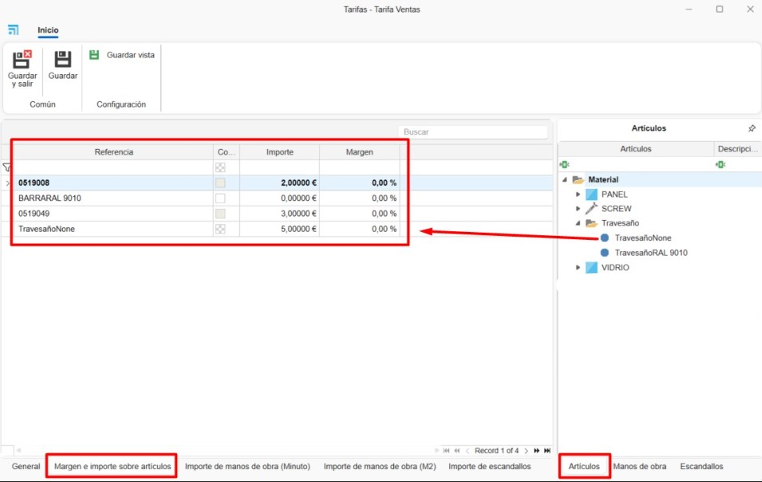
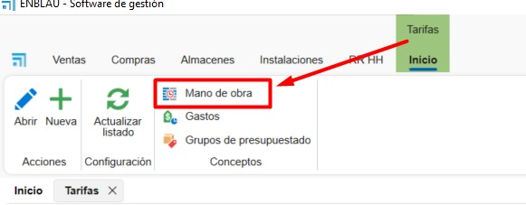

# Tarifas e Mão de Obra de Materiais no ENBLAU

---

## 1. Introdução

Este manual descreve, passo a passo, a utilização das **Tarifas** e da **Mão de obra** para a definição de preços de custo e de venda dos materiais no ENBLAU.

---

## 2. Criar Tarifas

- A partir de **Armazéns → Tarifas**, acede-se à lista de tarifas existentes.

  

- Selecionar o botão **Nova** para criar uma nova tarifa e indicar o respetivo nome.

  

### 2.1. Geral

- No separador **Geral**, podem ser preenchidos os seguintes campos:

    **Descrição:** Permite adicionar uma descrição à tarifa.  

    **Margem:** Define a margem aplicada à tarifa.  

    **Tarifa ascendente:** Indica se a tarifa se baseia noutra tarifa existente.  

    **Observações:** Campo para notas adicionais.

  

### 2.2. Margem e valor por artigos

- No separador **Margem e valor por artigos**, é possível definir margens e valores arrastando a referência final do material a partir do separador **Artigos**, localizado no lado direito da janela.  
O valor será calculado automaticamente de acordo com o tipo de cálculo do artigo: por unidade, metro linear ou metro quadrado (m²).

  

### 2.3. Valor de mão de obra (Minuto)

- No separador **Valor de mão de obra (Minuto)**, é possível definir o custo por minuto arrastando o conceito de mão de obra a partir do separador **Mão de obra**.

  

> ℹ️ **Nota:** A mão de obra deve ser criada previamente na secção [3. Criar Mão de Obra](#3-criar-mão-de-obra).

### 2.4. Valor de mão de obra (m²)

- No separador **Valor de mão de obra (m²)**, é possível definir o valor por metro quadrado arrastando o conceito de mão de obra a partir do separador **Mão de obra**.

  

> ℹ️ **Nota:** A mão de obra deve ser criada previamente na secção **Mão de obra**.

### 2.5. Valor de fichas técnicas

- No separador **Valor de fichas técnicas**, é possível atribuir um valor fixo a uma ficha técnica (grupo de materiais).

  

> ℹ️ **Nota:** O detalhe dos materiais continuará a ser calculado de forma independente. O valor da ficha técnica não tem necessariamente de coincidir com o total estimado dos materiais para venda.

### 2.6. Lista de Tarifas

- Ao criar uma tarifa, o sistema gera automaticamente outra tarifa com o mesmo nome seguido de **+ SUE**, destinada a materiais avulsos.

  

- A tarifa de **Custo** é gerada automaticamente e é definida como tarifa base de custo para os materiais do ENBLAU.  
Esta tarifa não pode ser eliminada.

  

---

## 3. Criar Mão de Obra

- A partir de **Armazéns → Tarifas → Mão de obra**, acede-se à lista de mãos de obra.

  

- Será aberta uma janela que permite criar e gerir diferentes conceitos de mão de obra, preenchendo os seguintes campos:

  

  **1. Conceito:** Nome da mão de obra.  
  **2. Descrição:** Descrição opcional do conceito.  
  **3. Tipo:** Tipo de mão de obra, selecionável a partir da lista de postos disponíveis no enCONTROL.  
  **4. É fabrico:** Indica se a mão de obra corresponde a fabrico.  
  **5. É montagem:** Indica se a mão de obra corresponde a montagem.

  

  **6. Artigos:** Permite definir o tempo de mão de obra (em minutos) para cada artigo, arrastando-o a partir da árvore **Artigos** à direita.  
  Pode ser definido um intervalo de unidades (**De / Até**) para o material.

  

  **7. Fichas técnicas:** Permite definir o tempo de mão de obra (em minutos) para cada ficha técnica, arrastando-a a partir da árvore **Fichas técnicas** à direita.

  

---
