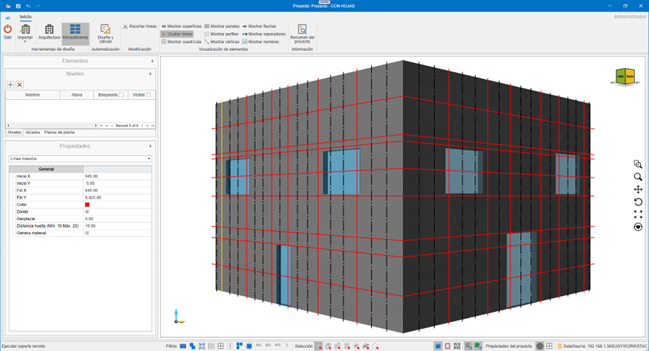
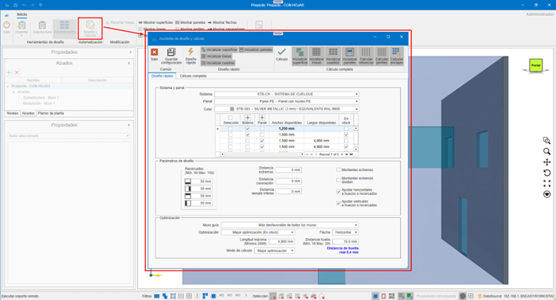
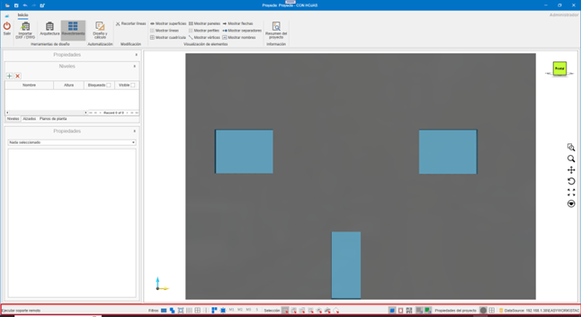
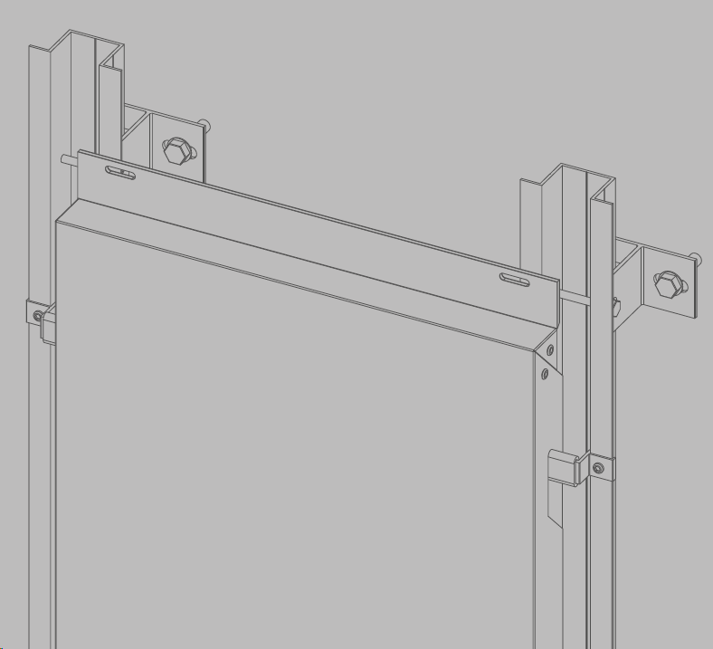

# enCLAD

---

## 1. Introdução

O objetivo deste documento é fornecer conhecimentos básicos sobre o funcionamento do **enCLAD**, para agilizar a gestão de processos no revestimento de um edifício.

Antes de começar a trabalhar com o enCLAD, é necessário dispor de uma base de dados com os sistemas e materiais definidos no **enMATERIALS**.

---

## 2. Nomenclaturas específicas do enCLAD

### 2.1. Linha mestra
Calhas utilizadas para o desenho das pegadas do edifício ou montantes intermediários.

- **Linhas de corte**: cor vermelha, contínuas
- **Linhas de reforço**: cor preta, descontínuas

  

### 2.2. Quadro de revestimento
Área situada entre linhas.

- **Verde**: zonas a revestir
- **Vermelho**: zonas não revestidas
- **Propriedade Revestir**: `Sim / Não`

  Utilizado para o cálculo automático de painéis a partir do botão **Design e cálculo**.

  

### 2.3. Superfície de revestimento
Zona visível do revestimento, independente da parede de obra.

Propriedades editáveis:

- **Remate de coroamento**
- **Altura de coroamento**
- **Separação em relação à parede**

  

### 2.4. Vão de revestimento
Este vão é independente do vão original na parede de obra e do vão desenhado sobre a superfície de revestimento.

Inclui propriedades automáticas como por exemplo:

- **Moldura**
- **Ombreira**
- **Padieira**
- **Peitoril**

  

### 2.5. Ficheiro `.enclad`
Formato próprio do enCLAD para armazenamento e intercâmbio.

> **Importante!**⚠️ Requer a mesma base de dados de sistemas e materiais para abrir corretamente.

---

## 3. Funcionamento e Navegação

### 3.1. LogIn

Ecrã de início de sessão com utilizador e senha.

  

### 3.2 Início

Vista principal após aceder à aplicação.

  

---

## 4. Menu Superior

Contém todas as ações sobre o projeto.

### 4.1. Botão de menu

**Projeto:**

- **Abrir:** Abre um projeto armazenado em formato `.enclad`.
- **Guardar:** Permite guardar em formato `.enclad` o projeto aberto no momento.
- **Exportar:** Exporta conforme o formato selecionado a informação do projeto.

  

**Formatos de exportação:**

- **DWG**: Exporta para DWG a vista atual do projeto. Formato AutoCAD.
- **EMF**: Exporta para EMF a vista atual do projeto. Formato de imagem de ficheiro do Windows.
- **PDF**: Exporta para PDF a vista atual do projeto. Formato de ficheiros Adobe (Portable Document Format).
- **PDF 3D**: Exporta para PDF 3D o projeto atual. Formato 3D de ficheiros Adobe.
- **STEP**: Exporta para STEP o projeto atual. Standard for the Exchange of Product Data, também conhecido como ISO 10303.
- **STL**: Exporta para STL o projeto atual. Formato de transmissão de dados padrão por excelência da indústria de criação rápida de protótipos.
- **XML**: Exporta para XML o projeto atual. (Extensible Markup Language). Armazena os dados de forma que possam ser lidos tanto por computadores como por pessoas. Um ficheiro .xml é um formato de dados baseado em texto que é compatível com a maioria dos editores de texto.
- **OBJ**: Exporta para OBJ o projeto atual. A extensão OBJ é um formato de ficheiros de imagens em 3D.
- **IGES**: Formato de ficheiro do software de Computer Aided Design (CAD).
- **WebGL**: Padrão de web aberta para representar gráficos em qualquer navegador compatível, sem necessidade de plugins adicionais.

  

### 4.2. Exportar painéis
Exporta os painéis desenvolvidos em formato DWG, conforme os valores selecionados na janela de exportação, prontos para enviar para corte.

  

  

  

- Configuração de camadas para exportação para DWG.

  

- Exportar painéis para DWG
- Exportar rigidificadores para DWG
- Exportar painéis para XML
- Exportar rigidificadores para XML

  

### 4.3. Eliminar revestimento
O menu suspenso **Eliminar revestimento** oferece diferentes possibilidades. Eliminar partes de um revestimento, ou o revestimento completo.

Opções:

- **Linhas:** Dá-nos a possibilidade de eliminar as linhas de revestimento do nosso projeto. Eliminar as linhas de revestimento implica a eliminação dos materiais que dependem desta linha, como montantes ou ancoragens.
- **Quadros:** Ao eliminar os quadros de revestimento não eliminamos nenhum material. Estes quadros são apenas as áreas definidas que serão painelizadas durante o cálculo dos painéis. Uma vez criados os painéis, não precisaremos deles e poderemos eliminá-los.
- **Vãos:** Elimina os vãos da superfície de revestimento. Se já tivermos os painéis necessários, não é necessário ter os vãos de revestimento.
- **Painéis:** Elimina os painéis do projeto.
- **Revestimento completo:** Elimina o revestimento da(s) parede(s) selecionada(s), ou na sua falta de todas as paredes. Superfície de revestimento e seus vãos, linhas de revestimento, quadros de revestimento, painéis, montantes, ancoragens, ...

  

### 4.4. Eliminar design

Elimina todo o conteúdo do projeto.

---

## 5. Ferramentas de Design

Permitem a construção do edifício.

### 5.1. Importar DXF / DWG

Importa:

- Níveis
- Paredes
- Vãos
- Linhas mestras

  

**Requisitos do DXF / DWG**
- Paredes como polilinhas fechadas de 4 vértices.
- Vãos como polilinhas fechadas
- Texto interior para nome da parede: `Name: "Parede Norte"`
- Níveis definidos por retângulos com:
  - `N: "Nome do nível", "Altura"`

  

  

---

## 6. Arquitetura

### 6.1. Projetar paredes
Criação manual de paredes no nível selecionado.

  

### 6.2. Projetar vãos
Vãos em paredes de obra ou superfícies de revestimento.

  

### 6.3. Editar vértices
Edição de vértices independentes das paredes de obra, vãos e da superfície de revestimento.

  

---

## 7. Revestimento

### 7.1. Automação

#### 7.1.1. Design e cálculo

Automação do cálculo de revestimento do edifício. Através do assistente de design e cálculo podemos obter de modo automatizado o revestimento necessário para as paredes que tenhamos selecionadas nesse momento, ou para todas as paredes do edifício na sua falta.

  

  - Serão desenhadas as linhas importadas do ficheiro CAD e será criada uma superfície de revestimento, se necessário.

  

  - Modulação importada.

  

##### 7.1.2. Design rápido
O design rápido permite-nos obter um cálculo da modulação do edifício, para obter uma aprovação inicial por parte do arquiteto/cliente envolvido.

  

Opções:

- **Inicializar superfície:** Inicializa uma superfície de revestimento, à distância indicada conforme a saída da fachada indicada. Esta saída será à face vista do painel.
- **Inicializar linhas:** Inicializa as pegadas horizontais e verticais que definirão o nosso modelo. No design rápido, apenas são calculadas as pegadas (linhas de corte).
  As linhas podem ser de corte ou de reforço. As linhas de corte definirão as pegadas do modelo, as de reforço definirão os montantes intermediários. As linhas serão calculadas em função dos vãos e das dimensões dos painéis escolhidos.
- **Inicializar quadros:** Os quadros serão calculados em função das linhas de revestimento e serão os espaços definidos entre estas.
- **Inicializar painéis:** Os painéis serão calculados para cada um dos quadros do design, desde que não tenhamos definido algum dos quadros como 'Não revestir'. Terá em conta os vãos ou molduras que se encontrem no seu interior. Por ser um design rápido, este cálculo de painéis não contemplará abas ou maquinações. Mostrar-nos-á apenas uma vista frontal da modulação calculada.

> **Nota:** Não contempla abas ou maquinações.

##### 7.1.3. Cálculo completo
O cálculo completo vai nos fornecer tanto a modulação, como o cálculo real dos painéis e toda a subestrutura necessária para realizar o nosso projeto. Os checks que encontramos para gerir diferem dos checks do design rápido.

  

Inclui:

- **Inicializar painéis:** Serão calculados da mesma forma que no design rápido, mas ao calculá-los de modo completo, já nos fornecerá as abas necessárias e demais informações para enviar para corte.
- **Calcular reforços:** Calcula os reforços necessários entre pegadas.
- **Calcular perfis:** Desenha os perfis necessários.
- **Calcular ancoragens:** Desenha as ancoragens necessárias.

---

### 7.2. Parâmetros de Design Rápido

  

- **Sistema**: Seleção do sistema de revestimento.
- **Painel**: Seleção do painel para revestir.
- **Cor**: Cor do painel.
- **Seleção Dimensões**: Dimensões disponíveis do painel.

  

- **Molduras**: Molduras a aplicar na superfície de revestimento. Posteriormente podem ser modificadas selecionando a superfície de revestimento.
- **Distância extremidades**: Distância da pegada/reforço desde as extremidades.
- **Distância coroamento**: Distância da pegada desde o coroamento da fachada.
- **Distância inferior**: Distância da pegada desde o remate inferior da fachada.
- **Montantes extremos**: Indica se coloca o montante das extremidades ou não.
- **Montantes extremos dividem**: Indica se convertemos em pegada o montante das extremidades.
- **Ajustar horizontais a vãos ou molduras**: Ajusta as pegadas horizontais aos vãos ou molduras.
- **Ajustar verticais a vãos ou molduras**: Ajusta as pegadas verticais aos vãos ou molduras.
- **Parede guia**: Indica a parede a partir da qual serão estabelecidas as pegadas horizontais. Se escolhermos nenhuma, cada parede será calculada separadamente.

  

- **Otimização**: Indica o modo como vamos utilizar os painéis ou bobinas pertinentes.
- **Seta**: Indica a direção da seta do painel para otimização.
- **Comprimento máximo**: Comprimento máximo do painel a utilizar.
- **Distância pegada**: Largura da pegada. Inicialmente obtém-se a partir do sistema escolhido, e neste indicam-se os parâmetros de mínimo e máximo.
- **Modo de cálculo**: Melhor otimização.

---

### 7.3. Parâmetros de Cálculo Completo

  

- **Montante**: Montantes disponíveis conforme sistema. Intercambiável posteriormente ao cálculo. Posteriormente, pode ser modificado selecionando a superfície de revestimento.
- **Montante intermédio**: Montantes intermédios disponíveis conforme sistema. Posteriormente, pode ser modificado selecionando a superfície de revestimento.

  

- **Saída de fachada**: Saída do revestimento à face vista do painel. Posteriormente, pode ser modificado selecionando a superfície de revestimento.
- **Espessura isolante**: Espessura do isolante a utilizar. Posteriormente, pode ser modificado selecionando a superfície de revestimento.
- **Separador**: Separadores disponíveis conforme a saída da fachada. Posteriormente, pode ser modificado selecionando a superfície de revestimento.

  

- **Distância separadores**: Distância de cálculo de separadores necessários. Posteriormente, pode ser modificado selecionando a superfície de revestimento.
- **Distância montantes**: Indica a distância máxima entre montantes. Posteriormente, pode ser modificado selecionando a superfície de revestimento.
- **Distância botas**: Indica a distância máxima entre botas num painel de tipo suspensão. No caso de um painel rebitado, visualizaríamos a distância máxima entre rebites.
- **Padieira**: Padieiras disponíveis no sistema. Posteriormente, pode ser modificado selecionando a superfície de revestimento.

  

- **Ombreira**: Ombreiras disponíveis no sistema. Posteriormente, pode ser modificado selecionando a superfície de revestimento.
- **Peitoril**: Peitoris disponíveis no sistema. Posteriormente, pode ser modificado selecionando a superfície de revestimento.
- **Canto**: Cantos disponíveis no sistema. Posteriormente, pode ser modificado selecionando a superfície de revestimento.
- **Coroamento e altura**: Coroamentos disponíveis no sistema e a distância que deve ultrapassar a parede de obra. Posteriormente, pode ser modificado selecionando a superfície de revestimento.
- **Fecho**: Fechos disponíveis no sistema. Posteriormente, pode ser modificado selecionando a superfície de revestimento.
- **Remate inferior**: Remates inferiores disponíveis no sistema. Posteriormente, pode ser modificado selecionando a superfície de revestimento.

---

## 8. Visualização de Elementos

Permite mostrar ou ocultar:

- **Superfícies**
- **Linhas**
- **Grelha**
- **Painéis**
- **Perfis**
- **Vértices**
- **Setas**
- **Separadores**
- **Nomes**

---

## 9. Resumo do Projeto

Mostra a lista de materiais necessários (despacho) para realizar o projeto. Esta lista pode ser copiada e colada num ficheiro Excel.

  

---

## 10. Barra Inferior

  

1. **Suporte remoto** (TeamViewer)
2. **Filtros**: Filtra a seleção de entidades, conforme os filtros aplicados.
3. **Modos de seleção**: Alterna entre os diferentes modos de seleção.
4. **Vistas**: Bloco, aramada, planta. Mostra uma vista em bloco do design 3D.
5. **Referência à grelha**: Referencia o ponteiro à grelha.
6. **Referência a objeto**: Referencia o ponteiro às diferentes entidades do design.
7. **Propriedades do projeto**: Permite alterar certas configurações do projeto e definir certos valores por defeito.

    

    

    

    

8. **Origem**: Mostra ou oculta o ponto de origem no design.
9. **Grelha**: Mostra ou oculta a grelha do design.

---

## 11. Painel Lateral Esquerdo

  

### 11.1. Níveis
Gestão e visibilidade de níveis.

  

### 11.2. Alçados
Definição de alçados do nosso design. Podemos ter de dois tipos, de subestrutura ou de modulação. Conforme o tipo escolhido visualizaremos uns elementos ou outros.

  

- **Modulação e desenhos**

  

  

- **Subestrutura e desenhos**

  

  

  

### 11.3. Plantas
Definição de pisos do projeto.

  

  

### 11.4. Propriedades
Painel de propriedades do elemento selecionado. Exemplos:

  

  

  

  

  

  

---

## 12. Modo de Emprego

### 12.1. Atalhos de teclado

- `CTRL + A` → Selecionar tudo
- `CTRL + I` → Inverter seleção
- `CTRL + SUPR` → Eliminar
- `CTRL + F` → Zoom automático
- `CTRL + + / -` → Zoom
- **Setas** → Rotação
- `ESC` → Cancelar

### 12.2. Comandos táteis

- **Duplo toque** → Seleção
- **Arrastar** → Rotação
- **Pinça** → Zoom
- **Dois dedos** → Deslocamento
- **Giro com dois dedos** → Rotação sem virar

---

## 13. Sistemas de Fachada Ventilada no enCLAD

Existem 4 sistemas de fachada ventilada disponíveis no enCLAD:

### 13.1. Sistema de suspensão

O **sistema de suspensão** é um sistema de ancoragem mecânica oculta.

  

  

### 13.2. Sistema macho-fêmea

O **sistema macho-fêmea** é um sistema de montagem por encaixe.

  

  

### 13.3. Sistema colado

O **sistema colado** é um sistema de adesivo estrutural.

  

  

### 13.4. Sistema rebitado

O **sistema rebitado** é um sistema de fixação mecânica à vista.

  

  

---

## 14. Criação de Materiais no enMATERIALS

A partir do módulo enMATERIALS serão criados os materiais para cada sistema de fachadas ventiladas.

Para mais informações, segue este link: [Criação de sistemas e materiais enCLAD](/pt/Utilidades/2.UT_Crear_Materiales_enMATERIAL/#9-criacao-de-sistemas-e-materiais-enclad)