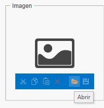
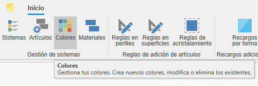
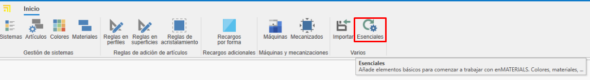
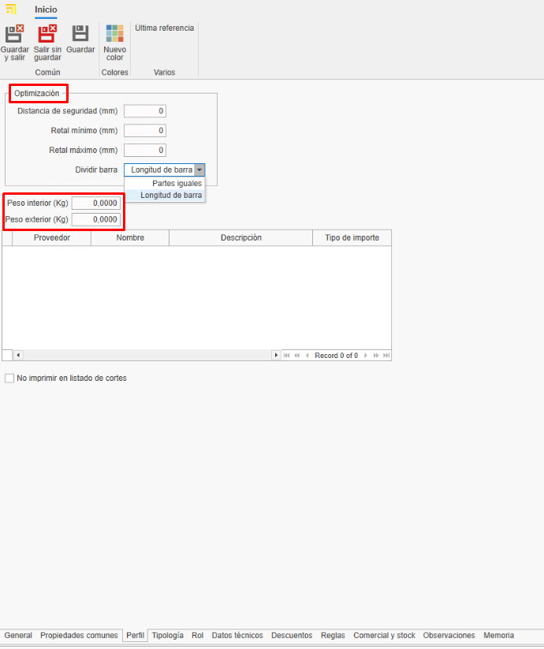

# Criação de materiais próprios no enMATERIALS

---

## 1. Introdução

Este manual tem como objetivo guiar o usuário no processo de cadastro e gestão de materiais próprios no enMATERIALS. Certifique-se de seguir as instruções detalhadas para garantir a definição e organização corretas dos materiais.

---

## 2. Definição de materiais

Os materiais podem ser classificados em diferentes tipos de acordo com suas propriedades e características. A seguir, são descritos os principais tipos:

### 2.1. Tipos de materiais

- **Peças**: Calculadas por unidade, são os materiais mais comuns e simples de definir.
- **Barras**: Calculadas por metro linear e requerem informações adicionais, como comprimento.
- **Superfícies**: Calculadas por metro quadrado e podem incluir características adicionais.
- **Juntas**: Calculadas por metro linear e têm especificações especiais para sua aplicação.

### 2.2. Artigos e cores

Os materiais são definidos na seção "Artigos", enquanto os acabamentos são gerenciados em "Cores" e a matéria-prima em "Materiais".

---

## 3. Criação de materiais

Para cadastrar um material, siga os seguintes passos:

### 3.1. Definir um artigo

1. Acesse a seção "Artigos".

   
   

2. Na aba **Geral**, atribua uma referência, tipo de cálculo e material.

   

3. Organize os artigos por níveis utilizando os campos "Familia1", "Familia2", etc.

   

4. Complete a descrição de compra (para fornecedores) e de venda (para clientes).

   

5. Atribua um material base arrastando um material da árvore de materiais na fita à direita.

   

6. Adicione imagens ao material. Certifique-se de otimizar as imagens para evitar lentidão na base de dados.

   

7. Na seção **Informações de Armazém** indicar para esse artigo alguns campos como:

   - **Armazém principal**: Define o armazém onde o artigo será localizado por padrão no sistema.
   - **Localização**: Especifica a localização física exata dentro do armazém (prateleira, corredor, nível, etc.).
   - **Montado no destino**: Ao marcar esta caixa, o artigo será configurado para montagem no destino por padrão. Estes materiais aparecerão na estação de Picking do enCONTROL.
   - **Controlo de stock**: Ao ativar esta opção, o artigo será incluído na seção de reposição de stock para acompanhamento de inventário.

      

> **Nota:** A aba "Geral" do artigo é igual para todos os tipos de cálculo.

### 3.2. Criação de cores

1. Acesse a seção "Cores".

   
   

2. Atribua uma referência, nome e uma cor ou textura.

   

3. Atribua um fornecedor na aba "Fornecedor" arrastando o fornecedor da janela à direita.

   

### 3.3. Criação de um material Base

1. Acesse a seção "Materiais".

   
   

2. Indique o nome, cor e marque o check "Material" para que apareça como matéria-prima.

   

> **Nota:** Para gerar automaticamente a carta RAL de cores e material base, selecione o botão **Essenciais** na barra "Início".

   

   
   

---

## 4. Gestão de fornecedores

Antes de cadastrar um material, verifique se o fornecedor já está registrado no ENBLAU na seção "Compras > Fornecedores". Caso não esteja, crie-o seguindo os padrões definidos.

   

---

## 5. Comercial e estoque

Após definir o material, complete suas informações nas seções de comercial e estoque.

### 5.1. Dados de compra e fornecedores

Atribua fornecedores, unidades e preços de compra para cada cor do material.

   

> **Nota:** Você pode adicionar uma referência de fornecedor se for diferente da registrada na base de dados.

### 5.2. Atribuição de referências

Cada cor e material terá uma referência única _(Referência do Artigo + Referência da Cor)_. Arraste uma ou mais cores da aba de cores na janela à direita.

   

---

## 6. Tipologia de materiais e dados adicionais

### 6.1. Peças

- Materiais individuais gerenciados por unidade (acessórios, parafusos, etc.).
- Avaliados por unidade.
- Na aba "Propriedades Comuns", você pode adicionar campos adicionais se necessário.

   

### 6.2. Barras

- Materiais definidos por comprimento e outros atributos técnicos.
- Avaliados por metro linear.
- Na aba "Propriedades Comuns", indique o comprimento da barra (obrigatório).

   

- Para perfis, adicione informações adicionais como distância de segurança e retalho mínimo/máximo. Esse tipo de informação é opcional.

   

> **Nota:** Seções como Tipologia, Papel, Dados Técnicos, Descontos e Regras não são necessárias para a criação de materiais próprios, pois são informações relevantes apenas para materiais desenhados.

### 6.3. Superfícies

- Materiais definidos por metro quadrado (vidros, chapas, etc.).
- Avaliados por m².
- Na aba "Propriedades Comuns", indique altura e largura da superfície.

 

- Na aba "Valoração e dados técnicos", indique alguns dados dependendo do tipo de superfície e necessidade. Por exemplo: Espessura, tipo de superfície, preços por m² (marque o check "m² por fornecedor" se o preço for calculado por fornecedor), etc. 

 

### 6.4. Juntas

- Materiais definidos por metro linear.
- Avaliados por metro linear.
- Na aba "Propriedades Comuns", você pode indicar o comprimento se achar necessário.

   

---

## 7. Padrões a seguir

Para garantir uma gestão correta, siga os seguintes padrões:

- Use letras maiúsculas em nomes e referências.
- Verifique a existência de fornecedores e materiais antes de cadastrá-los.
- Mantenha um formato uniforme nas referências de materiais e cores.
- Salve sempre as alterações.

---

## 8. Criação de documentos de compra ENBLAU

Para verificar se o artigo está cadastrado, abra o ENBLAU e crie um documento de compra:

1. Crie um pedido de compra e selecione o fornecedor.
2. No pedido de compra, busque e adicione o material da janela à direita. Arraste e selecione a cor associada.

   

3. Valide o preço atribuído ao fornecedor.

   

   - Se o material tiver mais de um fornecedor atribuído, você pode selecionar o fornecedor desejado com um duplo clique sobre ele.

---

## 9. Criação de sistemas e materiais enCLAD

Criação de sistemas e materiais para **fachadas ventiladas** no **enCLAD**.

---

### 9.1. Sistemas

A partir da janela inicial, na barra superior, aceder a **Sistema**.

- Para criar um novo sistema, selecionar **Novo** na barra superior.

---

#### 9.1.2. Propriedades

A partir do separador **Propriedades**, localizado na parte inferior, definem-se os seguintes campos do sistema:

- **Nome**
- **Descrição**
- **Fornecedor**
- **Família 1 e 2** (organização por níveis)
- **Imagem**
- **Estado**: Ativo, Desativado temporariamente ou Descontinuado.
- **Tipologia do sistema**  
  Neste caso, marcar a caixa **Fachada ventilada**.

A partir do separador **Artigos relacionados**, na parte inferior, é mostrada a lista de materiais vinculados ao sistema.

---

#### 9.1.3. Fachada ventilada

A partir do separador **Tipo de sistema**, na parte superior, será mostrada uma janela onde se pode selecionar o tipo de sistema:

- Sistema de suspensão
- Sistema macho-fêmea
- Sistema colado
- Sistema rebitado

Na ***janela lateral esquerda*** definem-se os parâmetros específicos do tipo de sistema.

Na ***janela inferior*** definem-se outros parâmetros comuns entre os diferentes tipos de sistema, como:

  - Distância extremo habitual
  - Pegada mínima – Vertical
  - Pegada máxima – Vertical
  - Pegada habitual – Vertical
  - Pegada mínima – Horizontal
  - Pegada máxima – Horizontal
  - Pegada habitual – Horizontal
  - Moldura mínima
  - Moldura máxima
  - Moldura habitual
  - Permitir moldura (caixa)

Na ***janela central*** é mostrado o design da fachada ventilada correspondente ao tipo de sistema selecionado.

  Se o tipo de sistema for **Sistema de suspensão**, é habilitada uma janela adicional para a definição do design da maquinação:

  - **Separador Maquinação suspensão**  
    Permite importar o desenho em formato `.dwg/.dxf`.
  - **Separador Outras maquinações**  
    Permite definir a maquinação através de parâmetros.

Na ***janela lateral direita***, **Materiais do sistema**, adicionam-se os artigos correspondentes ao sistema através de campos suspensos:

  - Calha
  - Rebite conformado
  - Suporte de suspensão
  - Platina conformada
  - Reforço de suporte

> ℹ️ **Nota:** Dependendo do tipo de sistema selecionado, serão habilitados uns parâmetros ou outros.

A partir do separador **Opções**, na parte inferior, será mostrada uma janela com as opções de **canto** disponíveis dependendo do tipo de sistema.

A partir do separador **Remates**, na parte inferior, será mostrada uma janela onde definir:

**Opções de remate:** Definir as opções de remate para o sistema na implantação da opção.

   - Coroamento
   - Remate inferior
   - Fecho de câmara
   - Janela padieira
   - Janela peitoril
   - Janela ombreira
   
**Valores:** Definir os valores para cada opção selecionada. 

**Dobras:** Definir o comprimento e rotação das dobras para cada valor selecionado. 

A partir do separador **Rigidificadores** (disponível apenas para sistemas de tipo suspensão), é mostrada a lista de materiais de tipo rigidificador vinculados ao sistema.

---

#### 9.1.4. Clonar sistemas

A partir de **Sistemas**, na fita superior, está disponível a opção **Clonar**.

Esta funcionalidade copia todas as propriedades do sistema selecionado na lista.

---

### 9.2. Definição de artigos enCLAD

Definir artigos a partir do módulo de artigos:

Criar um novo artigo:

---

**1. Geral**  

Preencher os campos de informação geral conforme o tipo de cálculo selecionado:

   - **Barra**
   - **Peça**
   - **Junta**
   - **Superfície**

   

   > ℹ️ **Nota:** É obrigatório indicar o sistema de fachada ventilada ao qual o material estará vinculado.

---

**2. Propriedades comuns**  

Preencher os campos de propriedades comuns.  
Dependendo do tipo de cálculo do material, aparecerão uns campos ou outros.

   **Exemplos:**

   - **Barra**

   - **Peça separadora**

---

**3. Função**  

Marcar o tipo de função do perfil (apenas para artigos de tipo **barra**) e definir o seu valor na secção de fachada ventilada.

   

---

**4. Dados técnicos** 

Importar o ficheiro `.dwg/.dxf` do material e definir as dimensões do desenho, como:

   - Dimensões interiores
   - Dimensões exteriores
   - Profundidade
   - Ponto de inserção
   - Outros parâmetros

> ℹ️ **Nota:** O separador **Dados técnicos** está disponível apenas para os tipos de cálculo **barra** e **junta**.

---

**5. Regras**  

Atribuir uma regra ao perfil (apenas para barras), arrastando uma regra previamente definida da janela lateral direita inferior, do separador **Regras**.

**6. Comercial e stock (atribuir cores)**

Cada cor e material terá uma referência única _(Referência Artigo + Referência Cor)_. Arrastar uma ou mais cores do separador de cores na janela direita, do separador **Comercial e stock**.

   

> ℹ️ **Nota:** Informações sobre como criar novas cores ir para [3.2. Criação de cores](#32-criação-de-cores).

---

### 9.3. Definição de regras

A partir da secção inicial, aceder à lista **Regras de adição de artigos** e selecionar **Regras em perfis**.

Criar uma **Nova** regra em perfis.

---

**1. Propriedades**  

Preencher os campos de propriedades da regra:

   - Nome
   - Descrição
   - Famílias (níveis de pastas)

---

**2. Artigos relacionados**  

Relacionar os artigos de tipo **barra** arrastando-os da janela lateral direita em **Artigos**.

---

**3. Sistemas restritivos**  

Indicar os sistemas a restringir para essa regra, arrastando-os da janela lateral direita em **Sistemas**.

---

**4. Acessórios**  

Indicar a opção e/ou o artigo que será gerado, arrastando-o da janela lateral direita em **Acessórios**.

> ℹ️ **Nota:** Pode-se definir uma configuração diferente para cada tipo de cálculo a partir do separador correspondente na parte inferior da janela.

## 10. Conclusão

Seguindo este manual, poderá registar e gerir materiais de forma eficiente no sistema, garantindo uma correta organização e otimização dos processos de compra e venda.

---
