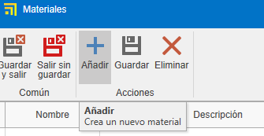
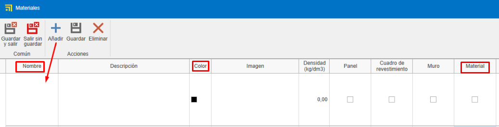
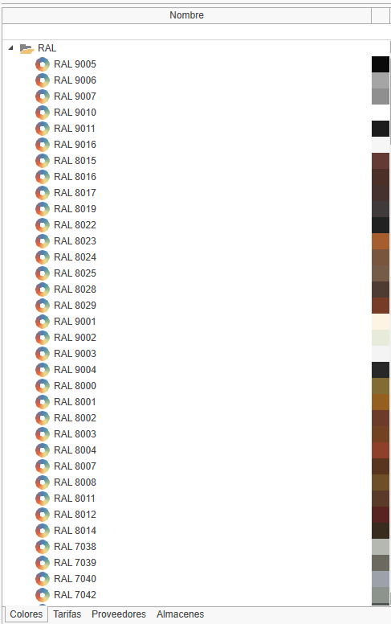
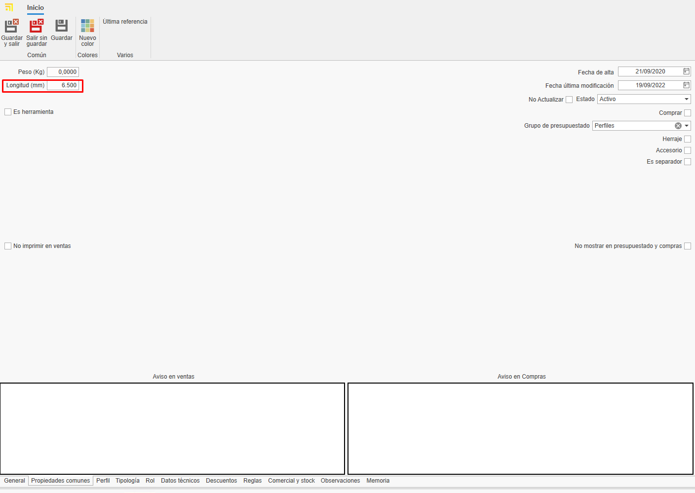

# Criação de materiais próprios no enMATERIALS

---

## 1. Introdução

Este manual tem como objetivo guiar o usuário no processo de cadastro e gestão de materiais próprios no enMATERIALS. Certifique-se de seguir as instruções detalhadas para garantir a definição e organização corretas dos materiais.

---

## 2. Definição de materiais

Os materiais podem ser classificados em diferentes tipos de acordo com suas propriedades e características. A seguir, são descritos os principais tipos:

### 2.1. Tipos de materiais

- **Peças**: Calculadas por unidade, são os materiais mais comuns e simples de definir.
- **Barras**: Calculadas por metro linear e requerem informações adicionais, como comprimento.
- **Superfícies**: Calculadas por metro quadrado e podem incluir características adicionais.
- **Juntas**: Calculadas por metro linear e têm especificações especiais para sua aplicação.

### 2.2. Artigos e cores

Os materiais são definidos na seção "Artigos", enquanto os acabamentos são gerenciados em "Cores" e a matéria-prima em "Materiais".

---

## 3. Criação de materiais

Para cadastrar um material, siga os seguintes passos:

### 3.1. Definir um artigo

1. Acesse a seção "Artigos".

   
   

2. Na aba **Geral**, atribua uma referência, tipo de cálculo e material.

   

3. Organize os artigos por níveis utilizando os campos "Familia1", "Familia2", etc.

   

4. Complete a descrição de compra (para fornecedores) e de venda (para clientes).

   

5. Atribua um material base arrastando um material da árvore de materiais na fita à direita.

   

6. Adicione imagens ao material. Certifique-se de otimizar as imagens para evitar lentidão na base de dados.

   

> **Nota:** A aba "Geral" do artigo é igual para todos os tipos de cálculo.

### 3.2. Criação de cores

1. Acesse a seção "Cores".

   
   

2. Atribua uma referência, nome e uma cor ou textura.

   

3. Atribua um fornecedor na aba "Fornecedor" arrastando o fornecedor da janela à direita.

   

### 3.3. Criação de um material Base

1. Acesse a seção "Materiais".

   
   

2. Indique o nome, cor e marque o check "Material" para que apareça como matéria-prima.

   

> **Nota:** Para gerar automaticamente a carta RAL de cores e material base, selecione o botão **Essenciais** na barra "Início".

   

   
   

---

## 4. Gestão de fornecedores

Antes de cadastrar um material, verifique se o fornecedor já está registrado no ENBLAU na seção "Compras > Fornecedores". Caso não esteja, crie-o seguindo os padrões definidos.

   

---

## 5. Comercial e estoque

Após definir o material, complete suas informações nas seções de comercial e estoque.

### 5.1. Dados de compra e fornecedores

Atribua fornecedores, unidades e preços de compra para cada cor do material.

   

> **Nota:** Você pode adicionar uma referência de fornecedor se for diferente da registrada na base de dados.

### 5.2. Atribuição de referências

Cada cor e material terá uma referência única _(Referência do Artigo + Referência da Cor)_. Arraste uma ou mais cores da aba de cores na janela à direita.

   

---

## 6. Tipologia de materiais e dados adicionais

### 6.1. Peças

- Materiais individuais gerenciados por unidade (acessórios, parafusos, etc.).
- Avaliados por unidade.
- Na aba "Propriedades Comuns", você pode adicionar campos adicionais se necessário.

   

### 6.2. Barras

- Materiais definidos por comprimento e outros atributos técnicos.
- Avaliados por metro linear.
- Na aba "Propriedades Comuns", indique o comprimento da barra (obrigatório).

   

- Para perfis, adicione informações adicionais como distância de segurança e retalho mínimo/máximo. Esse tipo de informação é opcional.

   

> **Nota:** Seções como Tipologia, Papel, Dados Técnicos, Descontos e Regras não são necessárias para a criação de materiais próprios, pois são informações relevantes apenas para materiais desenhados.

### 6.3. Superfícies

- Materiais definidos por metro quadrado (vidros, chapas, etc.).
- Avaliados por m².
- Na aba "Propriedades Comuns", indique altura e largura da superfície.

 

- Na aba "Valoração e dados técnicos", indique alguns dados dependendo do tipo de superfície e necessidade. Por exemplo: Espessura, tipo de superfície, preços por m² (marque o check "m² por fornecedor" se o preço for calculado por fornecedor), etc. 

 

### 6.4. Juntas

- Materiais definidos por metro linear.
- Avaliados por metro linear.
- Na aba "Propriedades Comuns", você pode indicar o comprimento se achar necessário.

   

---

## 7. Padrões a seguir

Para garantir uma gestão correta, siga os seguintes padrões:

- Use letras maiúsculas em nomes e referências.
- Verifique a existência de fornecedores e materiais antes de cadastrá-los.
- Mantenha um formato uniforme nas referências de materiais e cores.
- Salve sempre as alterações.

---

## 8. Criação de documentos de compra ENBLAU

Para verificar se o artigo está cadastrado, abra o ENBLAU e crie um documento de compra:

1. Crie um pedido de compra e selecione o fornecedor.
2. No pedido de compra, busque e adicione o material da janela à direita. Arraste e selecione a cor associada.

   

3. Valide o preço atribuído ao fornecedor.

   

   - Se o material tiver mais de um fornecedor atribuído, você pode selecionar o fornecedor desejado com um duplo clique sobre ele.

---

## 9. Conclusão

Seguindo este manual, você poderá cadastrar e gerenciar materiais de forma eficiente no sistema, garantindo uma correta organização e otimização dos processos de compra e venda.

---
