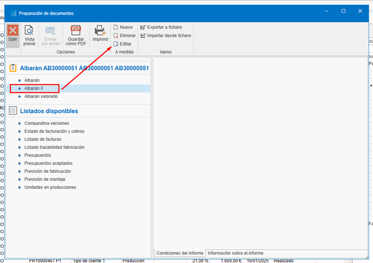
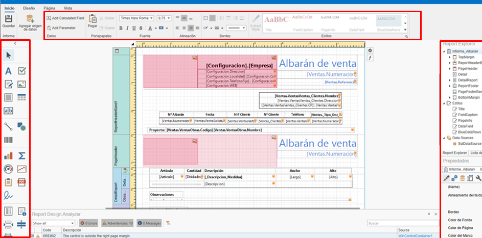
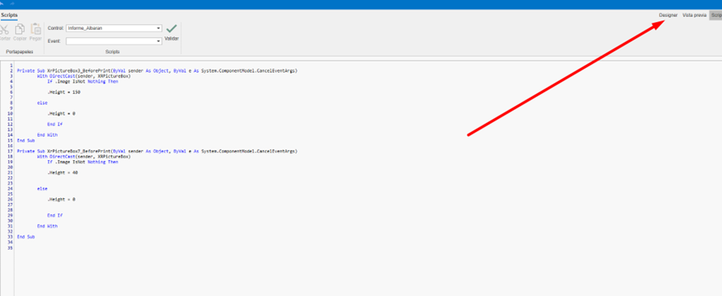
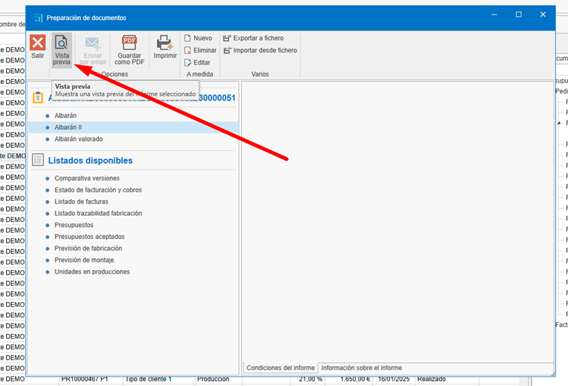

# Criação e edição de relatórios personalizados

---

## 1. Introdução
Este manual tem como objetivo guiar os usuários na criação e modificação de novos modelos de relatórios personalizados sem a necessidade de configurar um novo modelo. O processo foi projetado para ser simples e evitar confusões, permitindo aos usuários adaptar os relatórios às suas necessidades específicas de forma eficiente.

---

## 2. Criação de um relatório personalizado
Para gerar um relatório baseado em um existente, siga estes passos:

1. **Localizar o relatório base**:  
    - Navegue até o relatório que deseja utilizar como base para seu novo relatório personalizado.    

2. **Criar uma cópia do relatório**:  
    - Selecione a opção para criar um novo relatório a partir do existente. Isso gerará uma cópia exata do relatório original, que poderá ser modificada sem afetar o relatório base.

    

    

---

## 3. Edição do relatório
Após criar a cópia do relatório, siga estes passos para personalizá-lo:

1. **Localizar o relatório recém-criado**:  
    - Acesse o relatório que acabou de copiar.

2. **Acessar a opção de edição**:  
    - Selecione a opção de edição para começar a realizar alterações.

    

3. **Realizar as alterações necessárias**:  
    - Modifique os campos, seções ou dados que desejar. Você pode adicionar, remover ou ajustar informações conforme suas necessidades. Utilize os recursos de edição disponíveis para modificar o modelo:

    

4. **Salvar o relatório**:  
   - Depois de realizar as alterações, salve o documento para finalizar a edição.

        

---

## 4. Exclusão de elementos adicionais
Se o relatório exigir modificações mais profundas, você pode remover seções ou dados desnecessários antes de salvar a versão final. Para isso:

1. **Identificar elementos desnecessários**:  
   - Revise o relatório e determine quais seções ou dados não são relevantes para seu propósito.

2. **Remover elementos**:  
   - Utilize a opção de exclusão para retirar os elementos que não são necessários.

    

    - Para alguns relatórios (como o exemplo de Alvará), é necessário remover parte do Script. Acesse a seção de Script:

     

    - Se essas linhas estiverem no script, exclua-as:

    

     

    - Volte à seção Designer:

         

3. **Salvar as alterações**:  
   - Certifique-se de salvar o relatório após realizar as exclusões.

---

## 5. Uso do novo modelo
Após criar o novo relatório, selecione-o e vá para "Visualizar":

   

      

---

## 6. Considerações finais
- **Não é necessário configurar um novo modelo**:  
  Este processo permite modificar relatórios sem precisar criar um modelo do zero.

- **Processo rápido e simples**:  
  A clonagem e edição de relatórios é um método eficiente para personalizar documentos.

- **Revisão final**:  
  Antes de salvar o relatório, revise-o cuidadosamente para garantir que atende aos requisitos desejados.

---
