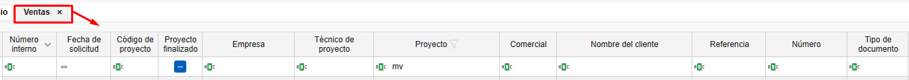
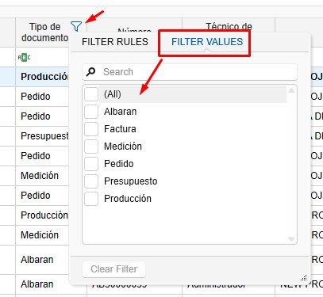
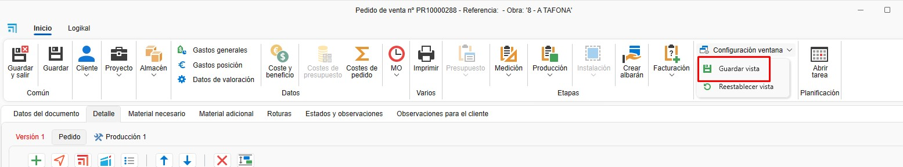

# Gestão de filtros

---

## 1. Introdução
Este manual foi elaborado para orientar os usuários sobre o uso de filtros e filtros personalizados. Sua função principal é otimizar a velocidade de busca e melhorar a organização da visualização em todas as listas dos aplicativos.

## 2. Gestão de filtros em listas

Os filtros permitem personalizar a visualização dos documentos nas listas. Siga estes passos:

### 2.1. Acessar os filtros
- No cabeçalho das listas, utilize os filtros para definir quais colunas e dados deseja visualizar.

  

- Por exemplo, você pode filtrar por "Orçamentos" para exibir apenas as colunas necessárias (empresa, projeto, data de solicitação, status do documento, técnico do projeto, tipo de documento, etc.).

  

- No campo de busca abaixo do cabeçalho há um ícone **ABC**, onde é possível selecionar as condições que deseja que sejam atendidas para buscar um valor.

   

- Para filtrar pelos valores do filtro, clique sobre o funil no cabeçalho e selecione os valores que deseja filtrar.

  

- Use `Ctrl + F` para buscar na lista.

  

### 2.2. Salvar filtros personalizados
- Organize as colunas conforme suas necessidades. Você pode remover, adicionar e alterar a posição das colunas clicando com o botão direito sobre qualquer cabeçalho.

  

- Outra opção para mudar a posição ou remover colunas é arrastá-las.

  

- Acesse "Filtros", depois "Gestão de filtros" e adicione um novo filtro.

  

- Salve o filtro com um nome específico (ex.: "Orçamento 2").

  

### 2.3. Salvar visualização
- Em qualquer documento ou projeto, você pode organizar as colunas ou filtros e depois salvar a visualização em Configuração da janela - **Salvar visualização**:

  

  Cada vez que você entrar novamente, verá a visualização que foi salva.

> **Nota:** Cada usuário pode ter seus próprios filtros e visualizações salvas.
