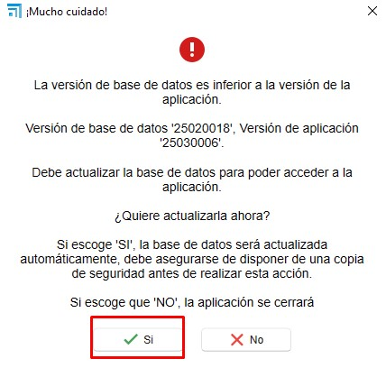
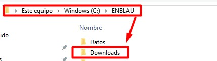
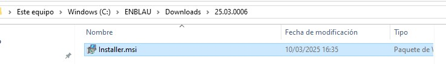

# Atualização ENBLAU

---

## 1. Introdução

Este manual foi elaborado para orientar os usuários no processo de atualização do ENBLAU para a última versão disponível.

---

## 2. Passos para a atualização

> ⚠️ **Importante!** Antes de começar, certifique-se de que **nenhum usuário esteja conectado ao ENBLAU**. Em **Ferramentas administrativas - Administração de equipamentos - Pastas compartilhadas - Arquivos abertos** você pode verificar se alguém está conectado ao aplicativo. 

   
   
   

> Se o ENBLAU estiver instalado em um servidor, a atualização deve ser feita **nesse servidor** e **nunca** em um computador conectado via unidade de rede.

### 2.1. ENBLAU

1. Acesse o ENBLAU (pelo servidor, se aplicável).  
2. Na parte inferior da tela inicial, clique em **"Nova versão disponível"** (aparecerá em vermelho junto com o número da última versão disponível).

   

3. Abrirá uma janela chamada **"Nova versão"**, onde você poderá ver as novidades antes de instalar. Clique em **"Abrir enUPDATE"** para continuar.

   

### 2.2. enUPDATE

1. Ao abrir *enUPDATE* a partir do ENBLAU, será exibida a janela correspondente. Este processo também pode ser feito diretamente pelo enUPDATE sem abrir primeiro o ENBLAU.  
2. Na parte superior da barra de ferramentas, clique em **"Baixar e instalar"**. Isso fará o download automático da última versão do ENBLAU (é possível acompanhar o progresso na barra).

   

3. Ao finalizar o download, aparecerá uma mensagem confirmando o sucesso e solicitando permissão para prosseguir com a instalação.

   

### 2.3. Instalação

> ⚠️ **Importante!** Certifique-se de que o ENBLAU esteja **totalmente fechado** antes de iniciar a instalação.

1. Ao confirmar a instalação, será aberta a janela do **Endades Suite Setup**. Siga os passos abaixo:

     

   - Aceite os termos da licença marcando a caixa correspondente e continue.

     

   - Verifique se o caminho de instalação do ENBLAU está correto.

       

   - Clique em **"Instalar"** para iniciar.

      

   - Conclua a instalação.

     

### 2.4. Atualização do banco de dados

1. Após finalizar a instalação, abra o ENBLAU no computador onde a atualização foi realizada.  
2. Ao iniciar, o sistema solicitará atualizar o banco de dados. Clique em **"Sim"** para continuar.

   

---

Pronto! Agora você já pode trabalhar com a **última versão atualizada do ENBLAU**.

---

## 3. Desinstalar e instalar ENBLAU

Caso a atualização do ENBLAU não tenha sido concluída corretamente — por exemplo, se havia usuários conectados ou ocorreu algum outro erro — será necessário desinstalar o programa completamente e realizar uma nova instalação.

### 3.1. Desinstalar Endades Suite

1. No computador onde o ENBLAU está instalado, abra o menu Iniciar do Windows e procure por **"Adicionar ou remover programas"** (o nome pode variar conforme a versão do sistema operacional).

   

2. Abrirá a janela de configuração. Na seção **Aplicativos e recursos**, procure por **Endades Suite**.  
3. Clique sobre o aplicativo e selecione **Desinstalar**. O procedimento é o mesmo de qualquer aplicação instalada no Windows.

   

   

### 3.2. Instalar ENBLAU

1. Após desinstalar o aplicativo, acesse a pasta de instalação do ENBLAU. Por exemplo:  
   **`C:\ENBLAU`**

2. Dentro dessa pasta, abra o diretório **Downloads**.

   

3. Ali você encontrará várias versões do instalador. Você pode ordenar os arquivos por nome ou data para localizar a **última versão disponível**.

   

4. Abra a pasta correspondente à última versão e execute o arquivo **`Installer.msi`** dando um duplo clique.

   

5. Será aberta a janela do instalador **Endades Suite Setup**. Siga os mesmos passos detalhados na seção [2.3. Instalação](#23-instalacion).

---

📌 **Nota**: Se, após reinstalar o ENBLAU, o sistema solicitar atualizar o banco de dados, siga o procedimento indicado em [2.4. Atualização do banco de dados](#24-actualizacion-de-la-base-de-datos).
