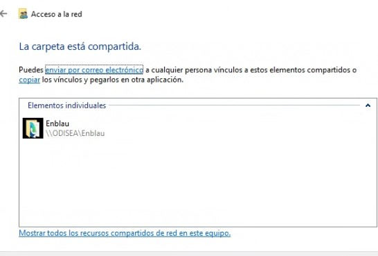

# Conectar uma Unidade de Rede

---

## 1. Introdução

Este manual explica passo a passo como conectar uma unidade de rede compartilhada em um computador com sistema operacional Windows, utilizando as pastas compartilhadas do **ENBLAU** e **Enblau Documentos**.

> **O que é uma unidade de rede?**  
> Uma unidade de rede é uma pasta compartilhada em outro computador ou servidor dentro de uma rede local, que você pode mapear como se fosse uma unidade adicional do seu computador (como o disco C: ou D:).

---

## 2. Compartilhar as pastas a partir do servidor

1. No servidor, compartilhe as pastas **ENBLAU** e **Enblau Documentos** com todos os usuários da rede.

   

2. Vá para a aba **Compartilhar** e clique no botão **Compartilhar...**.

   

3. Na janela **Acesso à rede**, selecione **Todos** na lista de usuários (se não aparecer, digite manualmente) e clique em **Adicionar**.  
   Certifique-se de que tenha permissão de **Leitura e gravação** e depois clique em **Compartilhar**.

   

   

---

## 3. Requisitos prévios

Antes de começar, certifique-se de que você possui:

- Conexão à rede local ou corporativa.
- Endereço da pasta compartilhada (por exemplo: `\\servidor\pasta`).
- Permissões de acesso necessárias.
- Usuário e senha, caso a pasta exija.

---

## 4. Conectar a unidade de rede

### 4.1. Abrir o explorador de arquivos

- Pressione `Windows + E` ou clique no ícone da pasta na barra de tarefas.

### 4.2. Acessar "Este Computador"

- No painel lateral esquerdo, selecione **Este Computador**.

   

### 4.3. Conectar a unidade de rede

- Na parte superior, clique na aba **Computador**, depois em **Conectar a unidade de rede**.

   

### 4.4. Escolher uma letra de unidade

- Selecione uma letra disponível (por exemplo: `Y:`).

   

### 4.5. Inserir o caminho da pasta compartilhada

- No campo **Pasta**, digite o caminho no formato UNC (por exemplo: `\\servidor\pasta`).

   

- Marque a opção **Reconectar na entrada de sessão** se quiser manter a conexão após reiniciar o computador.

   

### 4.6. Inserir credenciais (se solicitado)

- Digite o nome de usuário e senha com acesso à pasta compartilhada.

### 4.7. Finalizar

- Clique em **Concluir**. Se tudo estiver correto, a unidade de rede abrirá como uma pasta adicional no Explorador.

   

---

## 5. Verificação

- Verifique se a unidade de rede está disponível em **Este Computador**, sob a letra escolhida.

> **Se não conectar:**

> - Verifique se o caminho foi digitado corretamente
