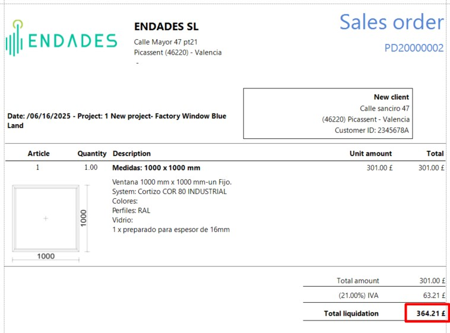

# Moedas

---

## 1. Introdução

Este manual explica passo a passo como utilizar moedas no ENBLAU e como refletí-las corretamente nos relatórios, respeitando a paridade de cada moeda.

---

## 2. Definição de moedas

No apartado **Moeda**, você pode definir a paridade entre moedas.  
Por exemplo:

- **Moeda aplicada: EUR**
- **Paridade definida:** 1 € = 0,86 £ (**GBP**)

Isso permite trabalhar com múltiplas moedas nos documentos de vendas.

  

---

## 3. Aplicação nos relatórios

Para utilizar uma moeda em documentos de venda (como um pedido):

1. Selecione a **moeda desejada** (ex.: GBP – Libra esterlina).
2. Opcionalmente, escolha também o **idioma** do documento.
3. Imprima o relatório.

O sistema aplicará automaticamente a conversão de valores conforme a paridade definida no momento.

  

---

## 4. Moeda utilizada

A opção **Moeda utilizada** permite manter um histórico das paridades aplicadas em cada documento.

Isso é útil para:

- Manter a paridade original sem precisar modificá-la manualmente.
- Garantir coerência em documentos históricos, mesmo que a taxa de câmbio tenha mudado posteriormente.

### Como usar?

1. Abra um documento de venda (ex.: um pedido).
2. Vá para: **Dados → Moeda utilizada**.
3. Abrirá a janela **Moedas do documento**.
4. Marque a caixa na coluna **Utilizada** para aplicar a paridade correspondente à data selecionada.

---

> **Nota:** Esta funcionalidade é especialmente útil para documentos antigos ou para operações que requerem manter a taxa de câmbio original.
