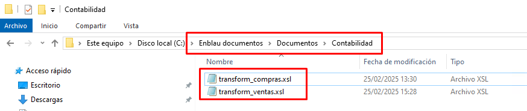
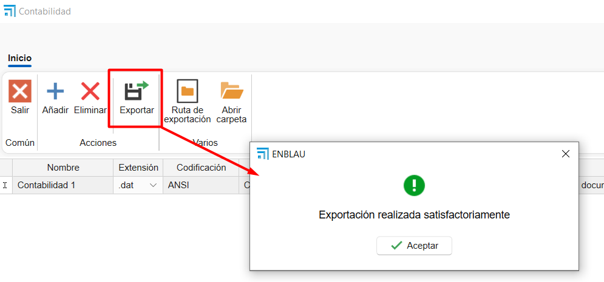

# Importação para programa de contabilidade

## 1. Objetivo

Estabelecer os requisitos técnicos necessários para que o ENBLAU possa gerar arquivos compatíveis com o programa de contabilidade, utilizando transformação de dados via **XSLT** e exportação para formatos específicos, com as codificações aceitas.

---

## 2. Requisitos gerais

### 2.1. Formato de Entrada

- O sistema externo deve gerar arquivos em formato **XML** como base para a transformação.
- O arquivo XML deve cumprir a estrutura definida no esquema XSD (se aplicável).
- Deve ser fornecido um protocolo claro de mapeamento de campos.

### 2.2. Transformação

- A transformação do XML para o formato de importação será realizada através de um arquivo **XSLT** fornecido pelo fornecedor ou desenvolvido internamente.
- O arquivo XSLT deve cumprir com a especificação 1.0 ou 2.0, conforme a compatibilidade com o motor XSLT do sistema.

### 2.3. Formato de exportação

- O resultado da transformação deve ser gerado em um dos seguintes formatos, conforme definido para cada tipo de operação contábil:

   | Tipo de Arquivo | Descrição                         |
   |-----------------|-----------------------------------|
   | `.dat`          | Formato de texto plano estruturado |
   | `.txt`          | Texto delimitado (ex.: tabulação, vírgula) |
   | `.xml`          | Estrutura XML compatível           |
   | `.xlsx`         | Planilha (Excel)                  |

### 2.4. Codificação de texto

- A codificação dos arquivos deve ser uma das seguintes, conforme o tipo de arquivo:

   | Codificação | Recomendado para |
   |------------|-----------------|
   | ANSI       | `.txt`, `.dat` antigos |
   | UTF-8      | `.xml`, `.txt` modernos |
   | UTF-16     | `.xml` com caracteres especiais |
   | UNICODE    | Geral para arquivos multilíngue |

---

## 3. Protocolo de integração

### 3.1. Arquivo XSLT base

O fornecedor do sistema contábil deve fornecer o arquivo XSLT base e a documentação com o protocolo e o formato do arquivo para realizar a transformação.

### 3.2. Especificação de mapeamento de campos

Deve ser entregue um documento detalhando:

- Nome do campo no sistema de origem
- Posições
- Comprimento (caracteres)
- Tipo de dado (numérico, texto, data)
- Formato requerido (ex.: `dd/MM/yyyy`, `#,##0.00`, etc.)

**Exemplo de tabela de mapeamento:**

A seguir, estrutura esperada para o arquivo de importação para **Tipo de registro = 0**, correspondente a **Lançamentos sem IVA**.

    | Posições | Comprimento (caracteres) | Descrição do Campo        | Comentários                                                               |
    |----------|-------------------------|--------------------------|---------------------------------------------------------------------------|
    | 1        | 1                       | Tipo de Formato           | Constante `5`                                                            |
    | 2 a 6    | 5                       | Código da empresa         | Valores entre `00001` e `99999`                                          |
    | 7 a 14   | 8                       | Data do lançamento        | Formato `aaaammdd` (Ex.: 1 de fevereiro de 2000 → `20000201`)            |
    | 15       | 1                       | Tipo de Registro          | Constante `0`                                                            |
    | 16 a 27  | 12                      | Conta                     | Nível 6 a 12. Se não existir, será criado automaticamente                 |

> **Observações**:

- Este formato deve ser gerado como arquivo de texto plano (`.txt` ou `.dat`) com codificação **ANSI**.
- Os campos devem ocupar exatamente as posições indicadas, sem delimitadores.
- Todos os registros devem cumprir a estrutura de comprimento fixo para serem válidos.

---

## 4. Transformação de XML com XSLT

A estrutura acima pode ser gerada a partir de um arquivo XML de entrada, transformado com uma planilha XSLT. Recomenda-se que o XML contenha os seguintes nós mínimos:

### 4.1. Exemplo de arquivo gerado

Exemplo de linha gerada para arquivo `.dat` com formato de largura fixa:

1. **Valores de exemplo:**

- Tipo de Formato: `5`
- Código da Empresa: `00001`
- Data do Lançamento: `20250728` (28 de julho de 2025)
- Tipo de Registro: `0`
- Conta: `430000000001`

2. **Resultado no arquivo `.dat`:**

500001202507280430000000001

- **Detalhe por seções:**

    | Posições | Conteúdo       | Descrição            |
    |----------|----------------|--------------------|
    | 1        | `5`            | Tipo de Formato     |
    | 2 a 6    | `00001`        | Código da empresa   |
    | 7 a 14   | `20250728`     | Data do lançamento  |
    | 15       | `0`            | Tipo de Registro    |
    | 16 a 27  | `430000000001` | Conta               |

> ⚠️ **Importante**  
- Não incluir separadores, espaços extras ou quebras de linha entre campos.  
- Cada linha representa um registro. Para múltiplos lançamentos, cada registro deve ocupar uma linha separada.

- **Exemplo com vários registros:**

500001202507280430000000001

500002202507280410000000010

500003202507280460000000050

---

## 5. Validações prévias

- O arquivo XML deve passar validação estrutural (bem formado e, se aplicável, válido contra XSD).
- A saída do XSLT deve ser revisada para assegurar compatibilidade com o formato de importação contábil.

---

## 6. Processo de importação e exportação no ENBLAU

1. Baixe os dois arquivos `.xls` (vendas e compras) fornecidos pela Endades e salve em: **Enblau Documentos\Documentos\Contabilidade**. (Recomendado pois é uma pasta compartilhada). Se a pasta Contabilidade não existir, crie-a.

    

2. Abra o ENBLAU e vá para:
   - Vendas → Documento de venda → Exportar → **Contabilidade**.

       

3. Abrirá uma janela de Contabilidade.
   - Clique em Adicionar uma linha.
   - Abrirá o explorador de arquivos para selecionar o arquivo exemplo: **transform_ventas.xls**.

       

4. Será gerada automaticamente uma linha chamada Contabilidade 1 (pode editar, ex.: Contabilidade Vendas).  
5. Selecionar os parâmetros:
   - Extensão: .dat, .xlsx, .txt ou .xml. 
   - Codificação: ANSI, UNICODE, UTF-8 ou UTF-16.
6. Será exibida a pasta onde o arquivo será exportado no formato escolhido.

    

7. Depois, Exportar o arquivo:

    

    - Na pasta de exportação, verá que foi gerado um arquivo com a informação da fatura de venda.
    - Se houver filtros aplicados na lista de documentos de vendas, somente os dados que atendam aos filtros aparecerão.
    - O arquivo exportado seguirá o formato da extensão selecionada e o arquivo `.xsl` que aplica a transformação (na pasta de exploração). Exemplo:

        
    
    - Após exportar no formato correto no ENBLAU, o próximo passo é importar no programa de contabilidade utilizado.

---

**Observações**

- Qualquer alteração no formato fonte XML ou na estrutura do arquivo XSLT deve ser documentada e validada antes de ser implementada em produção.
- Recomenda-se manter controle de versões de XSLT e dos esquemas XML.
