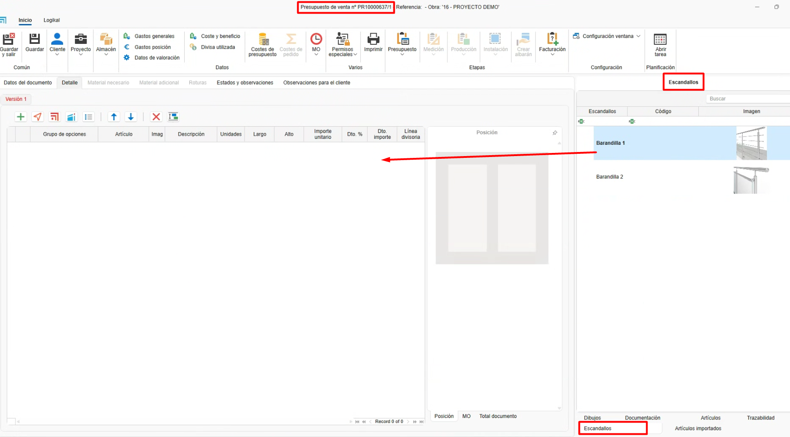
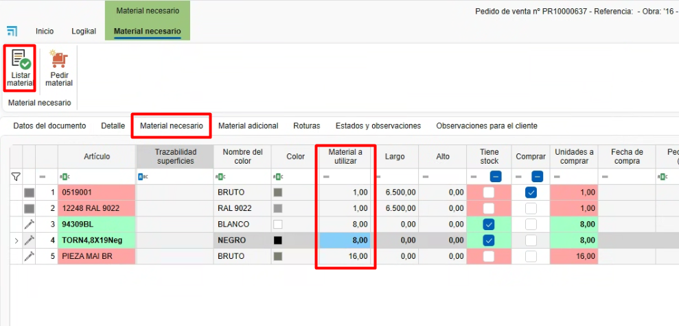

# Escandallos (Agrupamento de materiais)

---

## 1. Introdução

Este manual explica passo a passo como utilizar a funcionalidade de **Escandallos**.  
Os escandallos são definidos a partir do **ENBLAU**, agrupando materiais próprios criados no **enMATERIALS**.  
Além disso, é possível agrupar esses materiais e gerar as unidades necessárias de acordo com diversas condições, como dimensões, localização dos trechos, distância ou por fórmulas.

---

## 2. Escandallos

- Acesse os escandallos em **Armazéns → Escandallos**.

  

---

### 2.1. Criação de Escandallos

- Para criar um escandallo, siga os passos:

  1. No listado de escandallos, selecione o botão **Novo** para criar um novo escandallo.

     

  2. Abrirá uma janela onde você deve definir os seguintes campos:

     - **Nome**: Defina o nome do escandallo que está criando.  
     - **Família**: Campo opcional para indicar as pastas e subpastas onde deseja adicionar o escandallo. Este campo será refletido posteriormente na árvore de escandallos em **Documentos de vendas**.  
     - **Descrição**: Breve descrição do escandallo.  
     - **Descrição de vendas**: Indica se a descrição para vendas é diferente da descrição geral do escandallo.  
     - **Imagem**: Permite adicionar uma imagem ou captura representativa do escandallo.

       

  3. A secção **Produto acabado** é de uso exclusivo do posto de **Transformação** no enCONTROL. Neste campo deve ser indicada a referência de um material do tipo *peça* criado previamente no enMATERIALS.  
  Após o produto passar pelo posto de Transformação, os materiais definidos no desdobramento da ficha técnica serão automaticamente descontados e será gerada uma entrada em stock com a referência do material indicada nesta secção.

     

---

### 2.2. Agrupar materiais

- Uma vez criado o escandallo, os próximos passos permitem **agrupar e gerar os materiais** correspondentes:

    1. Na árvore de artigos, à direita, arraste os materiais que devem ser gerados para aquele escandallo.

        

    2. Em seguida, defina as condições conforme necessário:

        - **Unidades**: Indica as unidades que devem ser geradas do material.  
        - **Distância**: Especifica a frequência com que o material deve ser gerado.  
          Exemplo: *1 parafuso a cada 100 mm de trecho.*  
        - **Desde**: Define, junto com a distância, a partir de que ponto iniciar a contagem.  
        - **Localização**: Lista para indicar a posição do trecho onde o material deve ser gerado.  
          Exemplo: *Superior, inferior, direita, esquerda.*  
        - **Comprimento**: Permite indicar um comprimento fixo ou usar uma fórmula.  
          Exemplo: *L-50 → calcula o comprimento da barra menos 50 mm.*  
        - **Altura**: Permite indicar uma altura fixa ou usar uma fórmula.  
          Exemplo: *A-50 → calcula a altura da superfície menos 50 mm.*  
        - **Corte A**: Define o tipo de corte do lado **A** da barra.  
          Exemplo: *Corte a 90° ou 45°.*  
        - **Corte B**: Define o tipo de corte do lado **B** da barra.  
          Exemplo: *Corte a 90° ou 45°.*

          
      
> **Nota:** Os campos são ativados dependendo do tipo de cálculo do material (peça, barra, junta ou superfície).

---

## 3. Como usar escandallos

- Em qualquer documento de vendas (**Orçamento**, **Pedido**, **Produção**, etc.), acesse **Escandallos**, à direita do documento.  
  Em seguida, siga os passos:

    1. Arraste um escandallo para a posição do documento.

        

    2. Abrirá a janela do editor de escandallos, onde você poderá editar os valores antes de aceitar.

        

    3. Uma vez aceito, você poderá modificar medidas, preços e descontos.  
      Se os materiais tiverem uma tarifa de venda associada, o preço será calculado automaticamente por detalhamento.

        
    
    4. Acesse **Material necessário** para listar os materiais com as unidades definidas segundo as condições do escandallo e realizar o pedido de compra ao fornecedor.

        
